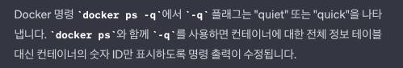

# 도커를 이용한 컨테이너 다루기 : 환경변수

- docker run 환경변수 설정방법 

- 명령어 분석

도커를 대화형, tty모드, 환경변수를 이후 설정으로 세팅한
우분투 focal버전을 실행한다.
---

- 환경변수를 파일로 .env 파일로 만들어서 한번에 주입도 가능

- 도커로 실행해 대화형, tty 모드로 이후의 환경변수파일 주입해서
우분트 포컬 버전을

# 도커를 이용한 컨테이너 다루기 : 네트워크

- -p : publish의 약자임

- 도커 컨테이너 삭제 : docker rm -f [컨테이너]
- -f : 실행중인 도커 컨테이너 강제 종료

---
## Expose vs Publish

- 도커 실행중 파일 전체 중지
: docker stop $(docker ps -q)
- 도커 전체 목록 삭제
: docker rm $(docker ps -a -q)
- expose 옵션은 문서화 용도일뿐이다.

## 도커 네트워크 명령어

- --net 옵션으로 실행시
- ipaddress가 빈값으로 설정되어 있음
- 드라이버 옵션도 null로 되어 있음

- apt update 도 에러남(네트워크 격리로)

- host 네트워크 사용시 포트 바인딩 보이지 않음

### 브릿지 네트워크 만들기

### 실행중인 컨테이너에서 실행하기

