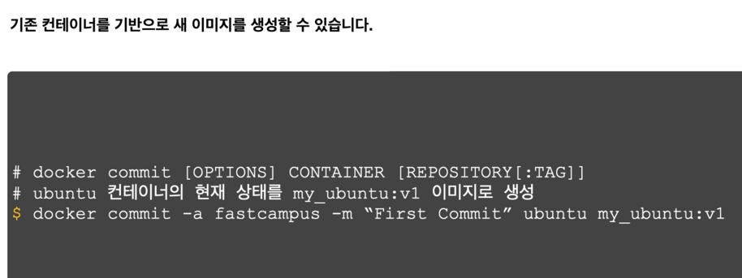
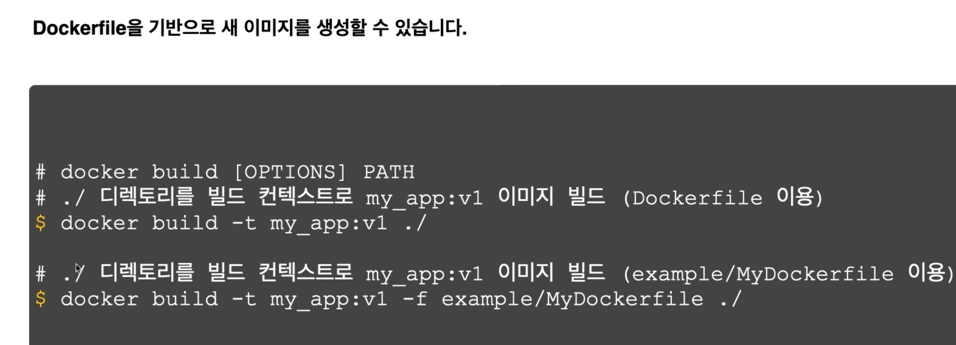
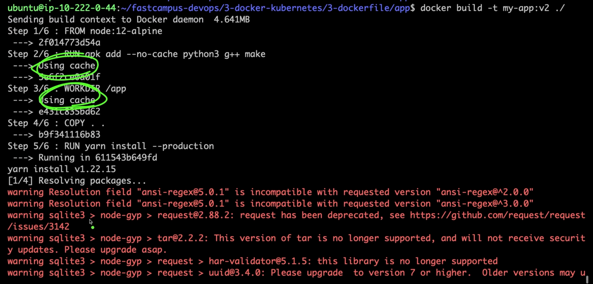

## 도커 이미지 구조

- docker image inspect [이미지명] 으로 확인 가능
## Dockerfile 없이 이미지 생성

- ctrl + p + q : 컨테이너 종료하지 않고 빠져나오는 단축키

## Dockerfile 이용하여 이미지 생성

- -t : tag 달아주는 명령어
- -f : 현재경로 아닌 다른곳의 dockerfile을 지정해 주는 명령어 

- 기존과 동일한 값은 using cache로 기존값을 가져와서 사용함
## 빌드 컨텍스트

- COPY . . : 도커 컨텍스트 이미지를 내용을 컨테이너 이미지 내부로 복사
- 도커 빌드할때, 빌드 컨텍스트의 모든정보가 도커데몬에 넘어간다.
- 따라서 빌드 컨텍스트의 정보가 너무 많다면, 도커 빌드의 시간이 길어지고, 비효율적이게 된다.
- 이런 문제 해결을 위해 .dockerignore를 제공해주고 있음

### .gitignore, .dockerignore 문법정리

## 도커파일 문법

- 주석사용 : #

- 환경변수 : 컨테이너의 환경변수임 (호스트의 환경변수가 아님)
- ENV : 이미지 빌드타임, 컨테이너 런타임에 환경변수 값을 전달할 수 있음
- ENV FOO=/bar : 디렉토리값이라서 / 있는것

- 도커이미지 상에서 사용할 변수명을 ARG 를 활용해서 전달할 수 있다.

ARG 값을 전달하는 방법은 두가지
1. 기본값 사용

2. 도커 빌드시에 --build-arg 에 전달

- build arguments(ARG) 사용전에 반드시 스코프를 고려해야 함

 - 위 그림에서 user ARG가 정의되기 전에 사용하고 있으므로, 아래에서
도커빌드시 주어지는 what_user 값이 아니라, 기본값인 some_user가 사용된다.

- ARG, ENV 같으면 ENV가 ARG를 덮어쓰게 됨

- FROM : 어떤 base 이미지를 사용할것인가? (nodejs 16버전
- LABEL : 이미지의 메타 데이터 설정( optional)
- WORKDIR : /app 이 경로를 working directory로 만들어 준다.
- COPY : src (host 운영체제 경로) dest(이미지 상 경로)
패키지로 시작해서 .json으로 끝나는 모든파일을 복사해서 이미지상 현재경로에(app/) 복사
- RUN : 해당 명령어를 실행해라.
- COPY : . . 
현재 디렉토리의 모든파일을 앱 디렉토리에 복사해라.\
- EXPOSE 8080 : 도커이미지가 8080 사용한다고 문서화 하는것(실제는 -p 로 해야함)
- CMD : 해당 이미지를 가지고 컨테이너를 실행할때 어떤 명령어를 수행할 것인지를 결정한다.
- 배열형태로 받을수도 있고 "node server.js" 처럼 문자열로 써도 된다.
- ENTRYPOINT : 배열형태로 받을수도 있고 문자열로 써도 된다.
- 엔트리포인트를 사용하면 커멘드에 앞어서 시작프로그램을 지정할 수 있다.
- ADD : COPY 지시어와 거의 동일한 역할
  (ADD에 src에 url을 사용할수 있지만, url을 src 사용하면 변경여부 확인할수 없어서 가급적
COPY를 사용하는 것을 추천한다.)