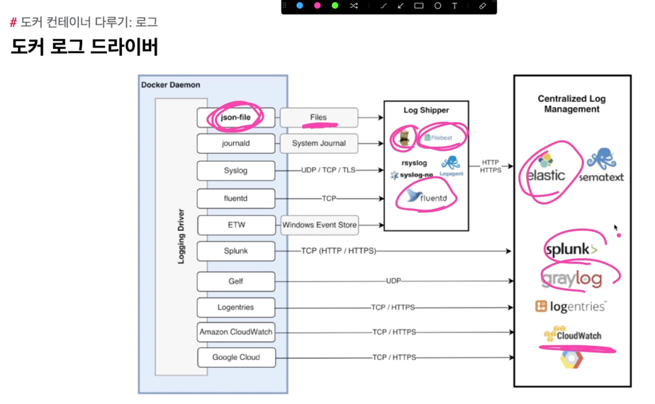

## STDOUt /STDERR

- 사용목적에 맞게 로깅 드라이버 사용
- 기본적으로 사용되는 로깅 드라이버는 json-file
- 한줄에 json 하나로 구성되는 로그파일

## 로그 확인하기

- -f : follow 의 의미로, 실시간 추적 기능을 의미
- -t : timestamp를 의미
## 호스트 운영체제의 로그 저장 경로

- 로그 드라이버를 json-file로 했을 경우만 유효하다.

- 루트사용자 변경

## 로그 용량 제한하기

## 도커 로그 드라이버
