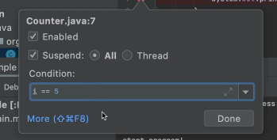

# 디버깅 관련 단축키

- cmd + f8 : 브레이크 포인트
- cmd + shift + f8 : 설정한 브레이크 포인트 한번에 확인
- 디버깅모드로 실행 : ctr + d
- 현재라인 코드 실행후 다음 라인으로 이동 : f8
- 현재라인의 메소드나 함수로 진입 : f7
- 프로그램 나머지 계속 실행 : f9

- 브레이크포인트에 조건을 걸수 있음
- 조건은 prdeicate 형식으로 써야함
- 초기화 되지 않은 곳에 중단점 걸면 에러 발생함

# 콜스택 확인

