# chapter 03. 영속성 관리
    - 엔티티 매니저 : 엔티티를 crud 하는 엔티티와 관련된 모든 일을 처리한다.
    - 엔티티를 처리하는 가상의 데이터베이스
## 3.1 엔티티 매니저 팩토리와 엔티티 매니저
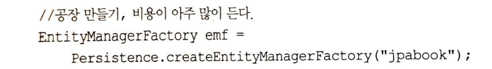
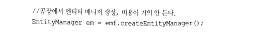
    
    - 엔티티 매니저 팩토리는 여러 스레드가 동시에 접근해도 안전하므로 여러 다른 스레드 간에 공유해도 되지만,
      엔티티 매니저는 여러 스레드가 동시에 접근하면 동시성 문제가 발생하므로 스레드 간에 절대 공유하면 안된다.
    - 엔티티 매니저는 데이터베이스 연결이 꼭 필요한 시점까지 커넥션을 얻지 않는다.

## 3.2 영속성 컨텍스트란?
    - 영속성 컨텐스트 : 엔티티를 영구 저장하는 환경이라는 뜻이다.
    - em.persist(member);   -> persist() 메소드는 엔티티 매니저를 사용해서 회원 엔티티를 영속성 컨텍스트에 저장한다.
    - 영속성 컨텍스트는 엔티티 매니저를 생성할 때 하나 만들어진다. 엔티티 매니저를 통해 접근, 관리할 수 있다.
    - 여러 엔티티 매니저가 하나의 영속성 컨텐스트에 접근할수도 있지만, 이런 상황은 11장에서 살펴본다.

## 3.3 엔티티의 생명주기
    - 엔티티의 생명주기는 비영속/ 영속 / 준영속 / 삭제 4가지가 있다.
    - 비영속 : 영속성 컨텍스트나 데이터베이스와는 전혀 관련이 없다.
    - 영속 : 영속성 컨텍스트가 관리하는 상태를 영속상태라고 한다.
    - 준영속 : 영속성 컨텍스트가 관리하던 영속 상태의 엔티티를 영속성 컨텍스트가 관리하지 않으면 준영속 상태가 된다.
    - em.detach(member);

## 3.4 영속성 컨텍스트의 
    1) 영속성 컨텍스트와 식별자 값
        - 영속성 컨텍스트는 엔티티를 식별자 값으로 구분한다.
        - 영속상태는 식별자값이 반드시 있어야 한다. 없으면 예외가 발생한다.(*)
    2) 영속성 컨텍스트와 데이터베이스 저장
        - jpa는 보통 트랜잭션을 커밋하는 순간 영속성 컨텍스트에 새로 저장된 엔티티를 데이터베이스에 반영하는데, 이를
          플러시(flush) 라고 한다.
    3) 영속성 컨텍스트가 엔티티를 관리하면 다음과 같은 장점이 있다
        - 1차캐시 / 동일성보장 / 트랙잭션을 지원하는 쓰기 지연/ 변경감지 / 지연로딩( Fetch_lazy)

### 3.4.1 엔티티 조회
    - 영속성 컨텍스트는 내부에 Map 구조의 1차 캐시를 가지고 있다.
    - 1차 캐시에 회원 엔티티를 저장한다. 회원 엔티티는 아직 데이터베이스에 저장되지 않았다.
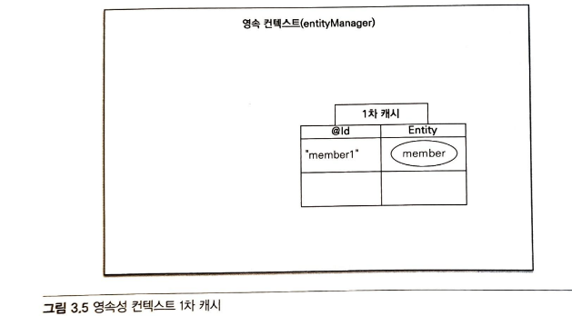
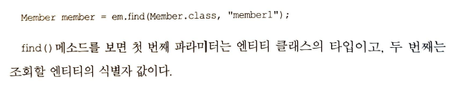
    
    - em.find()를 호출하면 먼저 1차캐시에서 엔티티를 찾고, 1차 캐시에 없으면 db에서 조회한다.
    - db에서 조회한 엔티티를 1차 캐시에 저장한 후, 영속상태 엔티티를 반환한다.
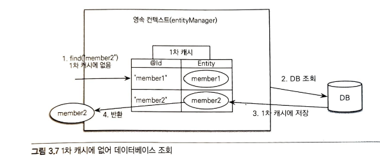
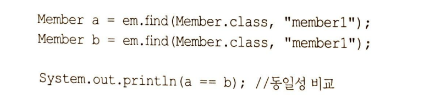
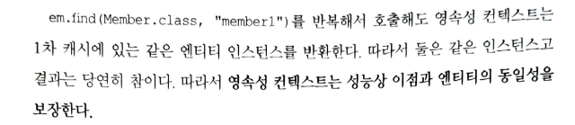
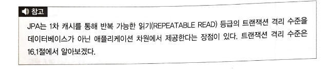

### 3.4.2 엔티티 등록
    - 엔티티 매니저는 트랙젝션을 커밋하기 직전까지 데이터베이스에 엔티티를 저장하지 않고 내부 쿼리 저장소에
    Insert SQL을 차곡차곡 모아둔다. 그리고 트랜잭션을 커밋할때 모아 둔 쿼리를 db에 보내는데, 이를 쓰기지연이라고 한다.
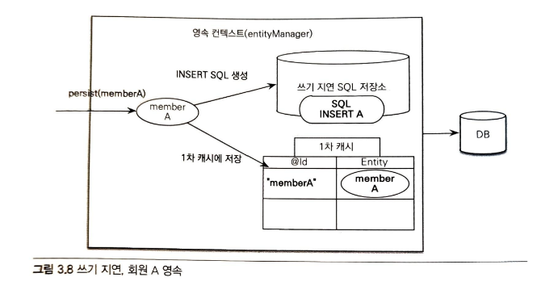
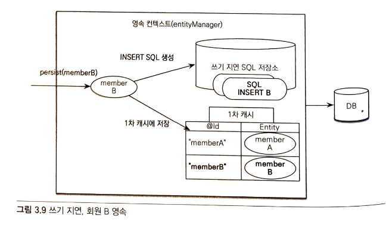
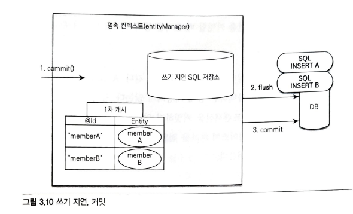
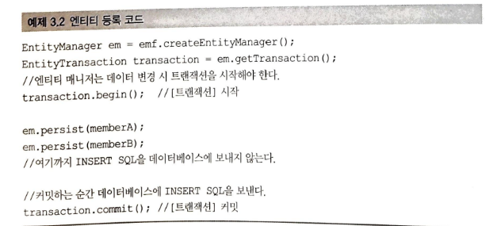

    - 트랜젝션을 커밋하면, 엔티티 매니져는 우선 영속성 컨텍스트를 플러시 한다.
    - 플러시는 영속성 컨텍스트의 변경 내용을 데이터베이스에 동기화 하는 작업이다.(쓰기 지연 sql저장소에 모인 쿼리를
    디비에 보낸다.)
    - 등록쿼리를 그때 그때 데이터 베이스에 전달해도 트랙잭션을 커밋하지 않으면 아무 소용이 없다. 어떻게든 커밋 직전에만
    데이터베이스에 sql을 전달하면 된다.
    - 이 기능을 잘 활용하면 모아둔 등록 쿼리를 데이터베이스에 한번에 전달해서 성능을 최적화 할 수 있다.

### 3.4.3 엔티티 수정
    - sql을 사용하면 수정쿼리를 직접 작성해야 한다. 이런 개발방식의 문제점은 수정 쿼리가 많이지는 것은 물론이고, 비지니스 
    로직을 분석하기 위해 sql을 계속 확인해야 한다는 점이다.
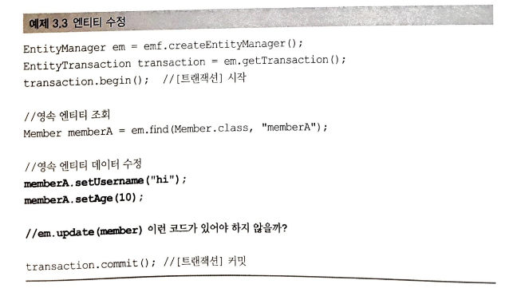

    - JPA로 엔티티를 수정할 때는 단순히 엔티티를 조회해서 데이터만 변경하면 된다.
    - 엔티티의 변경사항을 데이터베이스에 자동으로 반영하는 기능을 변경 감지라고 한다.

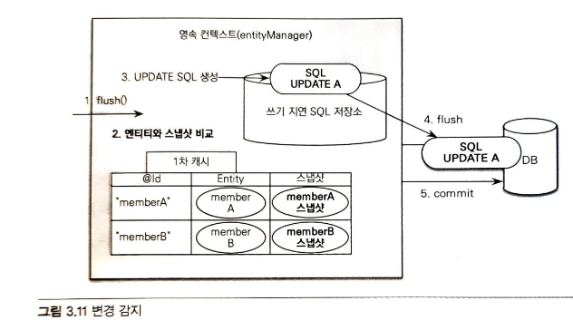

    - JPA는 엔티티를 영속성 컨텍스트에 보관할 때, 최초 상태를 복사해서 저장해두는데, 이를 스냅샷이라고 한다.
    - 플러시 시점에 스냅샷과 엔티티를 비교해서 변경된 엔티티를 찾는다.
    - 변경된 엔티티가 있으면 수정 쿼리를 작성해서 쓰기 지연 sql저장소에 보낸다.
    - 변경감지는 영속성 컨텍스트가 관리하는 영속 상태의 엔티티에만 적용된다.
    - 비영속, 준영속 엔티티 값은 변경해도 데이터베이스에 반영되지 않는다.
    - JPA는 수정시 엔티티의 모든 필드를 업데이트 하는 전략을 사용한다.
        - 모든 필드를 사용하면 수정쿼리가 항상 같아, 미리 생성해두고 재사용할수 있다.
        - 필드가 너무 많거나 내용이 너무 크면 수정된 데이터만 사용해서 동적으로 update sql을 생성하는 전략을 선택한다.
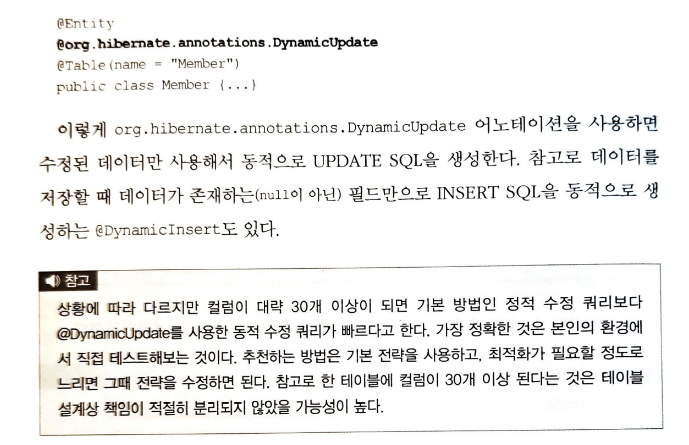

### 3.4.4 엔티티 삭제
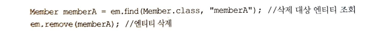

    - 삭제쿼리도 즉시 삭제하는 것이 아니라 쓰기지연 sql저장소에 등록된후, 플러시 호출시 쿼리에 전달하여 삭제한다.
    - 삭제된 엔티티는 재사용하지 말고, 자연스럽게 가비지 컬렉션의 대상이 되도록 두는 것이 좋다.

## 3.5 플러시
    - 플러시는 영속성 컨텍스트의 변경 내용을 데이터베이스에 반영한다.
    - 영속성 컨텍스트를 플러시하는 방법은 3가지 이다.
        1) em.flush() 를 직접 호출한다. ( 거의 사용 x)
        2) 트랜잭션 커밋시 자동호출됨   (db에 변경내용을 sql에 전달하지 않고 트랙잭션만 커밋하면 
        어떤 데이터도 데이터베이스에 반영되지 않는다.
        3) JPQL 쿼리 실행시 플러시가 자동호출된다.
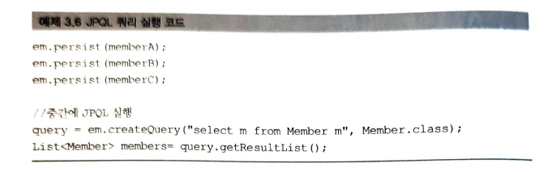

    - 위 와 같은 예에서 JPQL 실행시 결과가 조회되지 않는 문제 해결을 위해서, JOQL 실행시에도 플러시를 자동호출한다.

### 3.5.1 플러시 모드 옵션
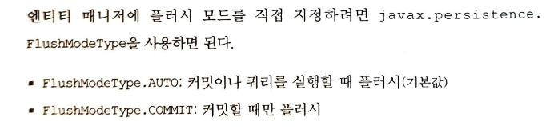
    - 영속서 컨텍스트의 변경내용을 데이터베이스에 동기화 하는 것이 플러시이다. ( 플러시라는 이름때문에 영속성 컨텍스트에 보관된
    엔티티를 지운다고 생각하면 안된다.)
## 3.6 준영속
    - 영속성 컨텍스트에서 분리된 것을 준영속 상태라고 한다.
    - 준영속 상태의 엔티티는 영속성 컨텐스트가 제공하는 기능을 사용할 수 없다.
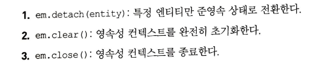
### 3.6.1 엔티티를 준영속 상태로 전화: detach()
    - 이 메소스를 호출하는 순간, 1차캐시부터 쓰기 지연 sql저장소까지 해당 엔티티를 관리하기 위한 모든 정보가 삭제된다.
    - 영속 상태였다가 더는 영속성 컨텍스트가 관리하지 않는 상태를 준영속 상태라고 한다.

### 3.6.2 영속성 컨텍스트 초기화: clear()
    - em.clear()는 영속성 컨텍스트를 초기화해서 해당 영속성 컨텍스트의 모든 엔티티를 준영속 상태로 만든다.
    - 준영속 상태이므로 영속성 컨텍스트가 지원하는 변경 감지는 동작하지 앟는다.
### 3.6.3 영속성 컨텍스트 종료: close()
    - 영속성 컨텍스트를 종료하면 영속성 컨텍스트가 관리하던 영속 상태의 엔티티가 모두 준영속 상태가 된다.
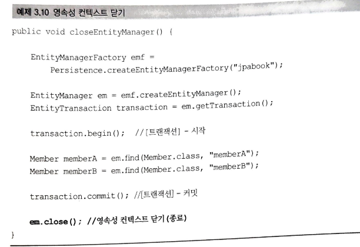

### 3.6.4 준영속 상태의 특징
    - 거의 비영속 상태에 가깝다.
    - 식별자 값을 가지고 있다. (이미 한번 영속상태였으므로, 반드시 식별자 값을 가지고 있다.
    - 지연로딩을 할 수 없다.준영속상태는 영속성 컨텍스트가 더는 관리하지 않으므로 지연 로딩시 문제가 발생한다.
### 3.6.5 병합: merge()
    - 준영속 상태의 엔티티를 다시 영속 상태로 변경하려면 병합을 사용하면 된다.
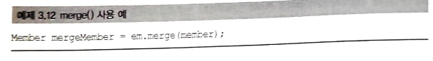

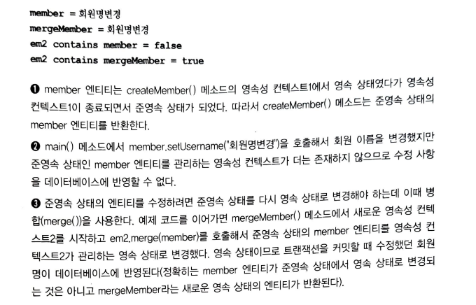

    - merge()는 파라미터로 넘어온 준영속 엔티티를 사용해서 새롭게 병합된 영속 상태의 엔티티를 반환한다.
    - 파라미터로 넘어온 엔티티는 병합 속에도 준영속 상태로 남아 있다.
    - merge()는 비영속 엔티티도 영속 상태로 만들 수 있다.
    - 병합은 준영속, 비영속을 신경 쓰지 않는다. 식별자 값으로 엔티티를 조회 할수 있으면 불러서 병합하고,
    조회할 수 없으면 새로 생성해서 병합한다.

## 3.7 정리

    - 엔티티 매니저를 만들면 그 내부에 영속성 컨텍스트도 함께 만들어진다.
    - 영속성 컨텍스트 덕분에 1차 캐시, 동일성 보장, 트랙잭션을 지원하는 쓰기 지연, 변경 감시, 지연 로딩 기능을 사용할 수 있다.
    - 영속성 컨텍스트에 저장한 엔티티는 플러시 시점에 데이터베이스에 반영되는데, 일반적으로 트랜잭션을 커밋할 때 영속성 컨텍스트가 
    플러시 된다.
