<!-- TOC -->

* [04. 엔티티 매핑](#04-엔티티-매핑)
    * [4.1. @Entity](#41-entity)
    * [4.2. @Table](#42-table)
    * [4.4. 데이터베이스 스키마 자동생성](#44-데이터베이스-스키마-자동생성)
    * [4.5. DDL 생성기능](#45-ddl-생성기능)
    * [4.6. 기본키 맵핑](#46-기본키-맵핑)
        * [4.6.1 기본키 직접할당전략](#461-기본키-직접할당전략)
        * [4.6.2 IDENTITY 전략](#462-identity-전략)
        * [4.6.3 SEQUENCE 전략](#463-sequence-전략)
        * [4.6.4 TABLE 전략](#464-table-전략)
        * [4.6.5 AUTO 전략](#465-auto-전략)
        * [4.6.6 기본키 매핑 정리](#466-기본키-매핑-정리)
    * [4.7. 필드와 컬럼맵핑: 레퍼런스](#47-필드와-컬럼맵핑-레퍼런스)
        * [4.7.1 @Column](#471-column)
        * [4.7.2 @Enumerated](#472-enumerated)
        * [4.7.3 @Temporal](#473-temporal)
        * [4.7.4 @LOB (Large OBject)](#474-lob-large-object)
        * [4.7.5 @Transient](#475-transient)
        * [4.7.6 @Access](#476-access)
    * [4.8. 정리](#48-정리)

<!-- TOC -->

# 04. 엔티티 매핑

    - JPA를 사용할 때 가장 중요한 일은 엔티티와 테이블을 정확히 맵핑하는 것이다.

## 4.1. @Entity

    - JPA를 사용해서 매핑할 클래스는 @Entity 어노테이션을 필수로 붙여야 한다.
    - @Entity 적용시 주의사항
        1) 기본생성자는 필수다. ( 파라미터 없는 public, protected)

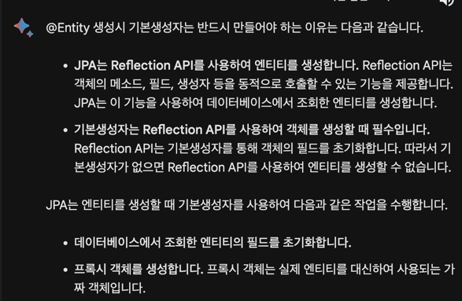

        2) final, enum, interface, inner 클래스에 사용할수 없다.
        3) 저장할 필드에 final 사용하면 안된다.

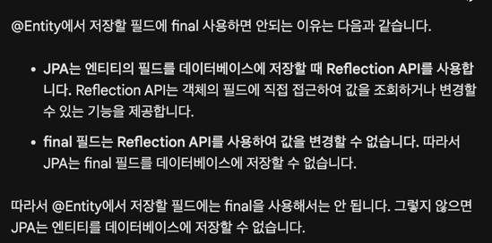

## 4.2. @Table

    - 엔티티와 맵핑할 테이블을 지정한다.
    - 생략하면 맵핑한 엔티티 이름을 테이블 이름으로 사용한다.

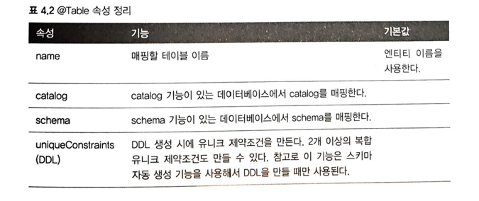

    - catalog와 schema 속성은 데이터베이스에 해당 기능이 있는 경우에 사용하는 속성입니다.

    catalog 속성은 데이터베이스의 범위를 나타냅니다. 
    예를 들어, MySQL의 경우 catalog 속성을 사용하여 데이터베이스별로 
    테이블을 분리할 수 있습니다.

    schema 속성은 데이터베이스 내의 범위를 나타냅니다. 
    예를 들어, MySQL의 경우 schema 속성을 사용하여 
    데이터베이스 내의 스키마별로 테이블을 분리할 수 있습니다.

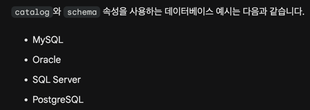
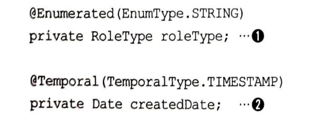
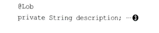

    - Lob (Large Object)
        1) CLOB (Character Large Object)
        2) BLOB (Binary Large Object)

## 4.4. 데이터베이스 스키마 자동생성

    - JPA는 데이터베이스 스키마를 자동생성하는 기능을 지원한다.
    - hibernate.show_sql= true : 테이블생성 DDL을 콘솔에 출력
    - 스키마 자동생성 기능이 만든 DDL은 운영 환경에서 사용할 만큼 완벽하지는 않으므로,
    개발환경에서 사용하거나 내핑을 어떻게 해야 하는지 참고하는 정도로만 사용할 것.

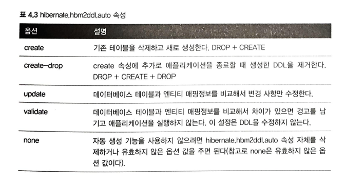
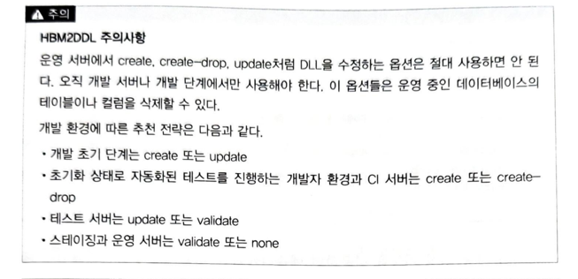

    - 운영서버에서 create, create-drop, update 처럼 DDL을 수정하는 옵션은 절대 사용하면 안된다.
    (운영중인 데이터베이스 테이블, 칼럼을 삭제할 수 있다.)
    - 하이버네이트는 org.hibernate.cfg.ImprovedNamingStrategy class를 제공하여, 클래스명이나 컬럼 명이 생략되면 자바의 카멜 표기법을
    테이블의 언더스코어 표기법으로 매핑한다.

## 4.5. DDL 생성기능

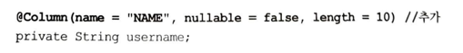
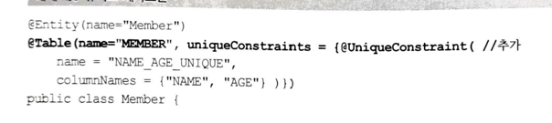

    - 이런 기능들은 단지 DDL 을 자동 생성할 때만 사용되고, JPA의 실행로직에는 영향을 주지 않는다.
    - 직접 DDL을 만든다면 사용할 이유가 없다. 그래도 이 기능을 사용하면 엔티티만 보고도 다양한 제약조건을 파악할수 있는 장점이 있다.

## 4.6. 기본키 맵핑

    - JPA가 제공하는 데이터베이스 기본 키 생성 전략은 다음과 같다.

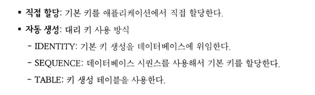

    - 생성전략을 사용하려면 @Id, @GeneratedValue를 추가하고 원하는 키 생성 전략을 선택하면 된다.
    - 생성전략을 사용하려면 hibernate.id.new_generator_mapping= true 속성 이용

### 4.6.1 기본키 직접할당전략

    - @Id 직접 적용 가능한 자바타입 : 기본형, 래퍼형, String, java.util.Date, java.sql.Date, java.math.BigDecimal, java.math.BigInteger
    - 영속화하기 전에 직접 기본키 할당하는 방법

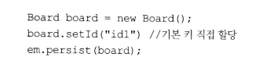

### 4.6.2 IDENTITY 전략

    - Identity는 기본 키 생성을 데이터베이스에 위임하는 전략이다.
    - 주로 MySQL, PostgreSQL, SQL Server, DB2에서 사용한다.

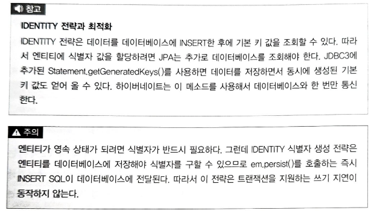

    - 데이터를 DB에 INSERT 한후에 기본 키 값을 조회할 수 있다.
    - IDENTITY 식별자 생성 전략은 쓰기지연이 동작하지 않는다.
    - 식별자가 존재해야하는 영속성의 특성상, persist() 호출하는 즉시, INSERT SQL이 쿼리에 전달된다.

### 4.6.3 SEQUENCE 전략

    - 유일한 값을 순서대로 생성하는 특별한 데이터베이스 오브젝트이다.
    - 오라클, postgreSQL, DB2, 데이터베이스 에서 사용할수 있다.
    - sequence 전략은 em.persist() 호출할때, 먼저 데이터베이스 시퀀스를 사용해서 식별자를 조회한다. 조회한 식별자를 엔티티에 할당한후,
    엔티티를 영속성 컨텐스트에 저장한다. (cf. IDENTITY 전략은 먼저 db 저장후, 식별자 조회하여 엔티티 식별자에 할당)

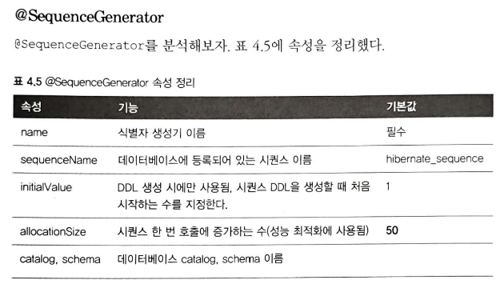    
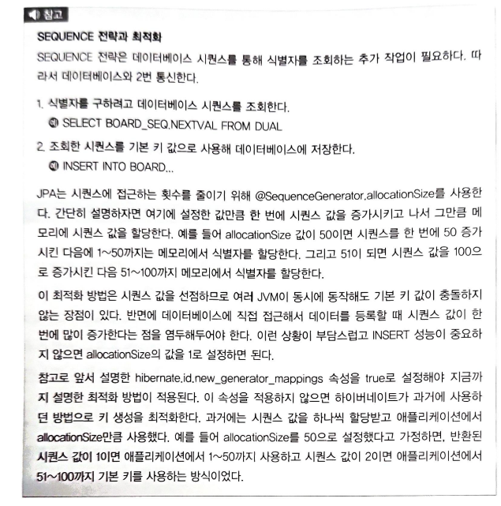

### 4.6.4 TABLE 전략

    - 테이블을 사용하므로 모든 db에 적용 할 수 있다.
    - 키 생성 용도로 사용할 테이블을 만들어야 한다.
    - 시퀀스 대신에 테이블을 사용한다는 점만 빼면 SEQUENCE 전략과 내부작동방식이 같다.

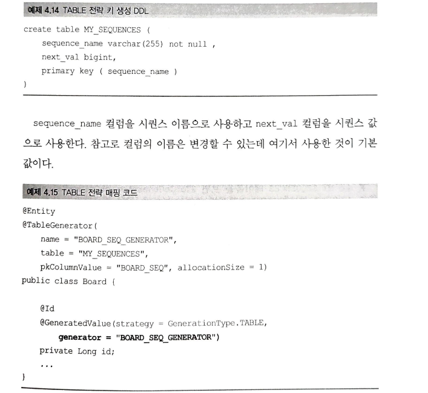
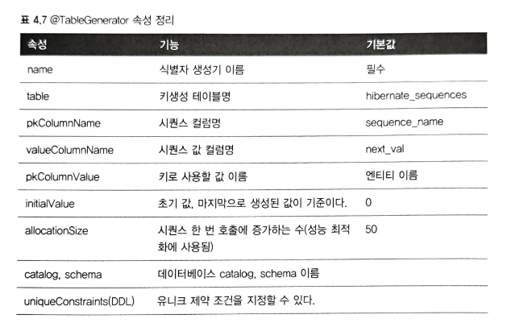
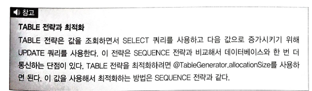

### 4.6.5 AUTO 전략

    - 장점 : 데이터베이스를 변경해도 코드를 수정할 필요가 없다.
    - 단점 : 선능, 예측못한 전략 선택, 효율성 저하 가능성, 통제력 부족

### 4.6.6 기본키 매핑 정리

    - 영속성 컨텍스트는 엔티티를 식별자 값으로 구분하므로, 엔티티를 영속 상태로 만들려면, 식별자 값이 반드시 있어야 한다.
    - 직접할당 : em.persis() 전에 직접 식별자 값을 할당해야 한다.
    - SEQUENCE : DB 시퀀스에서 식별자 값 획득후 영속성 컨텍스트에 저장함
    - TABLE : 시퀀스 생성용 테이블에서 식별자 값 획득후 영속성 컨텍스트에 저장
    - IDENTITY : DB에 엔티티를 저장해서 식별자 값 획득후, 영속성 컨텍스트에 저장.

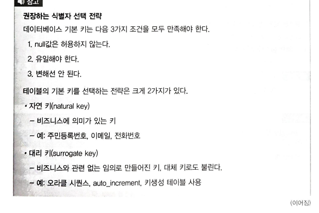

    - 자연키보다는 대리키를 권장.
    - ex) 전화번호는 유일할수 있지만, 없을수 있고, 변경가능성이 있음
    - ex) 주민번호 유일키 썼다가 정책변경으로 전체 저장 못함

## 4.7. 필드와 컬럼맵핑: 레퍼런스

### 4.7.1 @Column

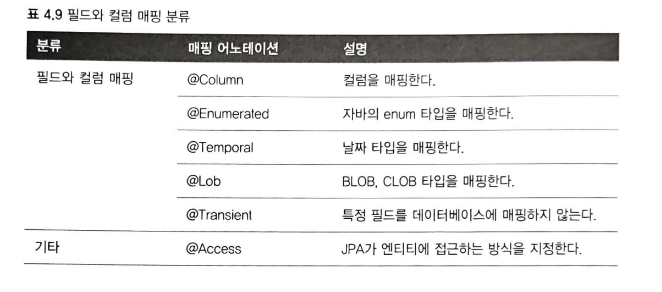
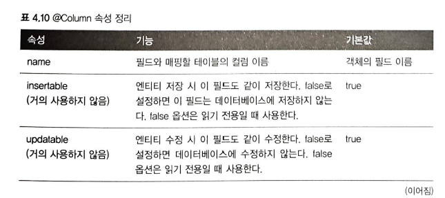
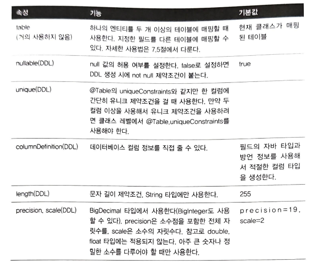
- 자바 기본타입에는 @Column 쓸때, nullable=false 지정하는 것이 안전하다.

### 4.7.2 @Enumerated

    - EnumtType.ORDINAL : enum 순서를 db에 저장
    - EnumType.STRING : enum 이름을 db에 저장

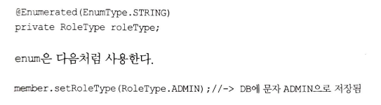
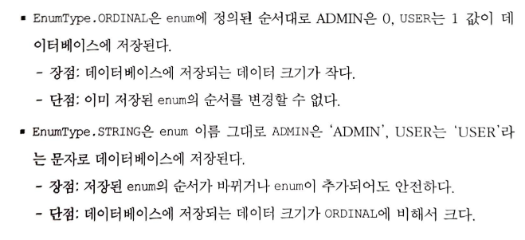

    - EnumType.STRING 을 권장

### 4.7.3 @Temporal

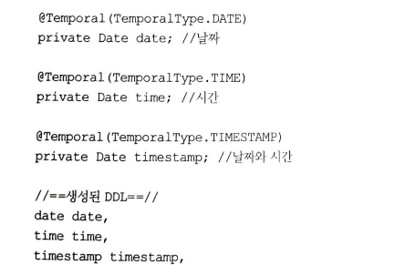
- @Temporal 생략시 자바의 Date와 가장 유사한 timestamp로 정의된다.

### 4.7.4 @LOB (Large OBject)

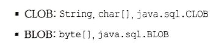
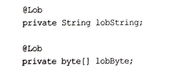

### 4.7.5 @Transient

    - 이 필드는 매핑하지 않는다. 
    - db에 저장하지 않고, 조회하지도 않는다.
    - 객체에 임시로 값을 보관하고 싶을때 사용한다.

### 4.7.6 @Access

    - JPA가 db에 접급하는 방식을 지정한다.
    - AccessType.FIELD : 필드에 직접접근, 접근권한이 private이라도 접근 가능
    - AccessType.PROPERTY

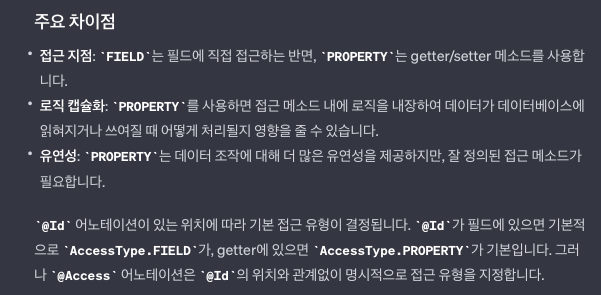

## 4.8. 정리

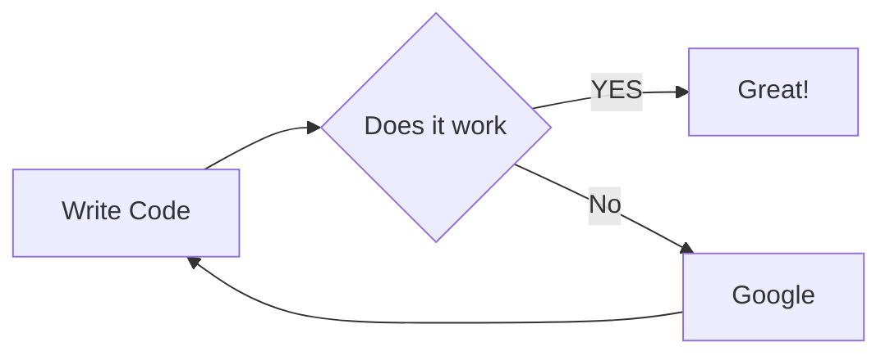

body {
background: #DDDDDD;
color: #888888;
font-size: 250% !important;
}

