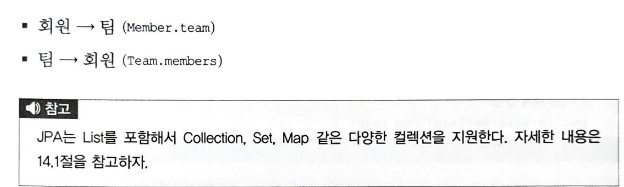
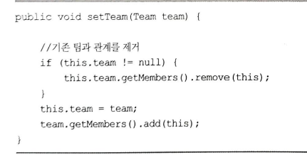

<!-- TOC -->

* [05. 연관관계 매핑 기초](#05-연관관계-매핑-기초)
    * [5.1 단방향 연관관계](#51-단방향-연관관계)
        * [5.1.1 순수한 객체 연관관계](#511-순수한-객체-연관관계)
        * [5.1.2 테이블 연관관계](#512-테이블-연관관계)
        * [5.1.3 객체 관계 매핑](#513-객체-관계-매핑)
        * [5.1.4 @JoinColumn](#514-joincolumn)
        * [5.1.5 @ManyToOne](#515-manytoone)
    * [5.2 연관관계 사용](#52-연관관계-사용)
        * [5.2.1 저장](#521-저장)
        * [5.2.2 조회](#522-조회)
        * [5.2.3 수정](#523-수정)
        * [5.2.4 연관관계 제거](#524-연관관계-제거)
        * [5.2.5 연관된 엔티티 삭제](#525-연관된-엔티티-삭제)
    * [5.3 양방향 연관관계](#53-양방향-연관관계)
        * [5.3.1 양방향 연관관계 매핑](#531-양방향-연관관계-매핑)
        * [5.3.2 일다다 컬렉션 조회](#532-일다다-컬렉션-조회)
    * [5.4 연관관계의 주인](#54-연관관계의-주인)
        * [5.4.1 양방향 매핑의 규칙: 연관관계의 주인](#541-양방향-매핑의-규칙-연관관계의-주인)
        * [5.4.2 연관관계의 주인은 외래키가 있는 곳](#542-연관관계의-주인은-외래키가-있는-곳)
    * [5.5 양방향 연관관계 저장](#55-양방향-연관관계-저장)
    * [5.6 양방향 연관관계의 주의점](#56-양방향-연관관계의-주의점)
        * [5.6.1 순수한 객체까지 고려한 양방향 연관관계](#561-순수한-객체까지-고려한-양방향-연관관계)
        * [5.6.2 연관관계 편의 메소드](#562-연관관계-편의-메소드)
        * [5.6.3 연관관계 편의 메소드 작성시 주의사항](#563-연관관계-편의-메소드-작성시-주의사항)
    * [5.7 정리](#57-정리)
        * [연관관계의 주인을 정하는 기준](#연관관계의-주인을-정하는-기준)

<!-- TOC -->

# 05. 연관관계 매핑 기초

    - 객체의 참조와 테이블의 외래키를 매핑 하는것이 이장의 목표
    - 방향 : 단방향, 양방향
    - 다중성 : 1:1, 1:N , N:1 , N:N
    - 연관관계의 주인 : 객체를 양방향 연관관계로 만들면 연관관계의 주인을 정해야함

## 5.1 단방향 연관관계

    - 객체연관관계 : 회원객체와 팀 객체는 단방향 관계이다. 
    - 테이블연관관계 : 회원테이블과 팀 테이블은 양방향 관계이다.
    - 참조를 통한 연관관계는 언제나 단방향이다. 반면에 테이블은 외래키 하나로 양방향 조인을 할 수 있다.
    - 객체간에도 양방향을 만들수 있으나, 정확히 말하면 서로 다른 단방향 두개이다.
    - 객체는 참조(주소)로 연관관계를 맺고, 테이블은 외래키로 연관관계를 맺는다.

### 5.1.1 순수한 객체 연관관계

    - 팀은 멤버를 가질수도 있고, 가지지 않을수도 있다.
    - 객체는 참조를 사용해서 연관관계 탐색을 할 수 있는데, 이를 객체 그래프 탐색이라 한다.

### 5.1.2 테이블 연관관계

    - 데이터베이스는 외래 키를 사용해서 연관관계를 탐색할 수 있는데, 이것을 조인이라고 한다.

### 5.1.3 객체 관계 매핑

    - @ManyToOne : 연관관계 매핑시 다중성을 나타내는 어노테이션은(필수 사용)
    - @JoinColumn : 외래키매핑시 사용 (생략 가능)

### 5.1.4 @JoinColumn

    - JoinColumn은 생략이 가능하다.
    - 생략시 외래 키 찾을때 기본 전략을 사용한다.

### 5.1.5 @ManyToOne

## 5.2 연관관계 사용

### 5.2.1 저장

    - JPA에서 엔티티를 저장할 때 연관된 모든 엔티티는 영속 상태여야 한다.

### 5.2.2 조회

    - 엔티티를 조회하는 방법은 2가지 : 객체 그래프 탐색, JPQL

### 5.2.3 수정

    - 수정은 em.update() 같은 메소드가 없다.

### 5.2.4 연관관계 제거

### 5.2.5 연관된 엔티티 삭제

    - 연관된 엔티티를 삭제하려면 기존에 있던 연관관계를 먼저 제거하고 삭제해야 한다. 그렇지 않으면,
    외래키 제약조건으로 데이터 베이스 오류가 발생한다.

## 5.3 양방향 연관관계

    - 데이터 베이스는 외래키 하나로 양방향 조회가 가능하므로, 데이터베이스에 추가할 내용은 없다.

### 5.3.1 양방향 연관관계 매핑

    - mappedBy 속성은 양방향 맵핑일때 반대쪽 매핑의 필드 이름을 값으로 주면 된다.

### 5.3.2 일다다 컬렉션 조회

## 5.4 연관관계의 주인

    - 엔티티를 양방향 관계로 설정하면 객체 참조는 둘인데, 외래키는 하나이다.
    - 따라서 둘 사이에 차이가 발생하고, 이로 인해 JPA에서는 두 객체 연관관계 중 하나를 정해서 
    테이블의 외래키를 관리해야 하는데 이를 연관관계의 주인이라고 한다.

### 5.4.1 양방향 매핑의 규칙: 연관관계의 주인

    - 양방향 연관관계 매핑 시, 두 연관관계 중 하나를 연관관계의 주인으로 정해야 한다.
    - 연관관계의 주인만이 데이터베이스 연관관계와 맵핑되고, 외래키를 관리(등록,수정,삭제)할 수 있다.
    반면에 주인이 아닌쪽은 읽기만 할 수 있다.
    - 주인은 mappedBy 속성을 사용하지 않는다. 주인이 아니면, mappedBy 속성을 사용해서 속성의 값으로
    연관관계의 주인을 지정해야 한다.
    - 연관관계의 주인을 정한다는 것은 사실 외래키의 관리자를 선택하는 것이다.

### 5.4.2 연관관계의 주인은 외래키가 있는 곳

    - 연관관계의 주인은 외래키가 있는 곳으로 정해야 한다.
    - 주인이 아닌 곳은 mappedBy 속성을 사용해서 주인이 아님을 설정한다.
    - mappedBy의 속성값으로는 연관관계의 주인인 team을 주면된다.(Member 엔티티의 team 필드)
    - 정리 : 연관관계 주인만 db와 맵핑되고, 외래키를 관리할수 있다. 반대편은 읽기만 가능

## 5.5 양방향 연관관계 저장

    - 양방향 연관관계는 연관관계의 주인이 외래 키를 관리한다. 따라서 주인이 아닌 방향은 값을 설정하지 않아고
    데이터 베이스에 외래키값이 정상 입력된다.

## 5.6 양방향 연관관계의 주의점

    - 양방향 연관관계를 설정하고 가장 흔히 하는 실수는 연관관계의 주인에는 값을 입력하지 않고, 주인이 아닌곳에만 값을 
    입력하는 것이다.

    - 연관관계의 주인만이 값을 변경할수 있다. 연관관계가 아닌 객체에 반대로 참조값을 입력하면,
    db에 값이 저장되지 않는다.

### 5.6.1 순수한 객체까지 고려한 양방향 연관관계

    - 객체 관점에서 양쪽 방향에 모두 값을 입력해주는 것이 가장 안전하다.
    - 양쪽 방향 모두 값을 입력하지 않으면, JPA를 사용하지 않는 순수한 객체상태에서 심각한 문제가 발생할 수 있다.
    - 객체 관계까지 고려해서 주인이 아닌 곳에도 값을 입력하자.
    - 결론 : 객체의 양방향 연관관계는 양쪽 모두 맺어주자.

### 5.6.2 연관관계 편의 메소드

    - 양방향 연관관계는 결국 양쪽 모두 신경 써야 한다. 따라서 하나의 메소드로 다루는게 편하다.

### 5.6.3 연관관계 편의 메소드 작성시 주의사항

    - 연관관계를 변경할 때는 기존 팀이 있으면 기존 팀과 회원의 연관관계를 삭제하는 코드를 추가해야 한다.

    - 객체에서 양방향 관련관계를 사용하려면 로직을 견고하게 작성해야 한다.

## 5.7 정리

    - 연관관계가 하나인 단방향 매핑은 언제나 연관관계의 주인이다.
    - 양방향의 장점은 반대방향으로 객체 그래프 탐색 기능이 추가된것 뿐이다.
    - 주인의 반대편은 mappedBy로 주인을 지정해야 한다.
    - 단방향 매핑만으로 테이블과 객체의 연관관계 매핑은 이미 완료되었다.
    - 양방향 연관관계를 매핑하려면 객체를 양쪽 방향에서 모두 관리해야 한다.

### 연관관계의 주인을 정하는 기준

    - 단방향은 항상 외래 키가 있는 곳을 기준으로 매핑하면 된다.
    - 비지니스의 로직상 더 중요하다고 생각하는 곳을 연관관계의 주인으로 하면 안된다.
    - 비지니즈 중요도와 관계없이 외래키 관리자 정도의 의미로 생각하면 된다.

