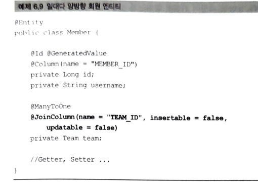

# 06. 다양한 연관관계 맵핑
    - 연관관계 매핑할때는 3가지를 고려해야 한다.
    1) 다중성(다대일, 일대다, 일대일, 다대다)
    2) 단방향,양방향
    3) 연관관계의 주인
        - 외래키를 가진 테이블와 맵핑한 엔티티가 외래키를 관리하는게 효율적이므로 보통 이곳을 연관관계의 주인으로 한다.
        - 주인이 아닌 방향은 외래키를 변경할 수 없고 읽기만 가능하다.
        (mapped 속성 사용, 주인필드이름값을 입력한다.(주의!! 객체명이 아니라, 주인객체의 필스명임 )
## 6.1 다대일
    - 데이터베이스 테이블의 1:N 관계에서 외래키는 항상 N쪽에 있다.
    - 객체 양방향 관계에서 연관관계의 주인은 항상 다쪽이다.

### 6.1.1 다대일 단방향[N:1]

### 6.1.2 다대일 양방향[1:N, N:1]

    
    - 객체 연관관계에서 실선이 연관관계의 주인이고, 점선은 연관관계의 주인이 아니다.
    - @JoinColumn의 연관관계 맵핑은 테이블의 이름이고, @OneToMany 같은 연관관계 맵핑의 기준은 필드명이다.
    - 양방향은 외래키가 있는 곳이 연관관계의 주인이다. JPA는 외래키를 관리할 때 연관관계의 주인만 사용한다.
    - 객체level에서 양방향 관계를 만들려면 연관관계 편의 메소드를 작성하는게 좋은데, 양쪽 다 작성할 경우 무한루프에 
    빠질 위험도 있으므로 주의해서 작성해야 한다.
## 6.2 일대다
    - 자바 컬렉션인 Collection, List, Set, Map 중 하나를 사용해야 한다.

### 6.2.1 일대다 단방향[1:N]

    - 일대다 단방향 관계는 특이하게, 팀 엔티티의 Team.members로 회원테이블의 Team.ID 외래키를 관리한다.
    - 일대다 관계의 외래키는 항상 다쪽 테이블에 있지만, 다쪽인 Member 엔티티에 외래키를 매핑할수 있는 참조필드가 없기때문.
    - 일대다 단방향 관계를 맵핑할때는 @JoinColumn을 명시해야 한다. 명시하지 않으면 JPA는 연결테이블을 중간에 두고, 연관관계를 관리하는
    조인테이블 전략을 기본으로 사용해서 맵핑한다.
    - 일대다단방향 매핑의 단점 : 맵핑한 객체가 관리하는 외래키가 다른 테이블에 존재한다. 다른 테이블에 외래키가 있으면,
    연관관계 처리를 위한 update sql을 추가로 실행해야 한다.(Q)
    - 일대다 단방향 맵핑보다는 다대일 양방향 맵핑을 사용하자

### 6.2.2 일대다 양방향[1:N, N:1]
    - 일대다 양방향 매핑은 존재하지 않는다. 대신 다대일 양방향 매핑을 사용해야 한다.
    - 일대다 양방향 매핑이 완전 불가능 한것은 아님(반대편에 같은 외래키를 사용하는 다대일 단방향 매핑을 읽기전용으로 추가하면 됨)

    - 위 그림은 일대다 단방향 맵핑 반대편에 다대일 단방향 매핑을 읽기 전용으로 추가해서 일대다 양방향 처럼 보이도록 하는 방법이다.
## 6.3 일대일(1:1)

    - 일대일 관계는 주 테이블, 대상테이블 둘 중 어느곳이나 외래키를 가질 수 있다.
    - 테이블은 둘 중 하나만 있으면 양쪽 조회가 가능하다.
    - 주테이블에 외래키 두기 장점 : 주테이블만 확인해도 대상 테이블과 연관관계가 있는지 알수 있다.
    - 대상테이블에 외래키 두기 장점 : db개발자가 선호. 테이블 관계를 일대일에서 일대다로 변경시 테이블구조 그대로 유지 가능
### 6.3.1 주 테이블에 외래 키 

### 6.3.2 대상 테이블에 외래 키 

    - 일대일 관계 중 대상 테이블에 외래 키가 있는 단방향 관계는 JPA에서 지원하지 않고, 맵핑방법도 없다
    - 이런 경우 단방향 관계를 Member방향으로 수정하거나, 양방향 관계로 만들고 Locker를 연관관계의 주인으로 설정해야 한다.

    - 대상 테이블에 외래키를 두고 싶으면 위와 같이 양방향으로 맵핑한다. Member 엔티티 대신에 대상 엔티티인 Locker 를 주인으로
    만들어서, Locker 테이블의 외래키를 관리하도록 한다.

## 6.4 다대다(N:N)

    - 정규화된 테이블 2개로 다대다 관계를 표현할수 없으므로 연결테이블을 사용한다.
### 6.4.1 다대다: 단방향

### 6.4.2 다대다: 양방향
    - 다대다 매핑이므로 역방향도 @ManyToMany 를 사용한다.
    - 원하는 곳에 mappedBy로 연관관계의 주인을 지정한다.
### 6.4.3 다대다: 매핑의 한계와 극복, 연결 엔티티 사용

    
    - @IdClass를 사용해서 복합 기본키를 매핑해서 사용할 수 있다.
    - JPA에서 복합 키를 사용하려면 별도의 식별자 클래스를 만들어야 한다.
    - 엔티티에 @IdClass를 사용해서 식별자 클래스를 지정하면 된다.
    - 식별자 클래스의 특징 : Serializable, equals, hashcode 구현, 기본생성자 필요,
    식별자클래스는 public
    - @EmbeddedID를 사용하는 방법도 있다.

    - 식별관계 : 부모 테이블의 기본키를 받아서 자신의 기본키+외래키로 사용하는 것을 식별관계라고 한다.
### 6.4.4 다대다: 새로운 기본키 활용
    - 추천하는 기본 키 생성 전략은 데이터베이스에서 자동 생성해주는 대리키를 Long 값으로 사용하는 것이다.
    - 새로운 기본키를 사용해서 다대다 관계를 풀어내는 것도 좋은 방법이다.

### 6.4.5 다대다 연관관계 정리
    - 식별관계 : 받아온 식별자를 기본키 + 외래키로 사용한다.
    - 비식별관계 : 받아온 식별자는 외래키로만 사용하고 새로운 식별자를 추가한다.
## 6.5 정리