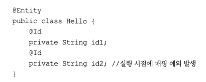

<!-- TOC -->
* [07. 고급매핑](#07-고급매핑)
  * [7.1 상속관계매핑](#71-상속관계매핑)
  * [7.2 @MappedSuperClass](#72-mappedsuperclass)
  * [7.3 복합키와 식별관계맵핑](#73-복합키와-식별관계맵핑)
  * [7.4 조인 테이블](#74-조인-테이블)
  * [7.5 엔티티 하나에 여러 테이블 맵핑](#75-엔티티-하나에-여러-테이블-맵핑)
  * [7.6 정리](#76-정리)
<!-- TOC -->

# 07. 고급매핑
## 7.1 상속관계매핑
    - 관계형 DB에서는 슈퍼타입 서브타입 관계 라는 모뎅링기법이 객체의 상속개념과 가상 유사하다.
    - ORM에서 말하는 상속관계 맵핑은 객체의 상속 구조와 데이터베이스의 슈퍼타입 서브타입 관계를 맵핑하는 것이다.
    - 슈퍼타입 서브타입 논리 모델을 실제 테이블로 구현할때는 3가지 방법이 있다.(조인전략, 단일테이블전략, 구현클래스마다 테이블 전략)
### 7.1.1 조인전략

    - 엔티티 각각 모두 테이블로 만들고, 자식 테이블이 부모 테이블의 기본키를 받아서 기본키+외래키로 사용하는 전략
    - 객체는 타입으로 구분할 수 있지만, 테이블은 타입 개념이 없으므로 타입구분 칼럼을 추가해 주어야 한다.(DTYPE)

    - 자식테이블은 부모테이블의 ID컬럼명을 그대로 사용
    - 컬럼명을 변경하고 싶으면 @PrimaryKeyJoinColumn 사용하면 됨
    - JPA표준명세에는 @DiscriminationColumn을 사용하도록 하지만, 하이버네이트를 포함한 구현체는 구분컬럼 없이도 동작한다.
(Q)

### 7.1.2 단일테이블전략
    - 하나의 테이블만 사용
    - 구분칼럼(DTYPE)으로 어떤 자식 데이터가 저장되었는지 구분한다.
    - 조회할때 Join을 사용하지 않으므로 일반적으로 가장 빠르다.

### 7.1.3 구현클래스마다 테이블전략

  - 자식 엔티티마다 테이블을 만든다. 일반적으로 추천하지 않는 전략이다.

## 7.2 @MappedSuperClass
    - 부모 클래스는 테이블과 매핑하지 않고, 부모 클래스를 상속받는 자식 클래스에게 매핑정보만 제공하고 싶으면
    @MappedSuperClass를 사용하면 된다.
    - @Entity는 실제 테이블에 맵핑됨. @MappedSuperClass는 실제테이블과 매핑되지 않는다.
    - 단순 맵핑정보를 상속할 목적으로만 사용한다.

    - 부모에게 상속받은 컬럼명 재정의
      : @AttributeOverride(name ="id", column = @Column(name = "MEMBER_ID"))
        @AttributeOverrides({
          @AttributeOverride(name ="id", column = @Column(name = "MEMBER_ID")),
          @AttributeOverride(name ="name", column = @Column(name = "MEMBER_NAME"))

    - @MappedSuperClass로 지정한 클래스는 엔티티가 아니므로, em.find()나 JPQL에서 사용할 수 없다.
    - 이 클래스를 직접 사용할일을 거의 없으므로 추상클래스로 만드는것을 권장한다.

## 7.3 복합키와 식별관계맵핑
### 7.3.1 식별관계 vs 비식별관계
    - 식별관계 : 부모테이블의 기본키를 받아 자식 테이블의 기본키+외래키로 사용하는 관계

    
    - 비식별관계 : 부모 테이블의 기본 키를 받아서 자식테이블의 외래키로만 사용

    - 필수적 비식별관계 : 외래키에 null을 허용하지 않는다. / 연관관계를 필수적으로 맺어야 한다.
    - 선택적 비식별 관계 : 외래키에 null을 허용한다. / 연관관계는 선택사항

    - 최근에는 비식별관계를 주로 사용하고 꼭 필요한 곳에만 식별관계 사용하는 추세임
### 7.3.2 복합 키: 비식별 관계 매핑

    - 위와 같이 매핑하면 매핑에러가 발생함.
    - JPA에서 식별자를 둘 이상 사용하려면 별도의 식별자 클래스를 만들어야 한다.
    - 왜냐하면 JPA는 영속성 컨텍스트에 엔티티 보관시 식별자를 키로 사용함. 그리고 동등성 여부를 equals, hashcode로 알아냄
    식별자가 두개 이상이 되면, 이를 새롭게 정의해야 하기 때문에 클래스를 새로 만들고 hashcode, equals를 구현해야 함.

    - @IdClass

    - @EmbeddedId : 좀 더 객체지향적인 방법
    - Parent에서 식별자 클래스를 직접 사용하고, @EmbeddedId 어노테이션을 붙이는 방법
    - @EmbeddedId 적용한 식별자 클래스는 식별자 클래스에 기본키를 직접 매핑한다.
    - 복합키에는 @GenerateValue를 사용할 수 없다.

### 7.3.3 복합 키: 식별 관계 맵핑

    - 식별관계는 기본키와 외래 키를 같이 매핑해야 한다.
    - 식별자 매핑인 @Id와 연관관계매핑인 @ManyToOne을 같이 사용하면 된다.
    - @EmbeddedId 는 식별관계로 사용할 연관관계의 속성에 @MapsId 를 사용하면 된다.(Q)
    - @IdClass와 다른점은 @Id 대신에 @MapsId를 사용한 점이다. @MapsId는 외래키와 매핑한 연관관계를 기본키에도 매핑하겠다는 뜻이다.

### 7.3.4 비식별 관계로 구현

### 7.3.5 일대일 식별관계

    - BoardDetail처럼 식별자가 단순히 컬럼 하나면 @MapsId를 사용하고 속성값은 비워두면 된다.
### 7.3.5 식별, 비식별 관계의 장단점
    < db 설계 관점에서는 비식별 관계를 선호한다 >
    - 식별 관계는 부모테이블 기본키를 자식 테이블로 전파하면서 자식 테이블 기본키 컬럼이 점점 늘어남
    - 결국 Join을 할때 SQL이 복잡해지고 기본 키 인덱스가 불필요하게 커질 수 있다.
    - 식별관계는 두개 이상 컬럼을 합쳐 복합 기본키를 만들어야 하는 경우가 많고, 테이블 구조가 유연하지 못하다.

    < 객체관계 매핑입장에서는 다음과 같은 이유로 비식별 관계를 선호한다. >
    - 식별관계는 별도의 복합키 클래스를 만들어야 함
    
    식별관계의 장점 : 기본키 인덱스 활용하기 좋음, 상위 테이블의 기본키 컬럼을 자식, 손자도 들고 있어서
    특정상황에 조인없이 하위 테이블만으로 검색을 완료할 수 있음.

    - 가급적 비식별 관계 사용하고 기본키는 Long타입의 대리키 사용 추천.
    - 필수적 비식별관계 > 선택적 비식별 
    - 필수적 비식별관계는 not null로 항상 관계가 있다는 것을 보장하므로 내부 조인만 사용해도 된다.

## 7.4 조인 테이블

      - 두 테이블의 외래키를 가지고 연관관계를 관리
      - 따라서 Member, Locker에는 외래키 컬럼이 존재하지 않는다.
      - 조인테이블의 가장 큰 단점은 테이블을 하나 추가해야 한다는 것.
      - @JoinTable로 맵핑함

### 7.4.1 일대일 조인 테이블

### 7.4.2 일대다 조인 테이블

    - 일대다 관계를 만들려면 조인 테이블의 컬럼 중 다(N)와 관련된 컬럼인 Child_ID에 유니크 제약 조건을 걸어야 한다.
### 7.4.3 다대일 조인 테이블
### 7.4.4 다대다 조인 테이블

## 7.5 엔티티 하나에 여러 테이블 맵핑

## 7.6 정리