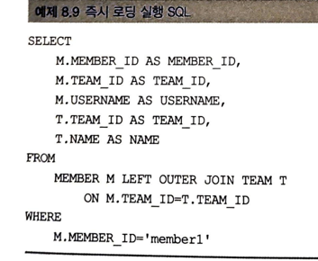
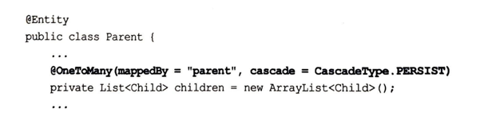

## 8.1 프록시
    - 객체가 데이터베이스에 저장되어 있으므로, 연관된 객체 탐색을 마음껏 하기 어렵다.
    - JPA 구현체들은 이 문제를 해결하려고 프록시라는 기술을 사용한다.
    - 엔티티를 조회할 때, 연관된 엔티티들이 항상 사용되는 것은 아니다.
  

    - 당장 사용하지 않는 객체를 조회하는 것은 비효율적이다. 이 문제를 해결하려고 데이터베이스
      조회를 지연시키는 데 이를 지연로딩이라고 한다.
    - 지연로딩을 사용하려면 실제 엔티티 객체 대신에 데이터베이스 조회를 지연할 수 있는 가짜 객체가 필요
    한데, 이를 프록시 객체라고 한다.

### 8.1.1 프록시 기초

    - getReference를 사용하면 프록시객체가 반환된다.
    - 프록시 클래스는 실제 클래스를 상속 받아서 만들어지므로 겉 모양이 같다. 
    - 프록시객체는 실제 객체에 대한 참조를 보관한다.

    - 영속성 컨텍스트에 찾는 엔티티가 이미 있으면 데이터베이스를 조회할 필요가 없으므로, em.getReference()를 
    호출해도 프록시가 아닌 실제 엔티티를 반환한다.
    - 준영속 상태의 프록시를 초기화 하면 예외가 발생된다.

### 8.1.2 프록시와 식별자

    - 엔티티를 프록시로 조회할때, 식별자(PK)를 파라미터로 전달하는데, 프록시 객체는 이 식별자 값을 보관한다.

    - 위 코드를 실행해도 프록시를 초기화 하지 않는다.(@Access(AccessType.PROPERTY) 로 설정한 경우에만)
    - @Access(AccessType.FIELD)로 설정하면, 프록시객체를 초기화 한다.
    - 연관관계를 설정할때는 식별자 값만 사용하므로 프록시를 사용하면 데이터베이스 접근 횟수를 줄일 수 있다.
    - **참고 : 연관관계 설정시 엔티티 접근 방식을 필드로 설정해도 프록시를 초기화 하지 않는다.

### 8.1.3 프록시 확인

    - 위 메소드를 쓰면 초기화 여부 확인이 가능하다.

    - 위와같이 출력했을때, 클래스 명 뒤에 ..javassist 라고 된 것으로 프록시 여부를 확인할 수 있다.

    - 위 메소드로 강제로 초기화 할수도 있다.
    - JPA 표준에는 강제 초기화 메소드가 없다. 강제 초기화 하려면 프록시의 메소드를 직접호출하는 방법이용

## 8.2 즉시로딩과 지연로딩

### 8.2.1 즉시 로딩
    - 회원과 팀 두 테이블을 조회해야 하므로, 쿼리를 2번 실행할 것 같지만, 대부분의 JPA 구현체는 
    즉시 로딩을 최적화 하기 위해서 가능하면 조인 쿼리를 사용한다.

### 8.2.2 지연 로딩

    - 실제 데이터가 필요한 순간이 되어서야 데이터베이스를 조회해서 프록시 객체를 초기화한다.
    - 조회 대상이 영속성 컨텍스트에 이미 있으면, 프록시 객체를 사용할 필요가 없다 .따라서 프록시가 아닌 실제 객체를 사용한다.
### 8.2.3 즉시 로딩, 지연로딩 정리

    - 뭐가 더 좋은 방식인지는 상황에 따라 다르다.

## 8.3 지연 로딩 활용

    - 사용률이 높은 관계를 즉시로딩으로 설정하였음.
### 8.3.1 프록시와 컬렉션 래퍼

    - 컬렉션은 컬렉션 래퍼가 지연로딩을 처리해 준다. 컬랙션 래퍼도 컬렉션에 대한 프록시 역할을 한다.
    - ** member.getOrders() 처럼 컬렉션을 호출해도 컬렉션은 초기화 되지 않는다. 실제 데이터를 호출
    예를 들어) member.getOrders().get(0) 같이 조회를 할때, 데이터베이스를 조회해서 초기화 한다.

    - 지연로딩이 되어 있는 Orders()가 초기화 될때, 즉시로딩으로 연결되어 있는 product 정보는 같이 로딩된다.

### 8.3.2 JPA 기본 페치 전략
    - @ManyToOne, @OneToOne : 즉시로딩
    - @OneToMany, @ManyToMany : 지연로딩
    - 추천하는 방법은 모등 연관관계에 지연로딩을 사용하고, 실제 사용하는 상황을 보고 필요한 곳에만 즉시로딩으로 최적화하는 것을 추천한다.
### 8.3.3 컬렉션에 FetchType.EAGER 사용시 주의점
    - 2개 이상의 컬렉션을 즉시 로딩으로 설정하는 것은 권장하지 않는다.
    - JPA는 일대다 관계를 즉시로딩할때 항상 외부 조인을 사용한다.
    - 컬렉션 즉시로딩은 항상 외부조인을 사용한다. 다대일 관계에서 외래키에 not null을 걸어두면 내부조인을 사용해도 되지만,
    일대다 관계에서는 회원이 한명도 없는 팀을 내부 조인하면 팀도 조회되지 않는 문제가 발생하므로, 무조건 외부조인을 사용한다.

    
## 8.4 영속성 전이: cascade
    - 특정 엔티티를 영속 상태로 만들때, 연관된 엔티티도 영속 상태로 만들고 싶으면 영속성 전이 기능을 사용하면 된다.
    - jpa에서 엔티티를 저장할 때 연관된 모든 엔티티는 영속 상태여야 한다.
    - 일일히 영속상태로 만들수도 있지만, 영속성 전이를 사용하면 부모만 영속상태로 만들면, 나머지도 영속상태로 만들수 있다.

### 8.4.1 영속성 전이: 저장

    - 영속성 전이는 연관관계 매핑과는 아무 관련이 없다. 단지 엔티티를 영속화 할때, 연관된 엔티티도 같이 영속화하는 편리함을
    제공할 뿐이다.
### 8.4.2 영속성 전이: 삭제
    - CascadeType.REMOVE 로 설정하고, 부모 엔티티만 삭제하면 연관된 자식 엔티티도 함께 삭제된다.
    - 삭제순서는 외래키 제약순서를 고려해서 자식을 먼저삭제하고 부모를 삭제한다.
    - Cascade.REMOVE 설정하지 않으면 부모 엔티티만 삭제된다. 데이터베이스의 부모 로우를 삭제하는 순간 자식 테이블에 걸려 있는 
    외래 키 제약 조건으로, 데이터베이스에서 외래키 무결성 예외가 발생한다.(Q) 
### 8.4.3 cascade 종류

## 8.5 고아 객체

    - 고아객체제거 : 부모 엔티티와 연관관계가 끊어진 자식 엔티티를 자동으로 삭제하는 기능

    - orphanRemoval = true 옵션으로 인해 컬렉션에서 엔티티를 제거하면 db의 데이터도 삭제된다.
    - 모든 자식 엔티티를 제거하려면 parent1.getChildren().clear() 하면 된다.
    - 고아객체제거는 참조가 제거도니 엔티티는 다른 곳에서 참조하지 않는 고아 객체로 보고 삭제하는 기능이다.
    - orphanRemoval 은 @OneToOne, @OneToMany 에서만 사용해야 한다. (Q)

## 8.6 영속성 전이 + 고아객체, 생명주기
    - CascdeType.All + orphanRemoval = true 동시에 사용하면 부모엔티티를 통해 자식의 생명주기를 관리할 수 있다.

## 8.7 정리