# 09. 값타입

    - jpa 타입은 크게 엔티티타입, 값타입으로 분류할 수 있다.
    - 엔티티 타입은 식별자를 통해 지속 추적이 가능하고, 식별자만 유지하면, 기타 값을 변경해도 같은 객체로 인식한다.
    - 값타입은 변경하면 완전 다른 값으로 인식한다.

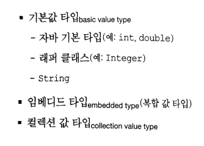
## 9.1 기본값타입
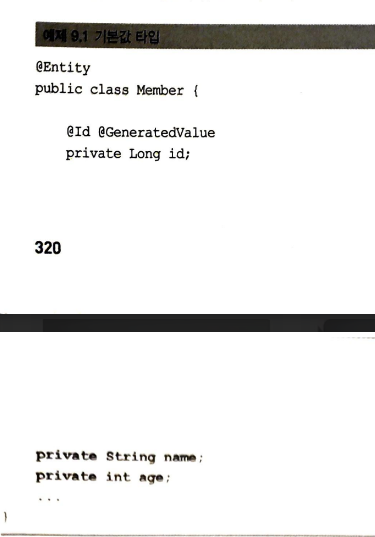

    - 값타입은 식별자 값도 없고 생명주기도 포함된 엔티티에 의존한다.
    - 회원 엔티티 인스턴스가 제거되면 name, age 도 제거된다.
## 9.2 임베디드 타입(복합값 타입)

    - 직접정의한 임베디드 타입도 int, String 같은 값타입이다.
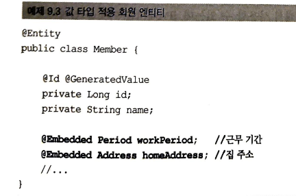
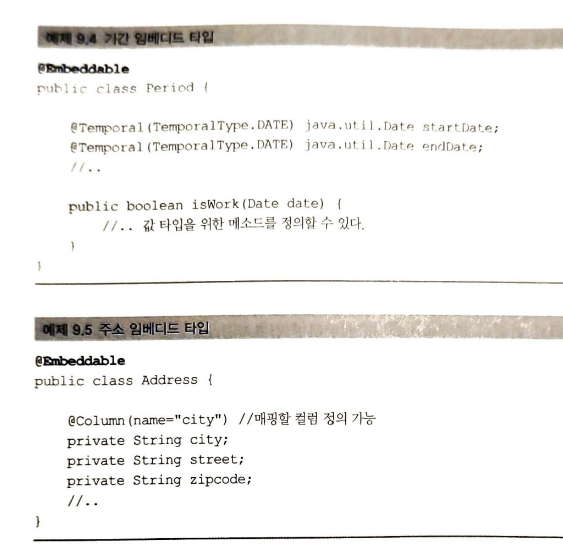

    - @Embeddable : 값 타입 정의하는 곳에 표시
    - @Embedded : 값 타입 사용하는 곳에 표시
    - 임베디드 타입은 기본 생성자가 필수다.
    - 모든 값타입은 엔티티의 생명주기에 의존하므로, 엔티티와 임베디드 타입 관계는 컴포지션 관계이다.
    - 하이버네이트는 임베디드 타입을 컴포넌트라고 한다.

### 9.2.1 임베디드 타입과 테이블 매핑
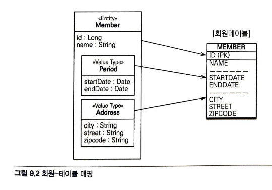

    - 임베디드 타입은 엔티티의 값일 뿐이다.
    - 임베디드 타입 덕분에 객체와 테이블을 아주 세밀하게 매핑하는 것이 가능하다.
    - 잘 설계한 ORM 어플리케이션은 매핑한 테이블의 수보다 클래스 수가 더 많다.
### 9.2.2 임베디드 타입과 연관관계

    - 임베디드 타입은 값 타입을 포함하거나 엔티티를 참조 할 수 있다.
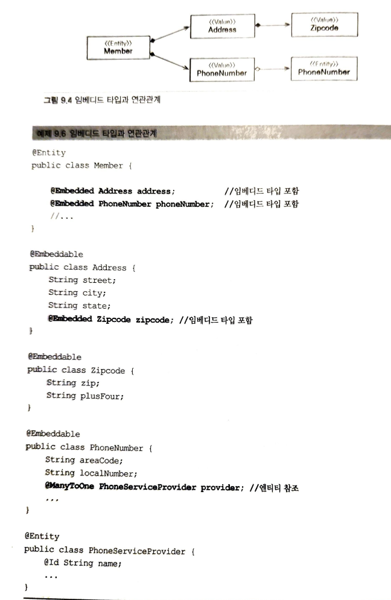

### 9.2.3 @AttributeOverride 속성 재정의
    - 임베디드 타입에 정의한 매핑정보를 재정의 하려면, 엔티티에 @AttributeOverride를 사용하면 된다.
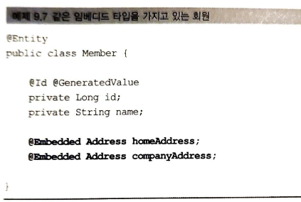
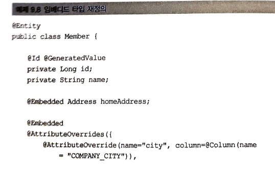
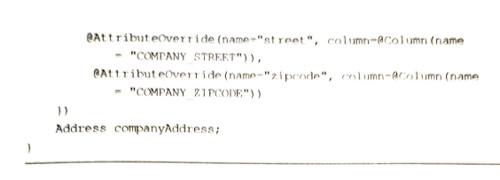
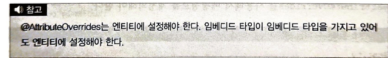

### 9.2.4 임베디드 타입과 null
    - 임베디드 타입이 null이면 매핑한 컬럼 값은 모두 null이 된다.

## 9.3 값타입과 불변 객체
### 9.3.1 값 타입 공유 참조

    - 임베디드 타입 같은 값 타입을 여러 엔티티에서 공유하면 위험하다.
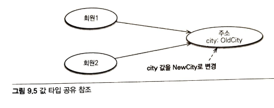

    - 부작용을 막으려면 값을 복사해서 사용하면 된다.
### 9.3.2 값 타입 복사
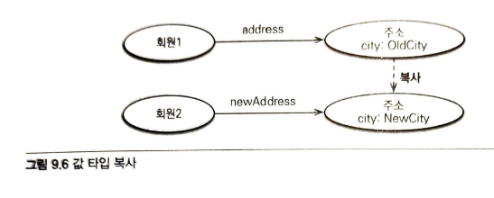
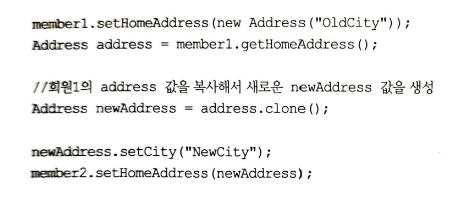

    - 항상 값을 복사해서 사용하면 공유 참조로 인해 발생하는 부작용을 피할 수 있다.
    - 임베디드 타입 같이 직접 정의한 값 타입은 자바의 기본타입이 아니라 객체 타입임
    - 즉, 값 자체가 아니라 참조값을 넘기기 때문에 객체의 공유 참조를 막을 방법이 없음
    - 따라서, setter를 제거해야 안전함

### 9.3.3 불변객체

    - 값 타입은 가능하면 불변객체로 설계해야 한다. ( 조회할수 있지만 수정할수 없음)
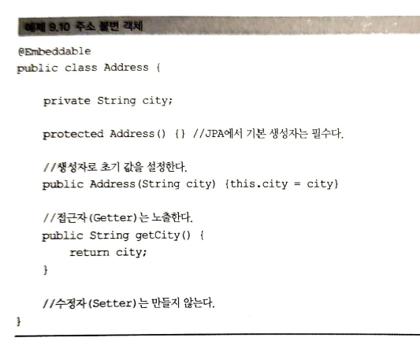

** 기본생성자가 필수인 이유

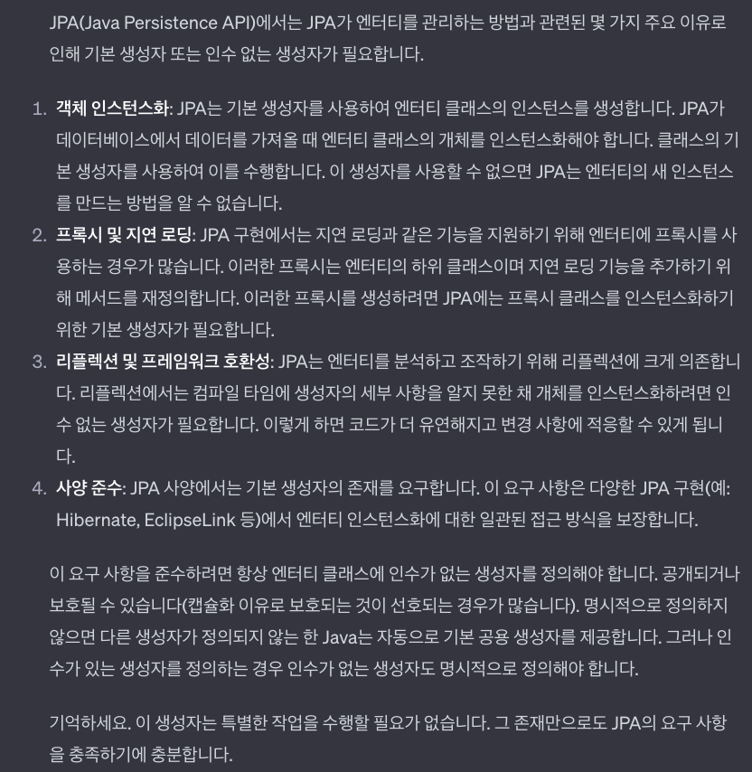

    - 결론 : 값객체 만들때 불변객체로 만들어서 사용해라

## 9.4 값 타입의 비교
    - 동일성 비교 : 인스턴스의 참조값을 비교 == 사용
    - 동등성 비교 : 인스턴스의 값을 비교 equals() 사용
    - 자바에서 equals를 재정의 하면 hashCode()도 재정의 하는 것이 안전하다. 그렇지 않으면, 사용하는 컬렉션이 정상 동작하지 않는다.
## 9.5 값 타입 컬렉션

    - 값타입을 하나 이상 저장하려면 컬렉션에 보관하고 @ElementCollection, @CollectionTable을 사용한다.
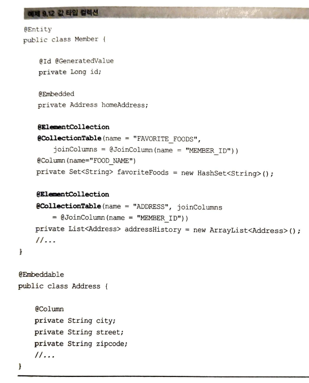
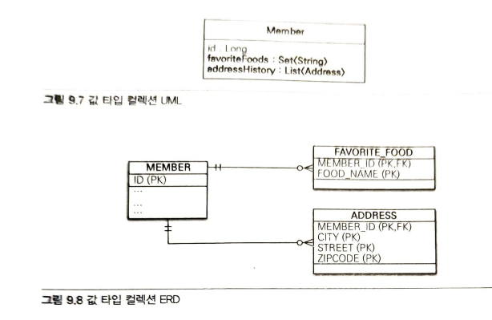

    - 값으로 사용되는 컬럼이 하나면( 위 예시에서 String 하나임) @Column으로 컬럼명을 지정할 수 있다.
    - 테이블 매핑정보는 @AttributeOverride를 사용해서 재정의 할수 있다.
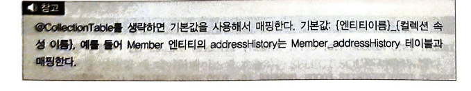

### 9.5.1 값 타입 컬렉션 사용
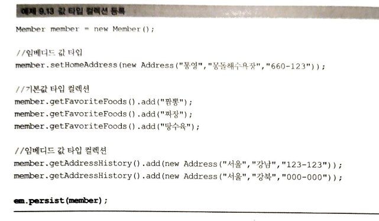
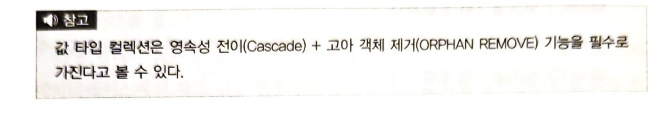
    
    - 값타입 컬렉션도 조회할때 패치 전략을 쓸 수 있고, Lazy가 기본이다.

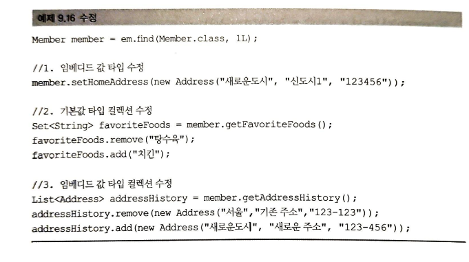

    
### 9.5.2 값 타입 컬렉션의 제약사항
    - 값 타입 컬렉션에 보관된 값들은 별도의 테이블에 보관된다. 따라서 여기에 보관된 값 타입의 값이 변경되면, 
    데이터베이스에 있는 원본데이터를 찾기 어렵다는 문제가 있다.
    - JPA 구현체들은 값타입 컬렉션에 변경사항이 발생하면, 값 타입 컬렉션이 맵핑된 테이블의 연관된 모든 데이터를 삭제하고,
    현재 값 타입 컬렉션에 있는 모든 값을 데이터베이스에 다시 저장한다.

    - 실무에서는 값 타입 컬렉션이 매핑된 테이블에 데이터가 많다면, 값타입 컬렉션 대신에 일대다 관계를 고려해야 한다.
    - 값 타입 컬렉션을 매핑하는 테이블은 모든 컬럼을 묶어서 기본키를 구성해야 한다. (데이터 베이스 기본키 제약조건으로 인해, 컬럼에 null을 입력할수 없고,
    같은 값을 중복 저장할 수 없다.
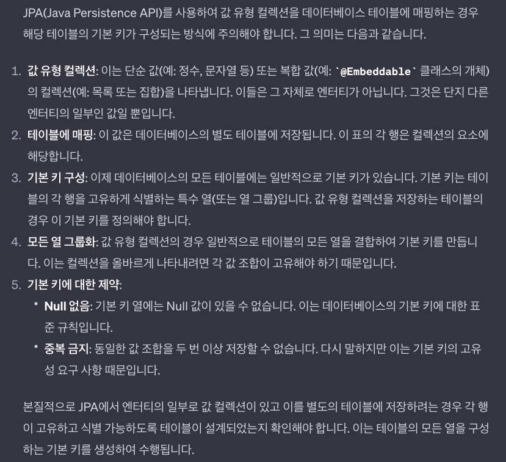
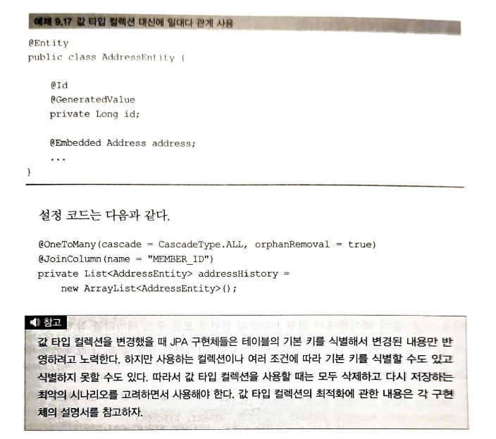
## 9.6 정리

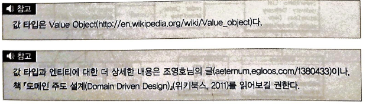
