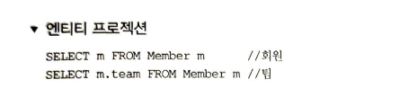
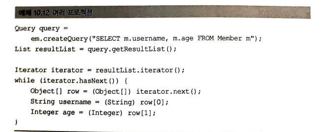
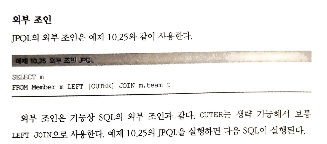
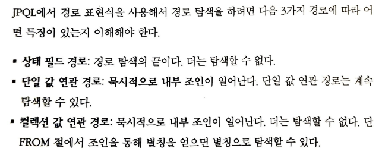
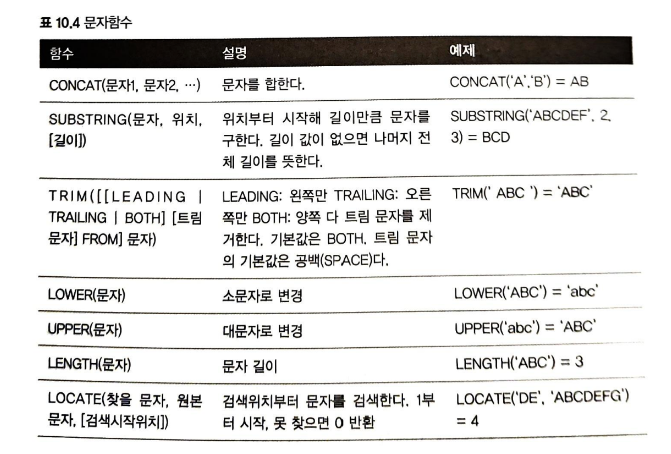

<!-- TOC -->
* [10. 객체지향쿼리언어](#10-객체지향쿼리언어)
  * [10.1 객체지향 쿼리 소개](#101-객체지향-쿼리-소개)
  * [10.2 JPQL](#102-jpql)
  * [10.3 Criteria](#103-criteria)
  * [10.4 QueryDSL](#104-querydsl)
  * [10.5 네이티브 SQL](#105-네이티브-sql)
  * [10.6 객체지향 쿼리 심화](#106-객체지향-쿼리-심화)
  * [10.7 정리](#107-정리)
<!-- TOC -->

# 10. 객체지향쿼리언어

## 10.1 객체지향 쿼리 소개
    - JPQL : 객체를 대상으로 검색하는 객체지향 쿼리이다. / SQL을 추상화해서 특정 DB SQL에 의존하지 않는다.
    - SQL이 DB 테이블을 대상으로 하는 데이터중심 쿼리라면, JPQL은 객체를 대상으로 하는 객체지향 쿼리이다.
    - JPA가 공식지원하는 검색방법
        1) JPQL  (Java Persistence Query Language)
        2) Criteria 쿼리 ( JPQL을 편하게 작성하도록 도와주는 API, 빌더 클래스)
        3) 네이티브 SQL : JPA에서 JPQL대신 직접 SQL을 사용할 수 있다.
    - JPA 공식지원은 아니지만 알아둬야 할 기능
        1) QueryDSL : JPQL을 편하게 작성하도록 도와주는 빌더 클래서, 비표준 오픈소스 프레임워크
        2) JDBC 직접사용 : MyBatis 같은 SQL mapper 프레임워크 사용
    - 가장 중요한 것은 JPQL이다. 나머지는 JPQL을 도와주는 것일뿐

### 10.1.1 JPQL 소개
    - JPQL은 SQL을 추상화해서 특정 데이터베이스에 의존하지 않는다.
    - JPQL은 SQL보다 간결하다.

### 10.1.2 Criteria  소개

    - JPQL을 생성하는 builder 이다.
    - criteria 의 장점은 프로그래밍 코드로 JPQL을 작성할 수 있다는 점이다. 
        -> 컴파일시점에 오류를 발견할수 있게 한다.
        -> IDE를 사용하면 코드 자동완성 지원
        -> 동적쿼리 작성이 편하다. 

    - 장점이 많지만, 복잡하고 장황하다는 단점이 있음 -> QueryDSL이 나옴

### 10.1.3 QueryDSL 소개

    - Criteria처럼 JPQL builder 역할을 한다.

    - QueryDSL도 어노테이션 프로세서를 사용해서 쿼리 전용 클래스를 만들어야 한다.

### 10.1.4 Native SQL 소개

    - JPA는 SQL을 직접 사용하는 기능을 제공하는데, 이를 네이티브 SQL이라고 한다.
    - 가끔은 특정 데이터베이스에 의존하는 기능을 사용해야 할때가 있다.
    ex) oracle DB에서만 사용하는 Connect By기능, 특정 DB에서만 동작하는 SQL 힌트 같은것.
    - SQL은 지원하지만, JPQL은 지원하지 않는 기능이 있다. 이때는 네이티브 SQL을 사용하면 된다.

### 10.1.5 JDBC 직접사용, MyBatis 같은 SQL mapper 프레임워크 사용

  
    - JDBC나 MyBatis를 JPA와 함께 사용하면 영속성 컨텍스트를 적절한 시점에 강제로 플러시 해야 한다.
    - JDBC를 직접사용하는 MyBatis 같은 SQL매퍼를 사용하든, 모두 JPA를 우회해서 데이터베이스에 접근한다.
    - 문제는 JPA를 우회하는 SQL에 대해서는 JPA가 전혀 인식하지 못한다는 점이다. 따라서, 최악의 경우 영속성 컨텍스트와
    데이터베이스를 불일치 상태로 만들어 데이터 무결성을 훼손할 수 있다.
    ex) 같은 트랜젝션 상에서, 영속성 컨텍스트에 있는 10000원짜리 상품은 --> 9000원 수정 후 플러시 하시 않음
     jpa 우회해서 상품가격 조회시 10000원으로 나옴

    - 해결책 : JPA우회해서 SQL 실행전에, 영속성 컨텍스트를 수동으로 플러시해서 db와 영속성 컨텍스트를 동기화 한다.

## 10.2 JPQL
    - 객체지향 쿼리언어, 엔티티 객체를 대상으로 한다, 특정 db sql에 의존하지 않는다, 결국 sql로 변환된다.
### 10.2.1 기본문법과 쿼리 API

#### SELECT문

    
    - 대소문자 구분 : 엔티티와 속성은 대소문자를 구분함 / SELECT, FROM, AS 같은 JPQL 키워드는 구분 안함
    - JPQL이 사용한 이름은 클래스 이름 x, Entity 이름임
    - @Entity(name = "XXX) 로 지정 안하면 클래스명을 기본값으로 사용한다. 
    - 별칭은 필수이다. 별칭없이 적으면 잘못된 문법
    (** HQL (Hibernate Query Language 사용시 안적어도 됌. 더 기능이 많음)

    
#### TypeQuery, Query
    - 반환타입을 명확히 지정할 수 있을때 : TypeQuery ---> 반환티입 : 지정한 타입
    - 반환타입을 명확히 지정할 수 없을때 : Query ---> 반환타입 : Object 타입

    - 타입변환이 필요없는 TypeQuery 사용하는게 편하다.
    - query.getResultList() : 결과가 없으면 빈 리스트가 반환된다.
    - query.getSingleResult() : 결과가 없으면 예외발생, 결과가 1개보다 많으면 예외발생

### 10.2.2 파라미터 바인딩

    - JDBC는 위치기준 바이딩만 지원하지만, JPQL은 이름 기준 파라미터 바인딩도 지원한다.

    - 이름 기준 파라미터

    - 위치 기준 파라미터

    - 파라미터 바인딩은 선택이 아닌 필수이다.
    - 파라미터 바인딩 방식을 사용하지 않고, 직접 문자를 더해 만들어 넣으면 악의적인 사용자에 의해 SQL injection 공격을 당할수  있다.(Q)

### 10.2.3 프로젝션

    - SELECT 절에 조회할 대상을 지정하는 것
    - 엔티티, 임베디드타입, 스칼라(숫자,문자) 타입 다 가능

  
    - 조회한 엔티티는 영속성 컨텍스트에서 관리된다.

    - 임베디드 타입은 조회의 시작점이 될수 없다.
    ( String query = "SELECT a FROM Address a") --> 에러남

    - 엔티티를 시작점으로 해서 찾아야 된다.

    - 스칼라타입검색은 위와 같이 한다.
    - 통계 쿼리로 주로 스칼라 타입으로 조회한다.

    - 프로젝션에 여러값을 선택하면 TypeQuery대신 Query를 사용해야 한다.

    - 위와 같이 반환받을 클래스를 지정해서 받으면 객체변환작업을 줄일수 있다.
    - 위와 같이 쓸때는 패키지 명을 포함한 전체 클래스명을 입력해야 한다.
    - 순서와, 타입이 일치하는 생성자가 필요하다.

### 10.2.4 페이징 API

  
    - FirstResult의 시작은 10이므로 11번째부터 시작해서 총 20건의 데이터를 조회한다.
    - 페이징 SQL을 더 최적화하고 싶다면 JPA가 제공하는 페이징 API가 아닌 네이티브 SQL을 직접 사용해야 한다.

### 10.2.5 집합과 정렬

    - 집합함수 사용시 주의할점
    1) null은 무시하므로, 통계에 잡히지 않는다.(distict 있어도 무시됨)
    2) 값이 없는데 sum, avg, max, min 하면 null 이 된다.
     단, count는 0이 된다.
    3) distict를 집합함수 안에서 사용해서 중복값을 제거하고 집합을 구할수 있다.

    4) dictict를 count에서 사용할때 임베디드 타입은 지원하지 않는다.

    - 통계쿼리는 보통 전체 데이터를 기준으로 처리하므로, 실시간으로 사용하기엔 부담이 많다. 통계 결과만 저장하는 테이블을 별도로 만들어두고 사용자가 적은 새벽에 통계 쿼리르 실행해서 결과를 보관하는 것이 좋다.

    - 정렬의 기본 디폴트는 ASC(오름차순)으로 되어 있음

### 10.2.6 JPQL 조인

  
    - JPQL은 JOIN 명령어 다음에 조인할 객체의 연관필드를 사용한다.

    - 위와 같이 조인하는 것은 잘못됨
    - JPQL은 JOIN명령어 다음에 조인할 객체의 연관필드를 사용한다.

    - 세타조인 : 내부조인만 지원한다. 전혀 관계없는 엔티티도 조인할 수 있다.
 

    - JPA 2.1부터 조인할때 ON절을 지원한다. 
    - 내부 조인의 ON 절은 WHERE 절 사용할때와 결과가 같으므로, 보통 ON절은 외부 조인에서만 사용한다.

### 10.2.7 페치 조인

    - JPQL에서 성능최적화를 위해 제공하는 기능
#### 엔티티 페치조인

    - 일반적인 JPQL 조인과는 다르게, m.team 다음에 별칭이 없는데
    , 페치조인은 별칭을 사용할 수 없다.(하이버네이트는 허용)
    - 위와 같이 회원엔티티만 선택했는데, 실행된 아래 SQL을 보면, 연관된 팀도 함께 조회된 것을 확인할 수 있다.

    - 회원을 조회할 때, 페치 조인을 사용해도 팀도 함께 조회했으므로, 연관된 팀 엔티티는 프록시가 아닌 실제 엔티티다.
    - 따라서 연관된 팀을 사용해도 지연로딩이 일어나지 않는다.
    - 프록시가 아닌 실제 엔티티이므로 회원 엔티티가 영속성 컨텍스트에서 분리되어 준영속 상태가 되어도 연관된 팀을 조회할 수 있다.
    
#### 컬렉션 페치조인

    
#### 페치조인과 Distinct
    - JPQL의 Distict 명령어는 SQL에 DISTINCT를 추가하는 것은 물론이고, 어플리케이션에서 한번 더 중복을 제거한다.(Q)
    - sql의 distinct 는 applicaton distinct는 다르다.

#### 페치조인과 일반조인의 차이

    - 일반조인에서 회원컬렉션은 위와 같이 조회되지 않는다.
    - JPQL은 결과를 반환할때, 연관관계까지 고려하지 않는다. 단지 SELECT 절에 지정한 엔티티만 조회할 뿐이다.

    - 페치조인을 사용하면 연관된 엔티티도 함께 조회한다.

#### 페치조인의 특징과 한계
<특징>

    - 페치조인은 SQL 한번으로 연관된 엔티티들 함께 조회할 수 있어서 SQL 호출횟수를 줄여 성능을 최적화 할 수 있다.
    - 엔티티에 직접 적용하는 전략을 글로벌 로딩전략이라 한다.(애플리케이션 전체에 영향을 준다.)

    - 페치조인은 글로벌 로딩전략보다 우선하기 때문에, 지연로딩 설정해도, 페치조인을 하면 작용한다.
    - 따라서, 전체 글로벌 로딩전략을 지연로딩으로 하고, 최적화가 필요한 부분을 페치조인을 적용하는 것이 효과적이다.
    - 페치조인을 사용하면 엔티티 엔티티를 쿼리 시점에 조회하므로, 지연로딩이 발생하지 않는다. 따라서 준영속상태에서도 객체그래프 탐색이 가능하다.

<한계>

    - 페치 조인 대상에는 별칭을 줄 수 없다. (하이버네이트는 지원한다. --> 별칭을 잘못 사용하면 연관 데이터 수가 달라져서 데이터 무결성이 깨질수 있으므로 조심해서 사용해야 한다.)

    - 둘이상의 컬렉션을 페치할 수 없다. 컬렉션의 카테시안 곱이 만들어지므로 주의해야 한다.
    - 컬렉션을 페치 조인하면, 페이징 API를 사용할 수 없다.
    - 단일값 연관필드(일대일, 다대일)은 페치 조인을 사용해도 페이징 API를 사용할 수 있다.
    - 페치조인은 객체 그래프를 유지할 때 사용하면 효과적이다.
    - 여러 테이블 조인해서 엔티티가 가진 모양이 아닌 전혀 다른 결과를 내야 한다면, 억지로 페치조인을 하는 것보다, 여러 테이블에서 필요한 필드만 조회해서 DTO로 반환하는 것이 효과적이다.

### 10.2.8 경로표현식

#### 경로표현식의 용어정리
    - 경로표현식 : .을 찍어 객체그래프 탐색 하는것

#### 경로표현식과 특징

    - 단일 값 연관 필드로 경로탐색을 하면 SQL에서 내부 조인이 일어나는데, 이것을 묵시적 조인이라 한다.
    - 묵시적 조인은 모두 내부조인이다.

    - 3번의 조인이 발생한다.
    - 임베디드 타입 접근은 단일값 연관경로 탐색이지만 주문테이블에 이미 포함되어 있으므로 조인이 발생하지 않는다.

    - JPQL을 다루면서 가장 많이 하는 실수 중 하나는 컬렉션 값에서 경로 탐색을 시도하는 것이다.
    - t.members.username 처럼 경로 탐색하는 것은 허락하지 않는다.

    - 컬렉션에서 경로탐색 하고 싶으면 조인을 사용해서 새로운 별칭을 획득해야 한다.
    - 컬렉션의 size를 사용하면 count 함수 사용하는 sql로 적절히 변환된다. 
#### 경로 탐색을 사용한 묵시적 조인시 주의사항

    - 항상 내부조인이다.
    - 컬렉션은 경로 탐색의 끝이다. 컬렉션에서 경로탐색을 하려면 명시적으로 조인을 해서 별칭을 얻어야 한다.
    - 경로 탐색은 주로 SELECT, WHERE절 에서 사용하지만 묵시적 조인으로 인해 SQL FROM 절에 영향을 준다.
    - 성능이 중요하다면 분석하기 쉽도록 묵시적 조인보다는 명시적 조인을 사용하자.

### 10.2.9 서브쿼리
    
    - JPQL의 서비쿼리는 WHERE, HAVING 절에서만 사용할수 있고, SELECT, FROM 절에서는 사용할 수 없다.(하이버 네이트는 가능)
#### 서브쿼리함수

### 10.2.10 조건식

  
    - a,b는 포함된다.(between)

    - %는 값이 없어도 된다.

    - null은 == 비교가 안되고, IS NULL을 사용해야 한다.
#### 컬렉션 식

#### 스칼라식

#### 케이스식

### 10.2.11 다형성 쿼리

    - JPQL로 부모 엔티티를 조회하면 그 자식 엔티티도 함께 조회한다.
#### JOIN 전략

#### TYPE
    - 상속 구조에서 조회 대상을 특정 자식 타입으로 한정할때 사용

#### TREAT(JPA2.1)
    - 자바의 타입캐스팅과 비슷
    - 상속구조에서 부모 타입을 특정 자식타입으로 다룰때 사용
    - 하이버네이트는 SELECT절에서도 TREAT를 사용할수 있다.

### 10.2.12 사용자정의함수 호출(JPA 2.1)
### 10.2.13 기타 정리
### 10.2.14 엔티티 직접 사용
### 10.2.15 Named 쿼리 : 정적 쿼리

## 10.3 Criteria
### 10.3.1 Criteria 기초
### 10.3.2 Criteria 쿼리생성
### 10.3.3 조회
### 10.3.4 집합
### 10.3.5 정렬
### 10.3.6 조인
### 10.3.7 서브쿼리
### 10.3.8 IN 식
### 10.3.9 CASE 식
### 10.3.10 파라미터 정의
### 10.3.11 네이티브 함수 호출
### 10.3.12 동적 쿼리
### 10.3.13 함수 정리
### 10.3.14 Criteria 메타 모델 API

## 10.4 QueryDSL
### 10.4.1 QueryDSL 설정
### 10.4.2 시작
### 10.4.3 검색 조건 쿼리
### 10.4.4 결과 조회
### 10.4.5 페이징과 정렬
### 10.4.6 그룹
### 10.4.7 조인
### 10.4.8 서브쿼리
### 10.4.9 프로젝션과 결과반환
### 10.4.10 수정,삭제,배치 쿼리
### 10.4.11 동적쿼리
### 10.4.12 메소드 위임
### 10.4.13 QueryDSL 정리

## 10.5 네이티브 SQL
### 10.5.1 네이티브 SQL 사용
### 10.5.2 Named 네이티브 SQL
### 10.5.3 네이티브 SQL XML 정의
### 10.5.4 네이티브 SQL 정리
### 10.5.5 스토어드 프로시저(JPA 2.1)

## 10.6 객체지향 쿼리 심화
### 10.6.1 벌크 연산
### 10.6.2 영속성 컨텍스트와 JPQL
### 10.6.3 JPQL과 플러시 모드

## 10.7 정리
