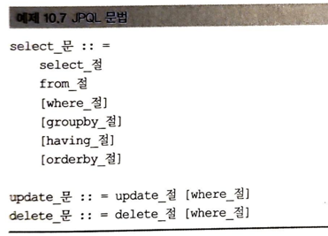
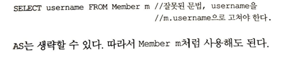

<!-- TOC -->
* [10. 객체지향쿼리언어](#10-객체지향쿼리언어)
  * [10.1 객체지향 쿼리 소개](#101-객체지향-쿼리-소개)
  * [10.2 JPQL](#102-jpql)
  * [10.3 Criteria](#103-criteria)
  * [10.4 QueryDSL](#104-querydsl)
  * [10.5 네이티브 SQL](#105-네이티브-sql)
  * [10.6 객체지향 쿼리 심화](#106-객체지향-쿼리-심화)
  * [10.7 정리](#107-정리)
<!-- TOC -->

# 10. 객체지향쿼리언어

## 10.1 객체지향 쿼리 소개
    - JPQL : 객체를 대상으로 검색하는 객체지향 쿼리이다. / SQL을 추상화해서 특정 DB SQL에 의존하지 않는다.
    - SQL이 DB 테이블을 대상으로 하는 데이터중심 쿼리라면, JPQL은 객체를 대상으로 하는 객체지향 쿼리이다.
    - JPA가 공식지원하는 검색방법
        1) JPQL  (Java Persistence Query Language)
        2) Criteria 쿼리 ( JPQL을 편하게 작성하도록 도와주는 API, 빌더 클래스)
        3) 네이티브 SQL : JPA에서 JPQL대신 직접 SQL을 사용할 수 있다.
    - JPA 공식지원은 아니지만 알아둬야 할 기능
        1) QueryDSL : JPQL을 편하게 작성하도록 도와주는 빌더 클래서, 비표준 오픈소스 프레임워크
        2) JDBC 직접사용 : MyBatis 같은 SQL mapper 프레임워크 사용
    - 가장 중요한 것은 JPQL이다. 나머지는 JPQL을 도와주는 것일뿐

### 10.1.1 JPQL 소개
    - JPQL은 SQL을 추상화해서 특정 데이터베이스에 의존하지 않는다.
    - JPQL은 SQL보다 간결하다.

### 10.1.2 Criteria  소개

    - JPQL을 생성하는 builder 이다.
    - criteria 의 장점은 프로그래밍 코드로 JPQL을 작성할 수 있다는 점이다. 
        -> 컴파일시점에 오류를 발견할수 있게 한다.
        -> IDE를 사용하면 코드 자동완성 지원
        -> 동적쿼리 작성이 편하다.

    - 장점이 많지만, 복잡하고 장황하다는 단점이 있음 -> QueryDSL이 나옴

### 10.1.3 QueryDSL 소개

    - Criteria처럼 JPQL builder 역할을 한다.

    - QueryDSL도 어노테이션 프로세서를 사용해서 쿼리 전용 클래스를 만들어야 한다.

### 10.1.4 Native SQL 소개

    - JPA는 SQL을 직접 사용하는 기능을 제공하는데, 이를 네이티브 SQL이라고 한다.
    - 가끔은 특정 데이터베이스에 의존하는 기능을 사용해야 할때가 있다.
    ex) oracle DB에서만 사용하는 Connect By기능, 특정 DB에서만 동작하는 SQL 힌트 같은것.
    - SQL은 지원하지만, JPQL은 지원하지 않는 기능이 있다. 이때는 네이티브 SQL을 사용하면 된다.

### 10.1.5 JDBC 직접사용, MyBatis 같은 SQL mapper 프레임워크 사용

  
    - JDBC나 MyBatis를 JPA와 함께 사용하면 영속성 컨텍스트를 적절한 시점에 강제로 플러시 해야 한다.
    - JDBC를 직접사용하는 MyBatis 같은 SQL매퍼를 사용하든, 모두 JPA를 우회해서 데이터베이스에 접근한다.
    - 문제는 JPA를 우회하는 SQL에 대해서는 JPA가 전혀 인식하지 못한다는 점이다. 따라서, 최악의 경우 영속성 컨텍스트와
    데이터베이스를 불일치 상태로 만들어 데이터 무결성을 훼손할 수 있다.
    ex) 같은 트랜젝션 상에서, 영속성 컨텍스트에 있는 10000원짜리 상품은 --> 9000원 수정 후 플러시 하시 않음
     jpa 우회해서 상품가격 조회시 10000원으로 나옴

    - 해결책 : JPA우회해서 SQL 실행전에, 영속성 컨텍스트를 수동으로 플러시해서 db와 영속성 컨텍스트를 동기화 한다.

## 10.2 JPQL
    - 객체지향 쿼리언어, 엔티티 객체를 대상으로 한다, 특정 db sql에 의존하지 않는다, 결국 sql로 변환된다.
### 10.2.1 기본문법과 쿼리 API

#### SELECT문

    
    - 대소문자 구분 : 엔티티와 속성은 대소문자를 구분함 / SELECT, FROM, AS 같은 JPQL 키워드는 구분 안함
    - JPQL이 사용한 이름은 클래스 이름 x, Entity 이름임
    - @Entity(name = "XXX) 로 지정 안하면 클래스명을 기본값으로 사용한다. 
    - 별칭은 필수이다. 별칭없이 적으면 잘못된 문법
    (** HQL (Hibernate Query Language 사용시 안적어도 됌. 더 기능이 많음)

    
#### TypeQuery, Query
    - 반환타입을 명확히 지정할 수 있을때 : TypeQuery
    - 반환타입을 명확히 지정할 수 없을때 : Query 

#### SELECT문
### 10.2.2 파라미터 바인딩
### 10.2.3 프로젝션
### 10.2.4 페이징 API
### 10.2.5 집합과 정렬
### 10.2.6 JPQL 조인
### 10.2.7 페치 조인
### 10.2.8 경로표현식
### 10.2.9 서브쿼리
### 10.2.10 조건식
### 10.2.11 다형성 쿼리
### 10.2.12 사용자정의함수 호출(JPA 2.1)
### 10.2.13 기타 정리
### 10.2.14 엔티티 직접 사용
### 10.2.15 Named 쿼리 : 정적 쿼리

## 10.3 Criteria
### 10.3.1 Criteria 기초
### 10.3.2 Criteria 쿼리생성
### 10.3.3 조회
### 10.3.4 집합
### 10.3.5 정렬
### 10.3.6 조인
### 10.3.7 서브쿼리
### 10.3.8 IN 식
### 10.3.9 CASE 식
### 10.3.10 파라미터 정의
### 10.3.11 네이티브 함수 호출
### 10.3.12 동적 쿼리
### 10.3.13 함수 정리
### 10.3.14 Criteria 메타 모델 API

## 10.4 QueryDSL
### 10.4.1 QueryDSL 설정
### 10.4.2 시작
### 10.4.3 검색 조건 쿼리
### 10.4.4 결과 조회
### 10.4.5 페이징과 정렬
### 10.4.6 그룹
### 10.4.7 조인
### 10.4.8 서브쿼리
### 10.4.9 프로젝션과 결과반환
### 10.4.10 수정,삭제,배치 쿼리
### 10.4.11 동적쿼리
### 10.4.12 메소드 위임
### 10.4.13 QueryDSL 정리

## 10.5 네이티브 SQL
### 10.5.1 네이티브 SQL 사용
### 10.5.2 Named 네이티브 SQL
### 10.5.3 네이티브 SQL XML 정의
### 10.5.4 네이티브 SQL 정리
### 10.5.5 스토어드 프로시저(JPA 2.1)

## 10.6 객체지향 쿼리 심화
### 10.6.1 벌크 연산
### 10.6.2 영속성 컨텍스트와 JPQL
### 10.6.3 JPQL과 플러시 모드

## 10.7 정리
