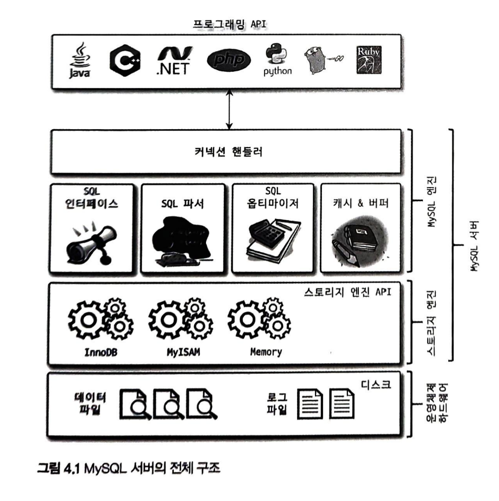
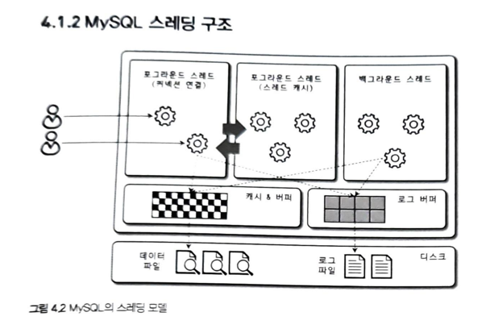
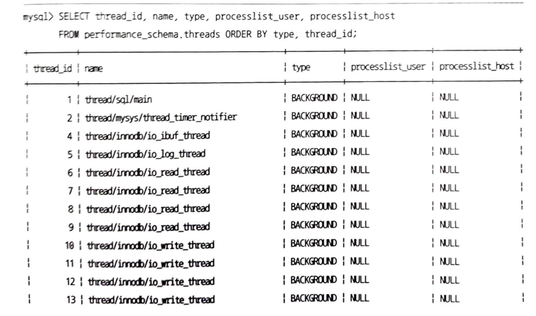
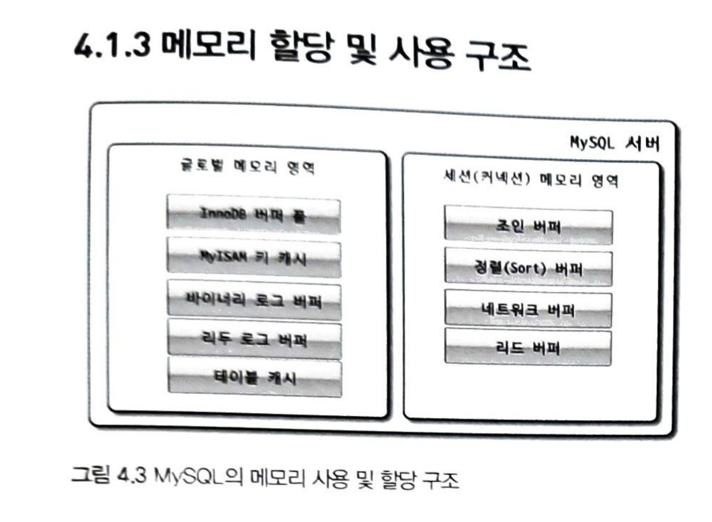
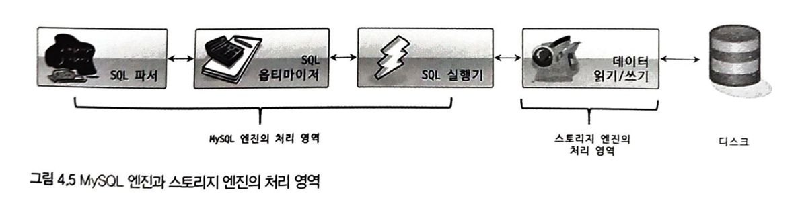
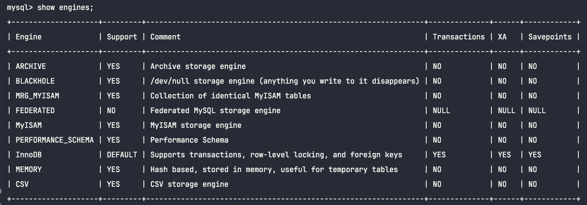
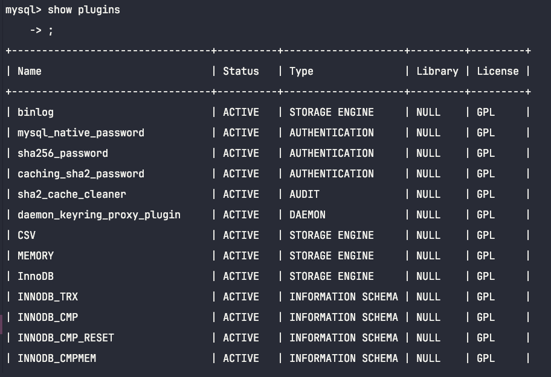
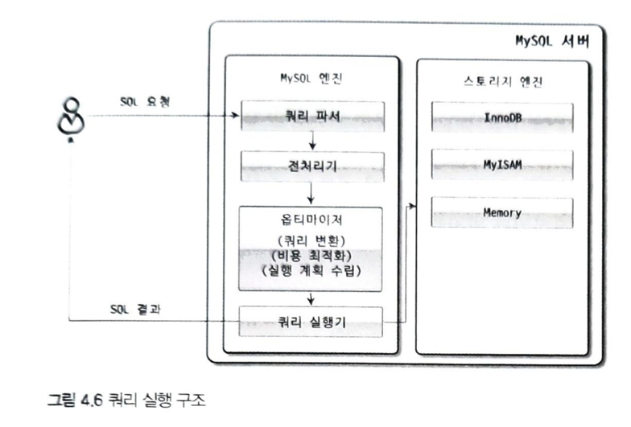

# 4.1 MySQL 엔진 아키텍처
## 4.1.1 MySQL의 전체구조

### 4.1.1.1 MySQL 엔진
    - MySQL은 표준 문법을 지원하기 때문에 표준 문법에 따라 작성된 쿼리는 타 DBMS와 호환되어 실행될 수 있다.
### 4.1.1.2 스토리지 엔진
    - 실제 데이터를 디스크 스토리지에 저장, 읽어오는 부분
    - 여러개를 동시에 사용가능 (MySQL 엔진은 하나)
    - mysql> CREATE TABLE test_table (fd1 INT, fd2 INT) ENGINE=INNODB;
        --> InnoDB storage Engine 쓰도록 하고 있다.
    - 각 스토리지 엔진은 성능향상위해 키캐시(MyISAM 스토리지엔진)이나, 버퍼풀(InnoDB)같은 기능을 내장하고 있다.
### 4.1.1.3 핸들러 API
    - 핸들러 API : 각 스토리지 엔진에 쓰기, 읽기 요청하는 하기 위해 사용
    - SHOW GLOBAL STATUS LIKE 'Handler%';
        ---> 얼마나 많은 데이터 작업이 있었는지 확인하는 명령어
## 4.1.2 MySQL 스레딩 구조

    - MySQL 서버는 프로세스 기반이 아니라 스레드 기반으로 작동한다.

    - 서버에서 실행중인 스레드 목록을 확인할 수 있다.
### 4.1.2.1 포그라운드 스레드(클라이언트 스레드)
    - 포그라운드 스레드는 최소한 SQL 서버에 접속한 클라이언트 수만큼 존재한다.
    - 스레드캐시에 유지할 수 있는 최대 스레드 개수는 thread_cache_size 시스템 변수로 설정한다.
    - MyISAM : 디스크 쓰기 작업까지 모두 포그라운드 스레드가 처리
    - InnoDB : 버퍼나 캐시까지만 포그라운드가 처리하고, 너머지 버퍼로부터 디스크 기록 작업은 백그라운드 스레드가 처리
### 4.1.2.2 백그라운드 스레드
    - InnoDB 의 여러 작업이 처리됨
        ex) 인서트 버퍼 병합 스레드, 로그 디스크로 기록하는 스레드, InnoDB 버퍼풀 데이터를 디스크에 기록하는 스레드,
            데이터 버퍼로 읽어오는 스레드, 잠금이나 데드락 모니터링 하는 스레드
    - InnoDB의 쓰기 작업을 주로 백그라운드 스레드에서 하기 때문에, 내장디스크 사용시 2~4, DAS나 SAN 같은 스토리지 사용시
      디스크 최적화 할 수 있을 정도로 충분히 설정하는 것이 좋다.
    - 사용자 요청처리 도중 데이터 쓰기 작업은 지연(버퍼링) 될수 있지만, 읽기는 절대 지연될수 없다.
    - InnoDB에서는 INSERT, UPDATE, DELETE 쿼리로 데이터 변경되는 경우, 데이터가 디스크의 데이터 파일로 완전히 저장될때
      까지 기다리지 않아도 된다.(MyISAM 에서는 일반적 쿼리는 쓰기 버퍼링 사용할수 없다.)
## 4.1.3 메모리 할당 및 사용 구조
    
    - 글로벌 메모리영역과 로컬 메모리 영역이 있음
    - 글로벌 메모리 영역의 모든 공간은 MYSQL 서버가 시작되면서 운영체제로 부터 할당됨
    - 단순하게 MySQL 시스템 변수로 설정해 둔 만큼 운영체제로부터 메모리를 할당받는다고 생각해도 됨

### 4.1.3.1 글로벌 메모리 영역
    - 클라이언트 스레드 수와 무관하게 하나의 메모리 공간만 할당됨 (두개이상 받더라도 클라이언트 스레드 수와는 무관하다.)
    - 모든 스레드에 의해 공유됨
    - ex) 테이블캐시, InnoDB 버퍼풀, InnoDB 어댑티브 해시 인덱스, InnoDB 리두 로그 버퍼
### 4.1.3.2 로컬 메모리 영역
    - 클라이언트 스레드가 쿼리를 처리하는데 사용하는 메모리 영역
    - ex) 정렬버퍼, 조인버퍼, 바이너리 로그캐시, 네트워크 버퍼
    - 클라이언트 메모리영역, 세션 메모리 영역(클라이언트와 MySQL 서버와의 커넥션이 세션이므로)으로 불림
    - 스레드별로 독립적으로 할당되며 절대 공유되지 않는다.
## 4.1.4 플러그인 스토리지 엔진 모델
    - 전문 검색엔진을 위한 검색어파서, 사용자 인증을 위한 Caching SHA-2 Authentication 등도 모두 플러그인으로 구현되어 제공된다.

    - 마지막 데이터 읽기/쓰기 작업만 스토리지 엔진에 의해 처리된다.
    - MySQL 엔진이 스토리지 엔진을 조정하기 위해 핸들러 라는 것을 사용한다.(스토리지 엔진의 데이터를 조작하려면 반드시 핸들러를 통해야 한다.)
    - MyISAM 과 InnoDB는 데이터의 읽기/쓰기 영역의 차이만 있을 뿐이다.
    - 하나의 쿼리작업은 여러 하위 작업으로 나뉘는데, 각 하위 작업이 MySQL엔진영역에서 처리되는지 스토리지 영역에서 처리되는지 구분할 줄 알아야 한다.

    - mysql> SHOW ENGINES; 
    - Yes : 해당 스토리지 엔진포함, 활성화됨
    - Default : 필수 스토리지 엔진임
    - No : 현재 MySQL 서버에 포함되지 않았음을 의미함
    - DISABLEED : 파라미터에 의해 비활성화 된 상태임

    - mysql>show plugins;

## 4.1.5 컴포넌트
    - 플러그인이 구려서 나옴
    - 1) 오직 mysql 서버랑만 통신, 플러그인끼리 통신안됨 2) mysql 서버의 변수나 함수를 직접 호출하므로 안전하지 않음(캡슐화 안됨) 
         3) 상호 의존관계 설정 할 수 없어서 초기화 어려움
    - mysql>INSTALL COMPONENT 'file://component_validate_password';

## 4.1.6 쿼리 실행 구조

    - 쿼리파서 : 사용자 요청으로 들어온 쿼리 문장을 토큰(MySQL이 인식할 수 있는 최소 단위의 어휘나 기호)으로 분리해 트리 형태의 구조로 만들어
            내는 것을 의미한다.
    - 전처리기 : 쿼리문장의 구조적 문제 없는지 확인, 객체의 존재여부, 접근권한 등을 확인
    - 옵티마이저 : DMBS의 두뇌, 비용최적화
    - 실행 엔진 : 만들어진 계획대로 각 핸들러에게 요청해서 받은 결과를 또 다른 핸들러 요청의 입력으로 연결하는 역할을 한다.
    - 핸들러(스토리지엔진) : MySQL 서버의 가장 밑단에서 MySQL 실행 엔진의 요청에 따라 데이터를 디스크로 저장하고 읽어오는 역할을 함.
## 4.1.7 복제
    - 16장에서 자세히 살펴봄
## 4.1.8 쿼리 캐시
    - mysql 8.0에서 제거된 기능( 심각한 동시처리 성능 저하 이슈 때문에)
## 4.1.9 스레드 풀
    - Percona Server 에서 스레드 풀 라이브러리를 mysql 커뮤니티 서버에 설치해서 사용 가능
    - 일반적으로는 cpu의 코어 개수와 맞추는 것이 cpu 프로세서 친화도를 높이는데 좋다.
    - Percona Server의 스레드 풀 플러그인은 선순위 큐와 후순위 큐를 이용해 특정 트랙잭션이나 쿼리를 우선 처리하는 기능도 제공
## 4.1.10 트랙젠션 지원 메타데이터
    - mysql> show create table information_schema.tables;
    - MySQL 8.0 부터 데이블 구조정보, 스토어드 프로그램 코드 관련정보는 InnoDB에 저장하도록 개선되었다.
    - mysql DB는 통째로 mysql.ibd라는 테이블 스페이스에 저장됨
    - MyISAM 이나 CSV 스토리지 엔진의 메타정보는 여전히 저장할 공간이 필요하고, 이를 위해 SDI(Serialized DIctionary Infomation)을 사용한다.
    - SDI 는 직렬화를 위한 포맷임

