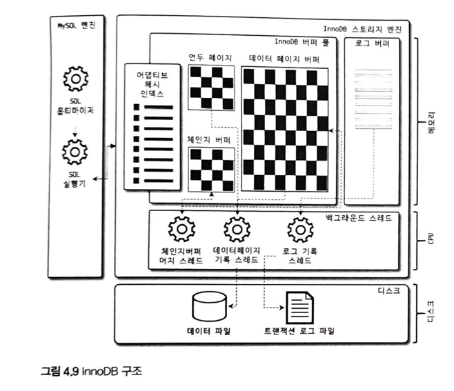
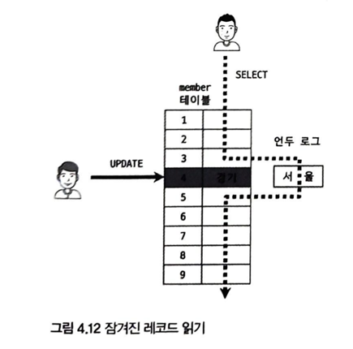

# 4.2 InnoDB 스토리지 엔진 아키텍쳐

    - 유일하게 레코드 기반의 잠금을 제공함 
    - 높은 동시성 처리가 가능하고, 안정적이며 성능이 뛰어나다.
## 4.2.1 프라이머리 키에 의한 클러스터링
    - issue[화면이 안보임]
### 4.2.2 외래키 지원
    - InnoDB 스토리지 엔진레벨에서 지원하는 기능( MyISAM, MEMORY 테이블에서는 사용할수 없다.)
    - 서비스용 데이터베이스에서는 자주 사용하지 않지만, 개발 환경 데이터베이스에서는 좋은 가이드 역할을 해줌
    - mysql>SET foreign key checks=off;
    - mysql>SET foreign key checks=on;
    - foregin_key_ckecks 가 비활성화되면 외래키 관계의 부모 테이블에 대한 작업(on delte cascade,
        on update cascade 옵션)도 무시하게 된다.

### 4.2.3 MVCC(Multi Version Concurrency Control)
    - 레코드 레벨의 트랜잭션을 지원하는 DBMS가 제공하는 기능
    - 가장 큰 목적은 잠금을 사용하지 않는 일관된 읽기 제공
    - InnoDB undo log 도 이 기능을 통해 구현됨.
### 4.2.4 잠금없는 일관된 읽기(Non-Locking Consistent Read)
    - 잠금을 걸지 않기 때문에 InnoDB에서 읽기 작업은 다른 트랜잭션이 가지고 있는 잠금을 기다리지 않고, 읽기 작업이 가능하다.

### 4.2.5 자동 데드락 감지
### 4.2.6 자동화된 장애 복구
### 4.2.7 InnoDB 버퍼 풀
#### 4.2.7.1 버퍼풀의 크기 설정
#### 4.2.7.2 버퍼풀의 구조
#### 4.2.7.3 버퍼풀과 리두 로그
#### 4.2.7.4 버퍼 풀 플러시
##### 4.2.7.4.1 플러시 리스트 플러시
##### 4.2.7.4.2 LRU 리스트 플러시
#### 4.2.7.5 버퍼 풀 상태 백업 및 복구
#### 4.2.7.6 버퍼 풀의 적재 내용 확인
### 4.2.8 Double Write Buffer
### 4.2.9 언두 로그
#### 4.2.9.1 언두 로그 레코드 모니터링
#### 4.2.9.2 언두 테이블스페이스 관리
#### 4.2.10 체인지 버퍼
### 4.2.11 리두 로그 및 로그 버퍼
#### 4.2.11.1 리두 로그 아카이빙
#### 4.2.11.2 리두 로그 활성화 및 비활성화
### 4.2.12 어댑티브 해시 인덱스 
### 4.2.13 InnoDB와 MyISAM, MEMORY 스토리지 엔진 비교
