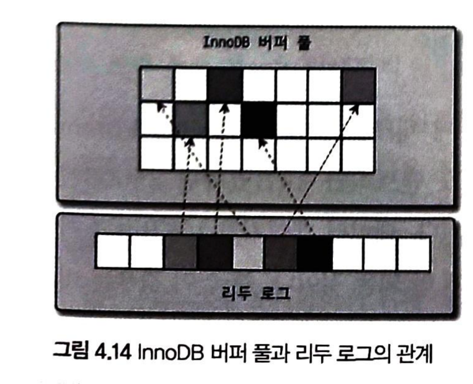

# 4.2 InnoDB 스토리지 엔진 아키텍쳐

    - 유일하게 레코드 기반의 잠금을 제공함 
    - 높은 동시성 처리가 가능하고, 안정적이며 성능이 뛰어나다.
## 4.2.1 프라이머리 키에 의한 클러스터링
    - issue[화면이 안보임]
### 4.2.2 외래키 지원
    - InnoDB 스토리지 엔진레벨에서 지원하는 기능( MyISAM, MEMORY 테이블에서는 사용할수 없다.)
    - 서비스용 데이터베이스에서는 자주 사용하지 않지만, 개발 환경 데이터베이스에서는 좋은 가이드 역할을 해줌
    - mysql>SET foreign key checks=off;
    - mysql>SET foreign key checks=on;
    - foregin_key_ckecks 가 비활성화되면 외래키 관계의 부모 테이블에 대한 작업(on delte cascade,
        on update cascade 옵션)도 무시하게 된다.

### 4.2.3 MVCC(Multi Version Concurrency Control)
    - 레코드 레벨의 트랜잭션을 지원하는 DBMS가 제공하는 기능
    - 가장 큰 목적은 잠금을 사용하지 않는 일관된 읽기 제공
    - InnoDB undo log 도 이 기능을 통해 구현됨.
### 4.2.4 잠금없는 일관된 읽기(Non-Locking Consistent Read)
    - 잠금을 걸지 않기 때문에 InnoDB에서 읽기 작업은 다른 트랜잭션이 가지고 있는 잠금을 기다리지 않고, 읽기 작업이 가능하다.

### 4.2.5 자동 데드락 감지
    - InnoDB 스토리지 엔진은 내부적으로 잠금이 교착 상태에 빠지지 않았는지 체크하기 위해 잠금 대기 목록을 그래프 형태로 관리한다.
    - 데드락 감지 스레드가 주기적으로 잠금 대기 그래프를 검사해 교착 상태에 빠진 트랙잭션을 찾아내 강제 종료시킨다.
    - 기준은 트랙젝션의 언두 로그 양이며ㅡ 언두 로그 레코드를 더 적게 가진 트랙재개션이 일반적으로 롤백의 대상이 된다.
    - 특별한 이유가 없다면, innodb_table_locks를 활성화하자.
    - 동시처리 스레드가 매우 많은 경우 데드락 감지 스레드는 더 많은 cpu자원을 소모 할 수 있다.
        --> 이를 해결하기 위해 innodb_deadlock_detect 변수를 제공하며, 이를 off 설정하면 데드락 감지 스레드는 동작을 멈춘다.
    - 그러나 데드락 상황이 발생하면 중재자가 없어 무한히 대기하게 되므로, innodb_lock_wait_timeout을 기본값인 50초보다 낮은 시간으로 변경하여 
      사용할 것을 권장한다.
### 4.2.6 자동화된 장애 복구
    - InnoDB에는 장애, 손실로 부터 데이터 보호하기 위한 여러 매커니즘이 탑재됨
    - InnoDB는 기본적으로 서버가 시작될때 항상 자동복구를 수행함
    - 자동으로 복구할수 없는 손상이 있으면 MySQL을 종료시켜 버림
    - innodb_force_recovery 시스템 변수를 설정해서 MySQL 서버를 시작해야 한다.
    - 어떤부분이 문제인지 알수 없으면 innodb_force_recovery 값을 1~6까지 변경해가면서 mysql을 재시작해본다.
    - innodb_force_recovery 값이 커질수록 심각한 상황. 손실 가능성 커지고 복구 가능성 낮아짐
    - 서버 가동이 된다면, mysqldump를 이용해 데이터를 가능한 만큼 백업하고 그 데이터로 MySQL 서버의 DB와 테이블을 다시 생성하는 것이 좋다.
    - p106 숫자별 복구장애상황과 해결방법 참조
### 4.2.7 InnoDB 버퍼 풀
    - InnoDB 스토리지 엔진에서 가장 핵심적인 부분으로 디스크의 데이터 파일이나 인덱스 정보를 메모리에 캐시해두는 공간.
    - 쓰기작업을 지연시켜 일괄 작업으로 처리해주는 버퍼역할도 같이 함.
#### 4.2.7.1 버퍼풀의 크기 설정
    - 운영체제와 각 클라이언트 스레드가 사용할 메모리도 충분히 고려해서 설정해야 함.
    - MySQL 5.7 버전부터는 InnoDB 버퍼 풀의 크기를 동적으로 조절할 수 있게 개선됐다.
    - 전체메모리 공간이 8GB 미만이라면 50% 정도만 InnoDB 버퍼 풀로 설정하고 나머지 공간은 MySQL 서버와 운영체제, 타프로그램 사용공간 확보
    - 전체 메모리 공간이 50GB 이상이면, 15~30 GB를 운영체제, 타 응용프로그램을 위해 남기고 나머지를 버퍼풀로 할당.
    - 버퍼풀의 크기 변경은 크리티컬한 변경이므로 가능하면 MySQL 서버가 한가한 시점을 골라서 진행하는 것이 좋다.
    - 가능하면 버퍼풀 줄이는 작업은 하지 않는것이 좋다.
    - InnoDB 버퍼 풀은 내부적으로 128MB 청크 단위로 쪼개어 관리된다.
#### 4.2.7.2 버퍼풀의 구조
    - InnoDB 스토리지 엔진은 버퍼 풀이라는 거대한 메모리 공간을 페이지 크기(innodb_page_size)로 쪼개어 InnoDB 스토리지 엔진이 데이터를
      필요로 할때 해당 데이터 페이지를 읽어서 각 조각에 저장한다.
    - LRU, Flush, Free 리스트 라는 3개의 자료구조를 관리한다.
    - LRU 리스트를 관리하는 목적은 디스크로부터 한번 읽어온 페이지를 최대한 오랫동안 InnoDB 버퍼풀의 메모리에 유지해서 디스크 읽기를 최소화 하는 것이다.
    - 데이터가 변경되면 InnoDB는 변경 내용을 리두 로그에 기록하고 버퍼 풀의 데이터 페이지에도 변경 내용을 반영한다.
#### 4.2.7.3 버퍼풀과 리두 로그
    - 버퍼풀은 클린페이지(디스크에서 일은 상태에서 변경이 전혀 되지않은) , 더티페이지(insert, update, delete 명령으로 변경된 데이터) 모두 가지고 있다.
    - 더티 페이지는 버퍼 풀에 무한정 머무를 수 있는 것은 아니다.
    - InnoDB 스토리지 엔진은 전체 리두 로그 파일에서 재사용 가능한 공간과 당장 재사용 불가능한 공간을 구분해서 관리해야 하는데, 재사용 불가능한 공간을 
      활성 리두로그 라고 한다.

#### 4.2.7.4 버퍼 풀 플러시
    - MySQL 8.0 버전으로 업그레이드되면서 대부분의 서비스에서는 더티 페이지를 디스크에 동기화 하는 부분에서 예전처럼 디스크 폭증현상은 없어짐.
    - 더티 페이지들을 성능상 악영향 없이 디스크에 동기화 하기 위해 2개의 플러시 기능을 백그라운드로 실행한다.(플러시 리스트 플러시, LRU 리스트 플러시)
##### 4.2.7.4.1 플러시 리스트 플러시

##### 4.2.7.4.2 LRU 리스트 플러시
#### 4.2.7.5 버퍼 풀 상태 백업 및 복구`
#### 4.2.7.6 버퍼 풀의 적재 내용 확인
### 4.2.8 Double Write Buffer
### 4.2.9 언두 로그
#### 4.2.9.1 언두 로그 레코드 모니터링
#### 4.2.9.2 언두 테이블스페이스 관리
#### 4.2.10 체인지 버퍼
### 4.2.11 리두 로그 및 로그 버퍼
#### 4.2.11.1 리두 로그 아카이빙
#### 4.2.11.2 리두 로그 활성화 및 비활성화
### 4.2.12 어댑티브 해시 인덱스 
### 4.2.13 InnoDB와 MyISAM, MEMORY 스토리지 엔진 비교
