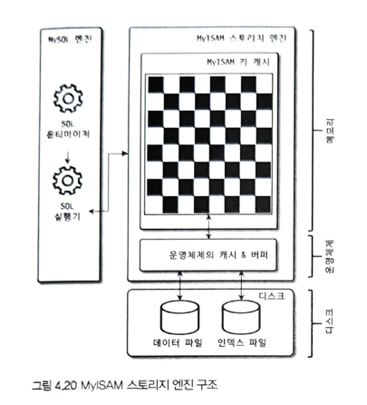

## 4.3 MyISAM 스토리지 엔진 아키텍처

### 4.3.1 키 캐시
    - InnoDB의 버퍼 풀과 비슷한 역할을 하는것이다.
    - 인덱스만 대상으로 작동한다.
    - mysql> SHOW GLOBAL STATUS LIKE 'Key%';
    - 매뉴얼에서는 일반적으로 캐시를 이용한 쿼리 비율을 99% 이상으로 유지하라고 권장하며, 히트율이 99% 미만이라면 키 캐시를 조금 더 크게 설정하는게 좋다.
### 4.3.2 운영체제의 캐시 및 버퍼
    - MyISAM 테이블의 데이터 읽기나 쓰기 작업은 항상 운영체제의 디스크 읽기, 쓰기 작업으로 요청될수 밖에 없다. 왜나하면,
      MyISAM 테이블의 데이터에 대해서는 디스크로부터 I/O를 해결해 줄만한 캐시나, 버퍼링 기능을 MyISAM 스토리지 엔진이 가지고 있지 않기 때문이다.
    - 운영체제의 캐시 공간은 남는 메모리를 사용하는 것이 원칙이다. ( 최대 물리 메모리의 40% 넘지 않게 설정한다.)
### 4.3.3 데이터 파일과 프라이머리 키(인텍스) 구조
    - 프라이머리에 대한 클러스터링 없이 데이터 파일이 힙(heap)공간처럼 활용된다.
    - 프라이머리 키 값과 무관하게 insert 되는 순서대로 데이터파일에 저장된다.
    - 고정길이 rowID : max_rows 옵션을 명시하면, mysql 서버는 최대로 가질수 있는 레코드가 한정된 테이블을 생성한다.
    - 가변길이 rowID : max_rows 옵션이 명시되지 않은 MyISAM 테이블의 최대 크기는 256TB
        
