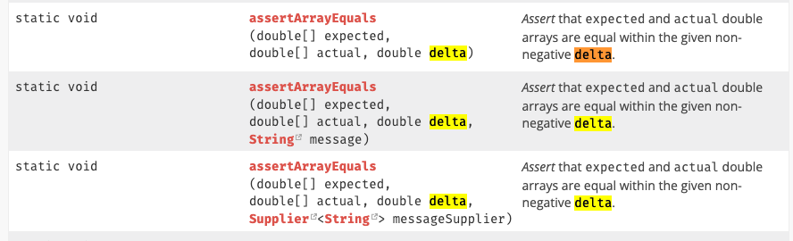

- 스프링부트로 기본세팅하면 Junit5 default로 세팅됨
- delta 값으로 받는 값은 오차가 있는 경우에 적용됨



```java
public class Calculator {

    public static double average(double a, double b) {
        return (a + b) / 2.0;
    }
}
```

```java
import static org.junit.Assert.assertEquals;

public class CalculatorTest {

    @org.junit.Test
    public void testAverage() {
        double a = 0.1;
        double b = 0.2;
        double expectedAverage = 0.15;
        
        double result = Calculator.average(a, b);

        // Using assertEquals with a delta value
        assertEquals("The average of 0.1 and 0.2 should be close to 0.15", expectedAverage, result, 0.0001);
    }
}
```

- Calculator.average 메서드는 두 숫자의 평균을 계산합니다.
  testAverage 메소드에서는 0.1과 0.2의 평균을 테스트합니다. 이상적으로 평균은 '0.15'여야 합니다.
  그러나 부동 소수점 정밀도 문제로 인해 '(0.1 + 0.2) / 2'의 실제 결과는 정확히 '0.15'가 아닐 수도 있습니다.
  따라서 델타 값 '0.0001'과 함께 'assertEquals'를 사용합니다. 즉, 실제 결과가 '0.15'의 '0.0001' 내에 있으면 테스트가 통과된다는 의미입니다.
  델타가 없으면 부동 소수점 연산에서 흔히 발생하는 사소한 정밀도 차이로 인해 테스트가 실패할 수 있습니다.

델타의 중요성
이 예는 컴퓨터의 부동 소수점 연산이 어떻게 예상치 못한 결과를 초래할 수 있는지 보여주며, 단위 테스트에서 동일성 검사를 위한 허용 수준(델타)이 필요합니다.
델타 값을 사용하면 예상 값과 실제 값 사이에 매우 작은 차이가 있어도 테스트를 통과할 수 있으므로 부동 소수점 계산에 내재된 부정확성을 인정합니다.