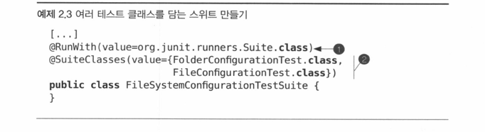

<!-- TOC -->
* [2.1 Junit의 핵심](#21-junit의-핵심)
* [2.2 파라미터화 테스트 실행하기](#22-파라미터화-테스트-실행하기)
* [2.3 Junit 테스트 러너](#23-junit-테스트-러너)
  * [2.3.1 테스트 러너 개요](#231-테스트-러너-개요)
  * [2.3.2 JunitCore 퍼사드](#232-junitcore-퍼사드)
  * [2.3.3 자신만의 테스트 러너 만들기](#233-자신만의-테스트-러너-만들기)
* [2.4 스위트를 이용한 테스트 조직하기](#24-스위트를-이용한-테스트-조직하기)
  * [2.4.1 테스트 클래스 집합 만들기](#241-테스트-클래스-집합-만들기)
  * [2.4.2 스위트의 스위트 만들기](#242-스위트의-스위트-만들기)
  * [2.4.3 스위트 vs. IDE, Ant, Maven](#243-스위트-vs-ide-ant-maven)

<!-- TOC -->
    - Junit 의 오장육부 : 테스트러너, 테스트 스위트, 테스트 클래스
# 2.1 Junit의 핵심
    - 테스트 클래스가 되는 조건은 : 
        1) public 클래스 
        2) 파라미터를 받지 않는 default 생성자 제공
    - 테스트 메소드가 되는 조건은 :
        1) @Test 어노테이션이 부여
        2) public
        3) 파라미터를 받아서는 안된다.
        4) 반환형은 void

      - @Test 메서드를 호출 할 때마다 테스트 클래스의 인스턴스를 새로 생성한다. 테스트 메서드들을 독립된 메모리 공간에서 실행시킴.
      - 모든 테스트 메서드는 각기 다른 테스트 클래스 인스턴스에서 실행되므로, 인스턴스 변수는 공유될수 없다.
      - assert 메서드를 호출할 때는 에러 메세지도 무조건 같이 기입하는 습관을 들이자.

      - assertEquals("message" ,A,B) ;; A,B 의 값이 같은지 검증
      - assertSame("message", A,B) ;; A,B 가 같은 객체인지 검증( ==)
      - 여러개의 테스트 클래스를 동시에 실행해야 할때, 테스트 스위트라 불리는 또다른 객체를 생성한다.
      - 테스트 스위트 : 특수한 형태의 테스트 러너, 테스트 클래스와 같은 방식으로 실행 할 수 있다.

      1) 테스트 클래스(테스트 케이스) : @Test 가 부여된 테스트를 하나 이상 포함한 클래스
      2) 스위트(테스트 스위트) : 테스트들의 집합. 관련 테스트를 묶는 편리한 수단/ 같은 패키지 내의 여러 클래스를 묶는데 사용됨
      3) 테스트 러너 : 테스트 스위트 실행 엔진.
# 2.2 파라미터화 테스트 실행하기

    - 파라미터화 테스트 러너는 하나의 테스트를 여러 번 반복 실행하는 기능을 제공한다.

    - 테스트 클래스에는 반드시 @RunWith 어노테이션을 부여, 파라미터로 Parameterized 클래스 사용한다.
    - 테스트에 사용할 값을 인스턴스 변수로 선언 할것/ @Parameters 라 표시된 메서드가 하나 필요하다.
    - collection 원소는 배열, 길이는 모두 같아야 한다.
    - 유일한 public 생성자ㅏ가 받는 파라미터의 수와 일치해야 한다.

    <Process>
    1) getTestParameters로 컬렉션 객체를 얻는다. 2) 유일한 public 생성자를 찾는다.
    3) public 생성자가 두개 이상이면, AssertionError를 던진다. 
    4) 파라미터로 입력 파라미터 세 개짜리 생성자를 호출한다. 5) @Test 메소드 실행
# 2.3 Junit 테스트 러너
## 2.3.1 테스트 러너 개요

    - 별다른 표식이 없는 테스트 클래스는 기본 테스트 러너로 실행됨
    - 특정 테스트 러너 사용하려면 @RunWith 사용해 테스트 러너 클래스를 지정한다.

## 2.3.2 JunitCore 퍼사드
    - 테스트수행, 결과 취합, 통계 제공 
    - 테스트에 사용할 러너를 스스로 정한다.

## 2.3.3 자신만의 테스트 러너 만들기

    - org.junit.runner.Runner 는 모든 Junit 러너의 조상 클래스이다.

# 2.4 스위트를 이용한 테스트 조직하기
## 2.4.1 테스트 클래스 집합 만들기
    -  스위트는 테스트 클래스 내의 모든 @Test 메서드들을 찾아 실행하는 일종의 러너다.

## 2.4.2 스위트의 스위트 만들기

    - 그냥 클래스 뿐 아니라, suite 안에 suiteclass도 삽입할 수 있다.
## 2.4.3 스위트 vs. IDE, Ant, Maven

