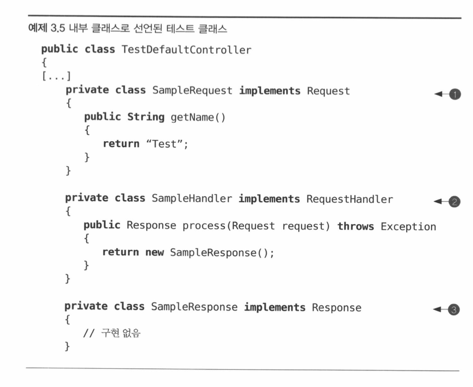

# 3장. Junit 마스터하기

## 3.1 컨트롤러 컴포턴트 소개

    - 웹 컨트롤러는 Http 요청을 받아 Http 파라미터와 쿠피, 헤더 등의 Http 요소들을 추출하여 애플리케이션의
    다른 곳에서 쉽게 사용할 수 있도록 도와준다.

### 3.1.1 인터페이스 설계하기

    - 컨트롤러의 필수객체 4가지 : Request, Response, RequestHandler, Controller

### 3.1.2 기반클래스 구현하기

## 3.2 자! 이제 테스트다.

### 3.2.1 DefaultController 테스트하기

### 3.2.2 핸들러 추가하기

- 단위테스트의 핵심은 한번에 한 객체씩 테스트 하는데 있다.
- 단위 테스트를 작성하려면 두가지 종류의 객체가 필요하다. 하나는 테스트 대상이 되는 도메인 객체이고, 다른 하나는
대상 객체와 상호작용할 테스트 객체이다.
- 테스트 대상이 되는 모든 객체는 도메인 객체로 간주한다.

#### [테스트 클래스가 사는 곳은 어디인가?]
1) 동일한 패키지의 public class로 만든다.
2) 테스트 클래스 안에 내부 클래스(inner class)로 만든다.  

### 3.2.3 요청 처리하기

### 3.2.4 testProcessRequest 개선하기

## 3.3 예외 처리 테스트하기

### 3.3.1 예외 상황 시뮬레이션 하기

### 3.3.2 예외 테스트하기

## 3.4 타임아웃 테스트하기

## 3.5 Hamcrest 매처 소개

## 3.6 테스트 프로젝트 셋업하기

## 3.7 정리 

