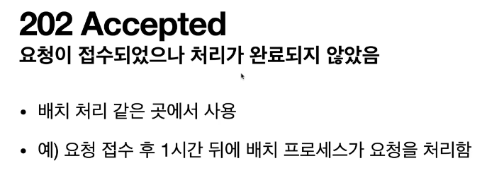
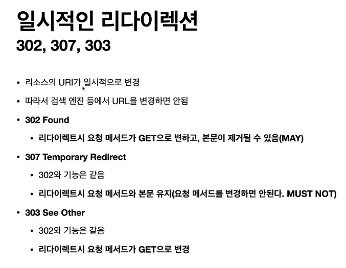

## 200 대 상태코드

## 300 대 상태코드

- location 에 새로운 주소를 보내줌

### 리다이렉션 종류ㅌ`

### 영구 리다이렉션

- 301, 308 영구적 리다이렉트라는 점에서는 완전히 동일

- 처음에 POST로 보내려던 데이터가 다 날아가고, 새로운 이벤트페이지로
GET 요청을 날리기 때문에 데이터를 다시 작성해야 할수 있음.

- 308을 사용하면 위의 문제점을 해결할수 있음.
- 기존의 POST메소드와, 메세지를 유지한채, 리다이렉트됨

- 실무에서는 페이지가 바뀌면, 요구 데이터도 바뀌는 경우가 많기 때문에,
GET으로 돌리는게 맞는 경우가 많다.

### 일시적 리다이렉션

### 일시적 리다이렉트가 꼭 필요한 상황[실무]

- 마지막 요청을 새로고침 하는 것이므로, Post요청을 또 보내게 된다.

### 기타 리다이렉션( 300, 304)

  - 300 안씀
  - 304 Not Modified (캐시로 리다이렉트 하는 것)
      - 캐시를 목적으로 사용
      - 클라이언트에게 리소스가 수정되지 않았음을 알려준다. 따라서 클라이언트는
        로컬 PC에 저장된 캐시를 재사용한다.(캐시로 리다이렉트 한다.)
      - 304 응답은 응답에 메시지 바디를 포함하면 안된다.(로컬캐시 사용해야 하므로)
      - 조건부 GET, HEAD 요청시 사용한다.

### 4xx 클라이언트 오류

- 철저히 validation 해서 client 의 잘못임을 명시해주어야 한다.

- 권한이 없는 페이지에 접속하려고 하는데 403 forbidden(있는데 권한이 없다.) 대신에
아예 페이지의 존재 자체를 언급하고 싶지 않을때 사용한다.

### 5xx 서버 오류

- 예정된 작업으로 요청 처리를 할 수 없는 경우
- 웬만하면 서버 내에 500대 에러를 만들어 애면 안된다.

ex) 고객의 잔고가 부족한 경우, 미성년자인 고객이 성년 콘텐츠에 접근하는 경우
> 이런 경우에는 5xx 에러를 내면 안된다.

- 진짜 서버에 문제가 있을때 (서버가 내려가거나, nullpoint Exception이 터지거나, db가 내려가거나)
하는 경우에만 5xx 에러를 내려야 한다.