# Http API 설계 예시

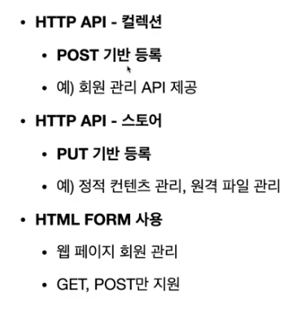

## POST 기반 등록 예시
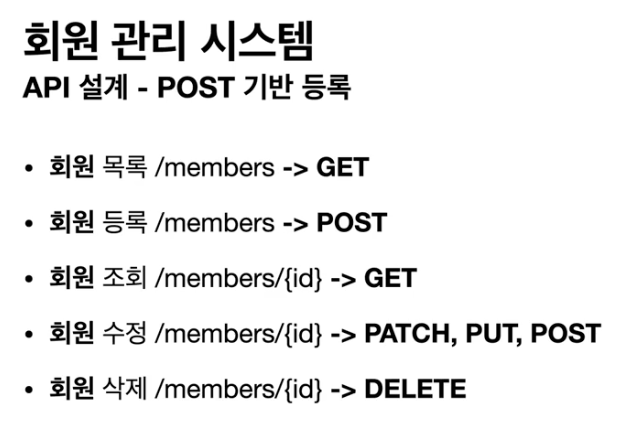

- PUT을 사용할때는 조심해야함. 전체글을 덮어쓰기 하기 때문에. 게시글을
새로 갱신한다던가 하는 특별한 경우만 사용하고, 대부분은 PATCH를 활용
- 애매할때는 POST를 쓰면 된다.

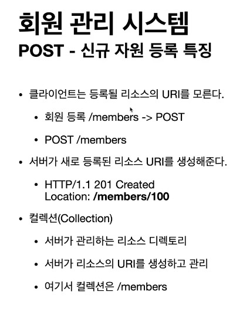

- POST로 리소스를 등록할때는 <U>서버에서</U> 리소스 id를 만들어서 등록해줌

## PUT 기반 등록 예시

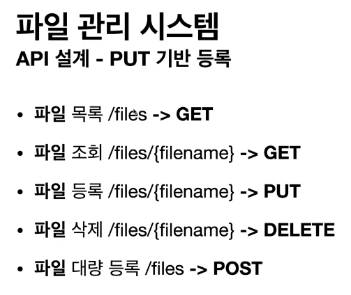ㅠ

- 파일업로드 시에는 기존 파일이 있으면 지우고 업로드하는게 딱맞기 때문에 PUT을 사용함

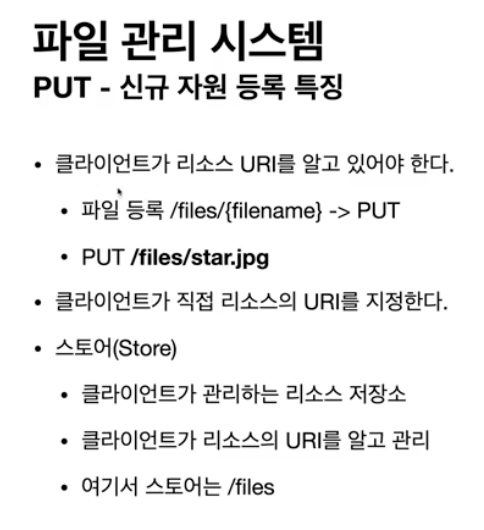
- PUT으로 등록할때는 클라이언트가 생성될 리소스의 URI를 알고 있다는 것이 핵심
- POST로 등록할때는 서버가 리소스의 경로를 만듬. 즉 POST시에는 리소스만 넘김

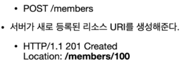

### 리소스 저장소

- collection : 서버가 관리하는 리소스 저장소
- store : 클라이언트가 관리하는 리소스 저장소
- 대부분 collection(POST기반) 을 많이 사용한다.

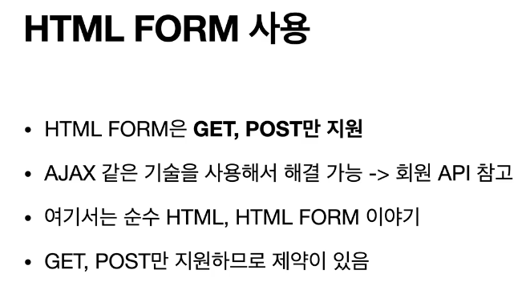
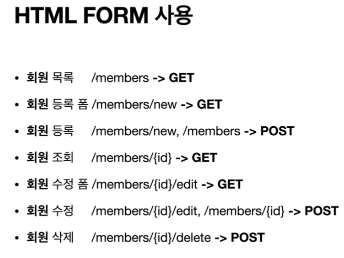

- delete 메소드가 없어서 어쩔수 없이 사용하는 방식

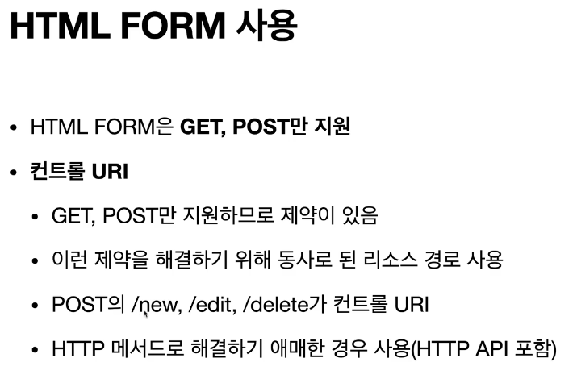

- 최대한 리소스와 메소드만으로 설계를 하고, 그게 안될때, control url
사용을 고민해야지 무지성으로 사용하지 말아야 한다.

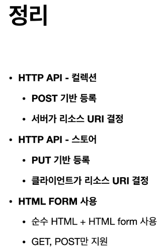

### 정리 [ 참고하면 좋은 URI 설계 개념]

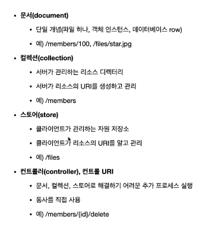