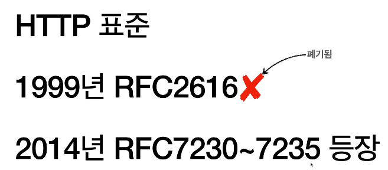
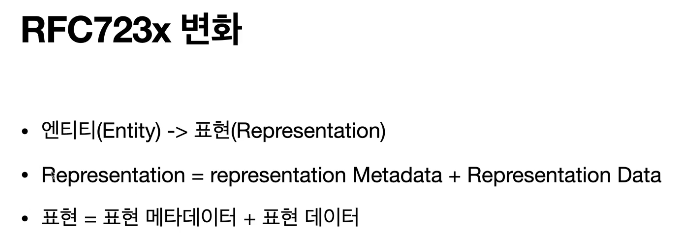
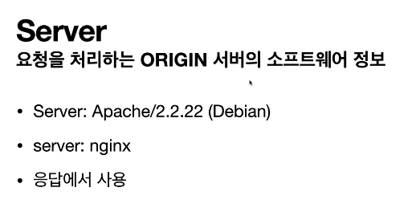
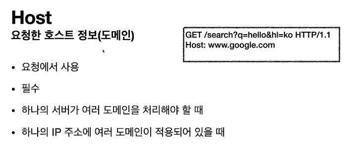

## HTTP 헤더 개요

- 표현(represent) 라는 표현을 쓰는 이유는?
: 실제 db 리소스를 html/json 으로 표현하는 것이라서

## 표현

- Transfer-Encoding(전송 코딩)을 사용하면 content-length 를 사용하면 안됨
- identity --> 압축 안함

# 협상 헤더

# 전송방식

- 분할전송시에는 cotent-length를 넣으면 안된다.

# 일반정보

- origin server : 중간에 있는 많은 proxy server 말고 궁극적으로 도달하는 서버

## 특별한정보

- 호스트 헤더는 필수 기재 사항임

- 많이 구현 하지는 않는 사항

## 쿠키

### 대안1

- SameSite
: 현재요청하는 도메인과 쿠키에 설정된 도메인이 같은 경우에만 쿠키를 전송할 수 있음

