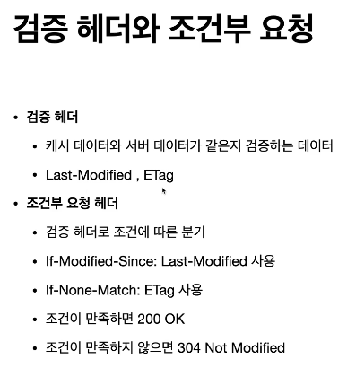
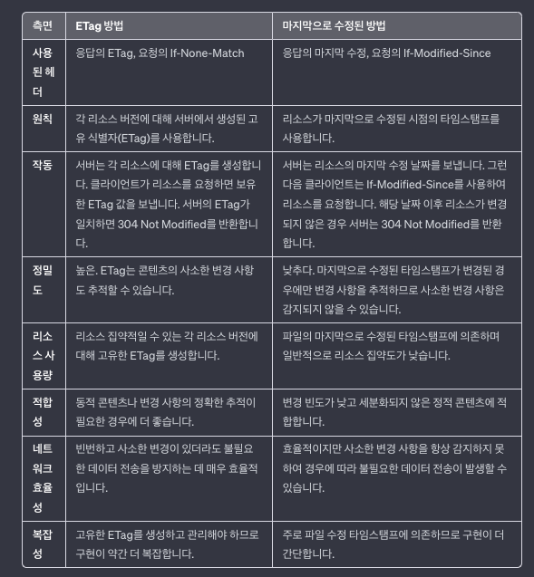

# 캐시와 조건부 요청

## 캐시 기본 동작

- 매 요청마다 이미지를 내려주게 된다.

## 검증 헤더와 조건부요청 1

- Last-Modified 를 추가함

- if-modified-sice 를 포함해서 요청을 보냄

- Http Body는 보내지 않음 (수정된 사항이 없기 때문에)

## 검증 헤더와 조건부요청 2

- If-Modified-Since 값이 Not 이면 요청실패이므로 200이 떨어지지않음
- 대신 304 Not Modified로 헤더 데이터만 전송해서 캐시로 리다이렉트 시킴
- 수정되었으면 200OK를 보냄

## 요청헤더, 조건부 요청의 문제점

- 날짜기반 로직이라서, 예를 들어 a -> b 로 수정했다가 다시 b -> a 로
수정한 경우도 모든 데이터를 다 가져오게 된다. 즉 결론적으로는 수정한 값이 없지만, 마지막으로 수정한 날짜 기반으로 로직이 움직이므로,
쓸데없는 데이터 전송이 발생하게 된다.
- 스페이스나 주석처럼 큰 영향이 없는 변경에서도 전체 요청 데이터를 모두 가져오게 되어 문제가 됨

### Etag (Entity tag)

- 캐시용 데이터에 임의의 고유한 버전 이름을 달아 둔다.
- 파일을 해시함수에 넣으면 해시값이 나오는데, 해시는 그 특성상 컨텐츠가 같은면 같은 해시값이 나옴. 즉
컨텐츠가 중간과정 관계없이 결론적으로 변한것이 없으면 값은 해시값을 받게 됨 (컨텐츠가 조금이라도 다르면 다른 해시값을 받게 됨)

- 캐시제어로직을 서버에서 완전히 관리할 수 있다.

### 캐시와 조건부 요청 헤더

- 지금은 Cache-Control로 다 할 수 있음
- Pragma 나 Expires는 하위호환을 위해서 사용함

- no-cache :: 항상 서버에 캐시 상태를 검증 받고 사용하도록 강제함
- 원(origin)서버는 프록시서버 같은 중간서버가 아님을 말하는 것

- no-cache 처럼 동작하고 , Http 1.0 하위 호환임.

- cache-control은 초단위로 지정하는데 비해, Expires는 날짜를 지정할 수 있음
- 초단위가 훨씬 유연한 방식임(가급적 cache-cotrol: max-age 방식을 권장)
- 둘이 같이 쓰면 하나는 무시됨

## 프록시 캐시

- ex) CDN 서비스

- 개인정보를 private 캐시에 저장하도록 하면 안됨
- 따라서 기본 default 설정은 private으로 되어 있음

## 캐시 무효화

- 캐시를 적용하지 않아도, get 요청을 보내면 임의로 웹브라우저에서 임으로 캐시를 해버리기도 한다.
- 이 페이지는 진짜 캐시되면 안된다고 하는 경우, 위의 내용을 전부 넣어주어야 한다.
- ex) 사용자의 통장잔고(계속 갱신 될수 있으므로)

- no-cache 는 항상 원서버에서 검증, 프록시캐시 검증 안됨

- 원서버 접근 중 에러가 발생했을때, 옛날 정보라도 보여주는게 에러발생보다 낫다고 설정해주면, 보여줄수 있다.
- 예를들어 통장잔고의 경우, 에러를 내고 보여주지 않는것이 맞지, 예전 통잔잔고 데이터를 보여주면 안된다.

