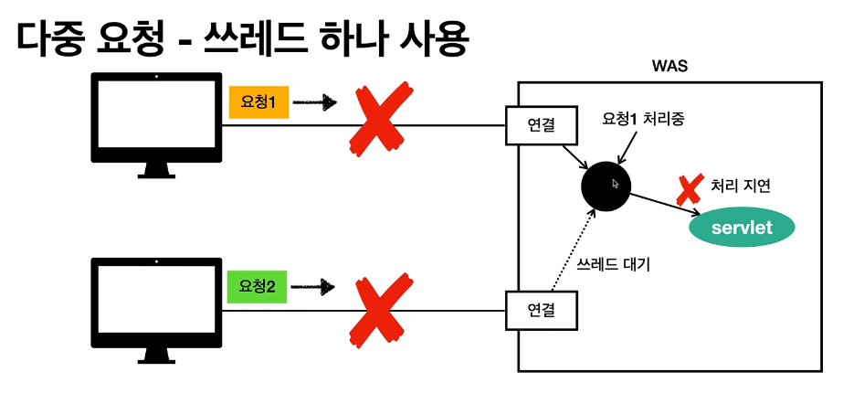
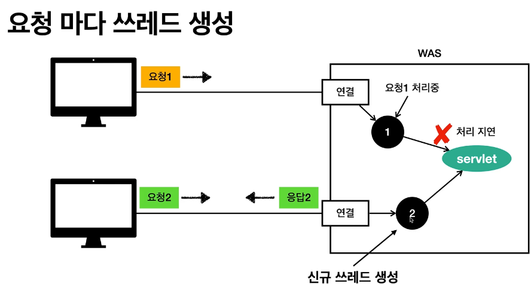
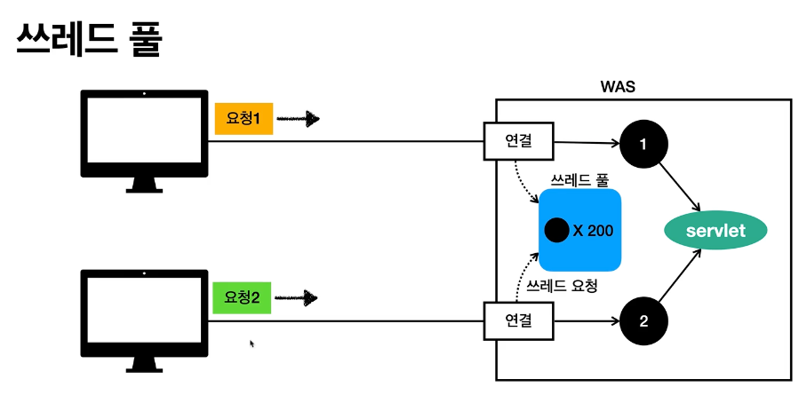
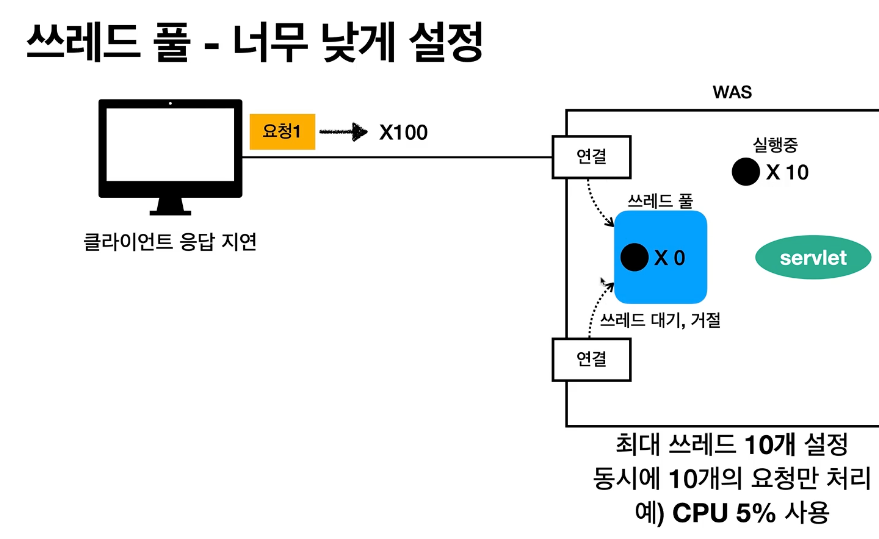

# 동시요청 - 멀티 쓰레드

    - 요청마다 쓰레드 생성의 단점
      1) 쓰레드 생성 비용이 비쌈
      2) 쓰레드의 컨텍스트 스위칭 비용이 발생한다.
      3) 쓰레드 생성에 제한이 없다.(cpu, memory 임계점을 넘어서 서버가 죽을수 있다.)

 
# 쓰레드 풀
    - 쓰레드 풀에 생성 가능한 쓰레드의 최대치를 관리한다.(톰캣은 최대 200개 기본설정)
    - 쓰레드가 필요하면 이미 생성되어 있는 스레드풀의 쓰레드를 사용한다.
    - 사용을 종료하면 쓰레드 풀에 해당 쓰레드를 반납한다.(종료 x)
    - 생성가능한 쓰레드 최대치가 있어서, 너무 많은 요청이 들어와도 기존 요청은 안전하게 처리할 수 있다.
    

# 쓰레드풀 (실문팁)

    - WAS의 주요 튜닝 포인트는 최대 쓰레드 수이다.
    - 이 값이 너무 낮으면, 동시 요청시 서버 리소스는 여유롭지만 클라이언트는 금방 응답 지연을 겪는다.
    - 이 값이 너무 높으면, cpu, memory임계점 초과로 서버가 다운 될수 있다.
    - 장애발생시, 클라우드면 일단 서버부터 늘리고 이후에 튜닝한다./ 클라우드가 아니면 열심히 튜닝한다.
  
  
# 쓰레드 풀의 적정 숫자
    - 어플리케이션 로직의 복잡도, cpu, memory, IO 리소스 상황에 따라 모두 다름
    - 성능테스트
        - 최대한 실제 서비스와 유사하게 성능 테스트를 시도함
        - tool : apache ab, 제이미터, nGrinder(네이버에서 만듬)
    
# WAS의 멀티 쓰레드 지원(핵심)
    - 개발자는 멀티 스레드 관련 코드를 신경쓰지 않아도 됨.
    - 멀티 스레드 환경이므로 싱글톤 객체(서블릿, 스프링 빈)는 주의해서 사용