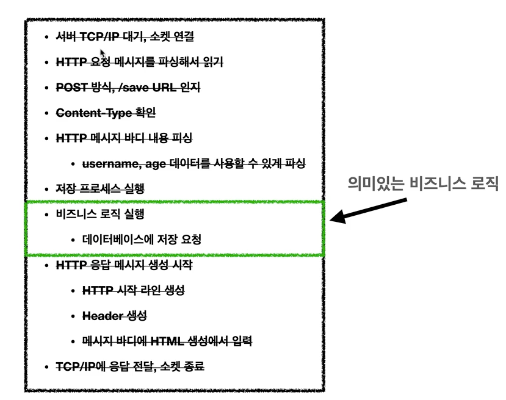

# 서블릿

    - 비지니스 로직 이외의 과정을 대신 해주기 위해 서블릿이 등장

    - 톰캣처럼 서블릿을 지원하는 WAS를 서블릿 컨테이너라고 함.
    - 서블릿 컨테이너는 서블릿 객체를 생성, 초기화, 호출, 종료하는 생명주기관리
    - 서블릿 객체는 싱글톤으로 관리한다.
    - request, response 객체는 매번 새로 생성된다.