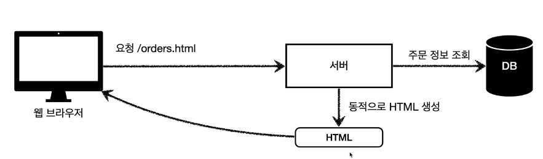

# HTTP API

- 주로 JSON 형태로 데이터 통신

# 백엔드 개발자가 고민해야 될 3가지
- 정적 리소스를 어떻게 내려줄 것인가.
- 동적 리소스를 어떻게 내려줄 것인가.
- HTTP API 어떻게 제공할 것인가.

# SSR (Server Side Rendering)

# CSR (Client Side Rendering)
- 자바 스크립트를 사용해 웹 브라우저에서 동적으로 생성해서 적용
- 웹 환경을 마치 앱처럼 필요한 부분부분 변경할 수 있음
- ex) 구글지도, Gmail, Google Calender
- SSR 사용하더라도, 자바스크립트 사용해서 화면 일부를 동적으로 변경 가능

- 서버 사이드 렌더링 기술 학습은 필수(타임리프)
- 웹 프론트엔드 기술 학습은 옵션