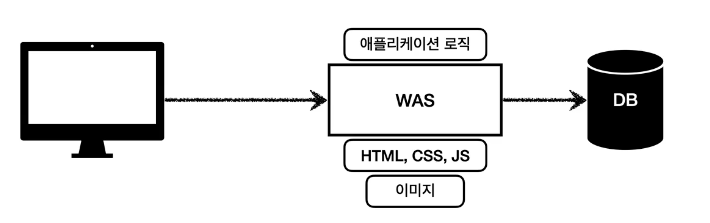
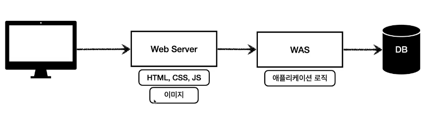

### 웹서버란?
    - 정적 리소스 제공
    - ex) nginx, apache

### WAS (web app server)
    - 웹서버의 기능포함 (정적 리소스 제공 가능)
    - 프로그램 코드 실행해서 application logic 실행
        - 동적 HTML, HTTP API(JSON)
        - Sevelet, JSP, Spring MVC
    - ex) 톰캣(Tomcat), Jetty, Undertow

### 정리

    - 요즘은 web server 와 was 의 경계가 모호해지고 있음.
    - 웹서버도 플러그인 설치 등을 통해 was의 기능을 할수 있고, was도
    웹서버의 기능을 포함하고 있기 때문에
    - 자바는 서블릿 컨테이너 기능을 제공하면 WAS로 볼수 있지만, 최근에는
    서블릿 없이도 자바코드 실행하는 서버 프레임 워크도 있음

    - 웹서버는 app logic 구동에 특화 되어 있다고 생각하면 됨

### 웹 시스템 구성

    - 가장 간단하게는 was, db 만으로도 웹 시스템 구성이 가능함. was가 정적 컨텐츠를
    제공하고 웹서버 기능까지 가능하기 때문에.
    - 근데, was에 모든걸 다 맡기면 서버 과부하 우려가 있음.
    - 가장 비싼 application logic이 정적 리소스 때문에 수행이 어려울수 있음.
    - was 장애시 오류 화면도 노출이 불가능하다.

    - 그래서 보통은 위와 같은 방식으로 구성을 한다.
    - was는 application 만 전담하면 되므로 과부하를 줄일 수 있다.
    - 정적로직이 많이 쓰이면 웹서버를 늘리고, app-logic이 많이 쓰이면, was를 늘리면
    되므로, 좀 더 효율적으로 서버를 운영할 수 있다.
    - 웹서버는 잘 죽지 않으므로, 장애시 웹서버가 오류화면 제공을 가능하게 해준다.
    - 데이터만 제공하는 경우에는 was만 운영해도 큰 문제가 없다.

