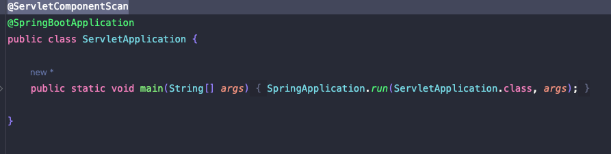
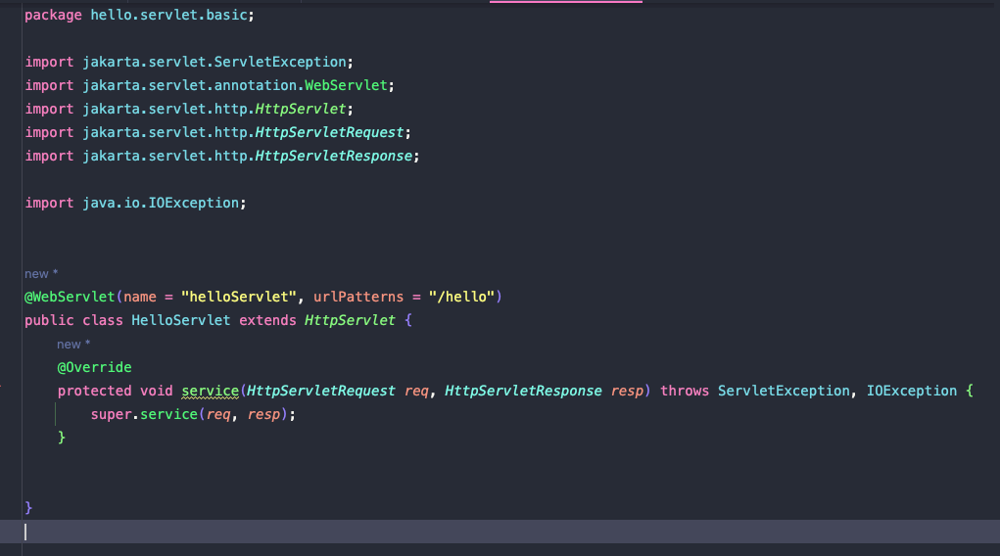
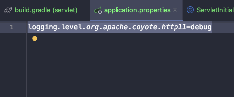
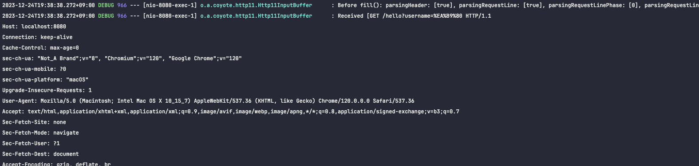
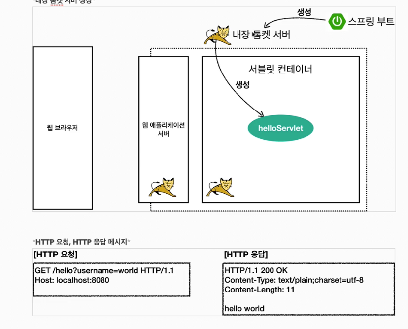

# Hello 서블릿

- 서블릿 자동등록 하는 어노테이션

- 오버라이딩 메소드 바로 넣기 단축키 : ^ + O
  (앞에 자물쇠가 있으면 protected, 없으면 private)

- 위와 같이 구현시, 서블릿이 호출되면 service 메소드가 자동호출된다.

- @WebServlet : 
  - name : 서블릿 이름
  - urlPatterns : url 맵핑

- 상세정보 볼수 있는 옵션 (application.properties에 추가해준다.)
- 운영서버에 모든 정보를 다 넣으면 성능 저하가 발생할 수 있음
- 개발시에만 넣을것

- index.html 이름대로 안하면 welcomepage가 안뜸
- webapp 도 이름 그래도 안하면 못찾음

