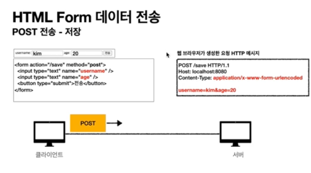

# HttpServeletRequest 기능

1. 임시 저장소 기능이 있음(Http 요청 시작부터 끝날때까지 유지 됨)
    - 저장 : ```request.setAttribute(name, value)```
    - 조회 : ```request.getAttribute(name)```
    

2. 세션관리기능
    ```reqest.getSession(create:true)```


### 단축키 : ^ + T + 7 (refactor extract method)
 :: 메소드로 뽑아내는 기능
 

# Http 요청데이터 개요

1) GET - 쿼리 파라미터
    - url?username=hello&age=20
    - <U>메세지 바디 없이</U>, URL 쿼리 파라미터에 데이터를 포함해서 전달
    - 검색, 필터, 페이징 등에서 많이 사용하는 방식이다.

2) Post - HTML Form 으로 전송하는 방식

    - content-type: application/x-www-form-urlencoded
    - <U>메시지 바디에 쿼리 파라미터 형식으로 전달</U> username=hello&age=20
    - 회원가이브 상품주문, HTML Form 사용


3) HTTP Message Body에 데이터 직접 담아서 요청
    - Http API에서 주로 사용, JSON, XML, TEXT
    - 데이터 형식은 주로 JSON 사용
    - Post, Put, Patch