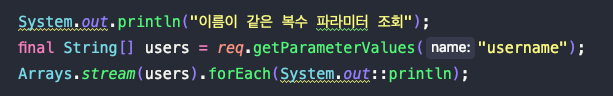
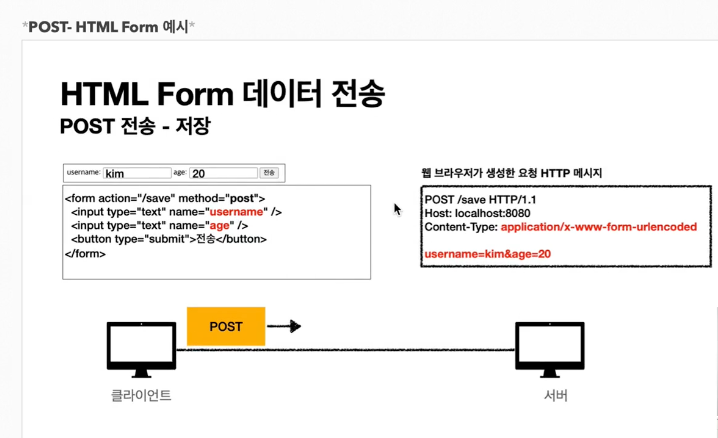
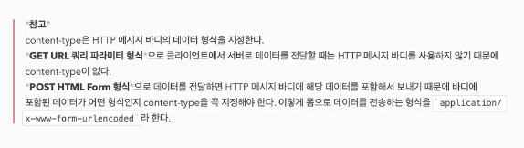
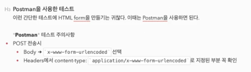
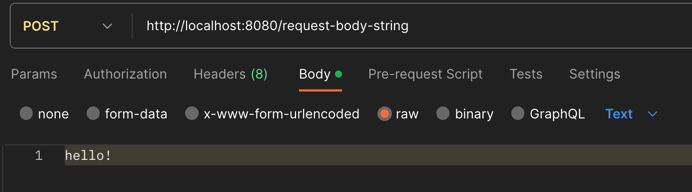
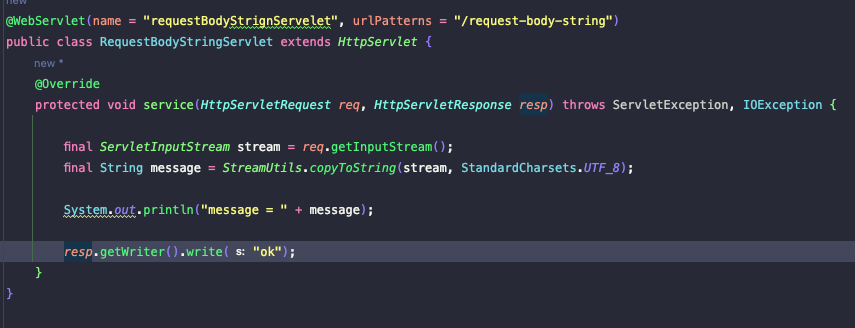
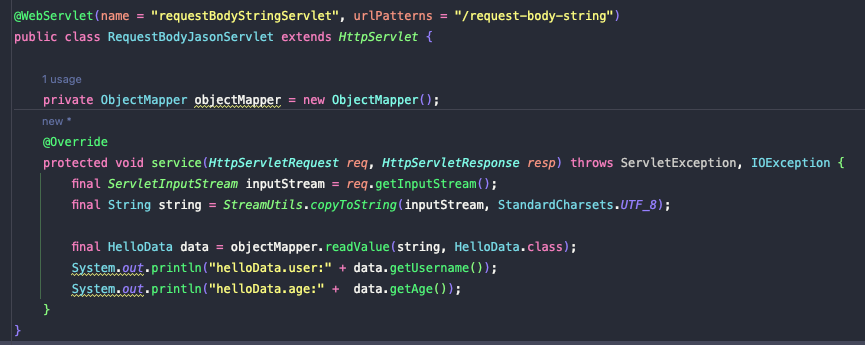
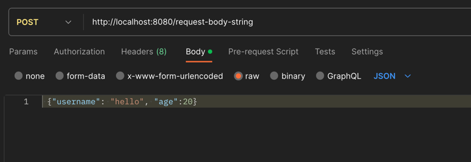

## Http 요청데이터 (Get 쿼리 파라미터)

    - http://localhost:8080/request-param?username=hello&age=20&username=hello2
    - 같은 파라미터의 두값을 넣어도 조회가 가능하다. req.getParameterValaues() 이용
    - 중복일때 req.getParameter()를 사용하면 첫번째 값만을 반환한다.

## Http 요청데이터 (Post HTML Form)

    - 쿼리파라미터로 보내는 정보나, Html form으로 바디에 보내는 정보나 형식이 같다.
    - 따라서 서버에서 꺼낼때도 req.getPrameter() 로 둘다 꺼낼수 있다.

## Http 요청데이터 (API 메세지 바디 - 단순텍스트)

## Http 요청데이터 (API 메세지 바디 - JSON)

