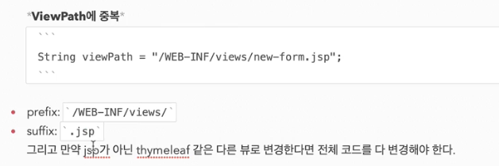

## MVC 패턴의 개요
- 하나의 서블릿, JSP 로 비지니스로직과 뷰 렌더링을 함께 처리하게 되면, 유지보수가 어려워지고,
  코드 수정과 파악도 어려워짐
- 비지니스 로직과 UI 수정은 변경의 라이프 사이클이 다르기 때문에, 하나의 코드로 관리하는 것은
  비효율적이다.
- JSP는 뷰 렌더링에 트고하되어 있으므로 뷰 기능만 담당하는게 효과적이다.

- 컨트롤러에 비지니스 로직을 두는 것은 좋지 않음.
- controller를 서블릿을, view를 jsp 를 사용해서 만듬

## MVC 패턴의 적용

- 상대경로 save 사용시 현재 경로 마지막 부분이 해당 문자열로 바뀐다.

- dispatcher.forward()는 다른 서블릿이나, jsp로 이동할수 있는 기능. 서버 내부에서 다시
호출이 발생한다.
- 즉, 클라이언트와 통신하지 않고 서버내부에서 함수 호출하듯이 로직이 움직임

- WEB-INF 안에 있는 파일은 직접적으로 호출할수 없음(web-app 경로에 있는 것은 직접 호출 됨)
- WEB-INF 안의 파일은 콘트롤러를 먼저 거치도록 설정되어 있음

- 
- webapp (보통 도메인주소까지 라고 생각하면 됨) 하위의 jsp는 바로 호출됨

- redirect 와 forward의 차이
- redirect는 실제 서버로 호출이 두번 일어남
- redirect는 따라서 클라이언트가 인지할수 있고, 실제 url경로도 변경된다.
- forward는 서버 내의 호출이므로 클라이언트가 전혀 인지 못함

## MVC 패턴의 한계

