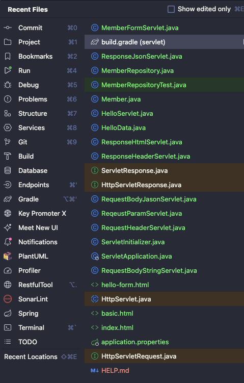
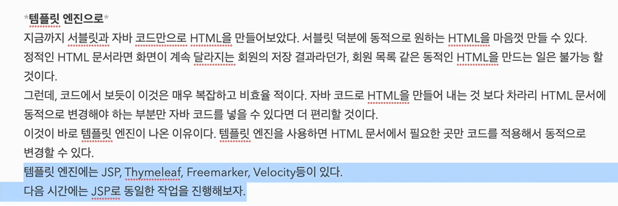

## 회원 관리 웹 어플리케이션 요구사항

- Junit4까지는 public 있어야 하는데 Jnit5부터는 public 필요없음

- 테스트코드 하나만 실행 단축키
option + cmd + r

## 서블릿으로 회원 관리 웹 어플리케이션 만들기

- 서블릿의 단점. html 문서 작성시 겁나 복잡함.
- cmd + option + u : 소스보기 단축키

## JSP로 회원관리 웹 어플리케이션 만들기

- 확장자 .jsp 까지 적어주어야 한다.

- <%=  =%>  로 쓰면 자바코드를 바로 출력 할수 있다.

- MVC 패턴이 등장하게 된 이유
