<!-- TOC -->
  * [프론트 컨트롤러 패턴소개](#프론트-컨트롤러-패턴소개)
  * [프론트 컨트롤러 도입 - v1](#프론트-컨트롤러-도입---v1)
  * [view 분리](#view-분리)
  * [Model 추가](#model-추가)
  * [단순하고 실용적인 컨트롤러](#단순하고-실용적인-컨트롤러)
  * [유연한 컨트롤러1 - v5](#유연한-컨트롤러1---v5)
  * [유연한 컨트롤러2 - v5](#유연한-컨트롤러2---v5)
  * [정리](#정리)
<!-- TOC -->

## 프론트 컨트롤러 패턴소개
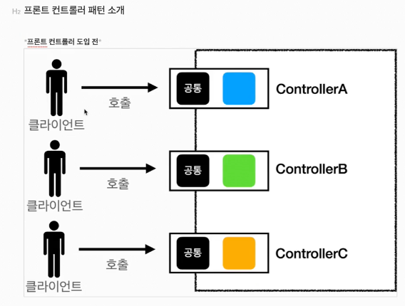
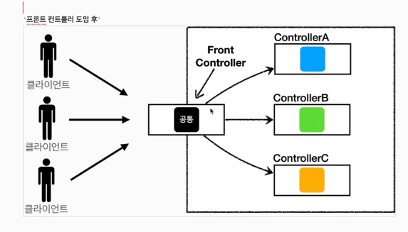
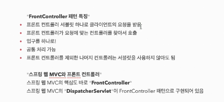

    - 스프링 웹 MVC의 핵심도 바로 Front Controller이다.
    - 스프링 웹 MVC의 DispatcherServlet 이 FrontController 패턴으로 구현되어 있음

## 프론트 컨트롤러 도입 - v1
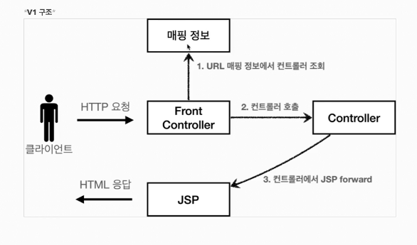
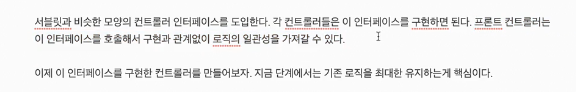

## view 분리
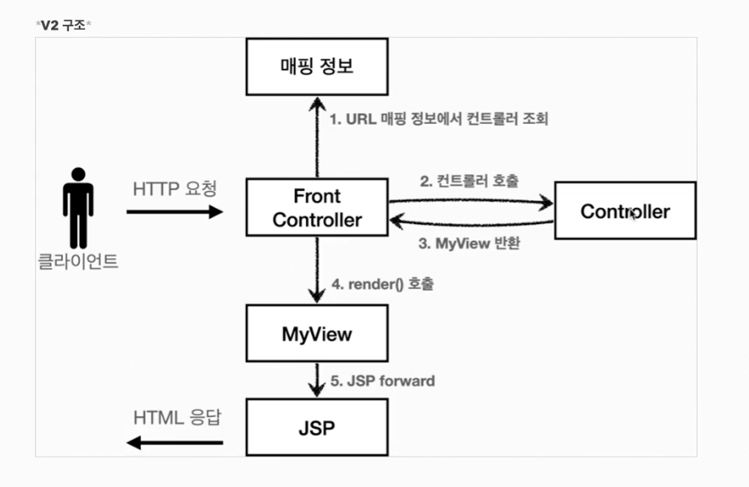

## Model 추가
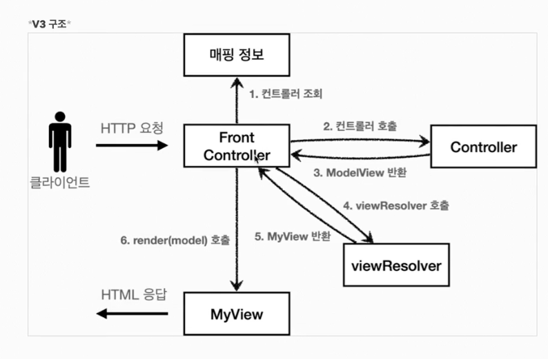
## 단순하고 실용적인 컨트롤러 - v4

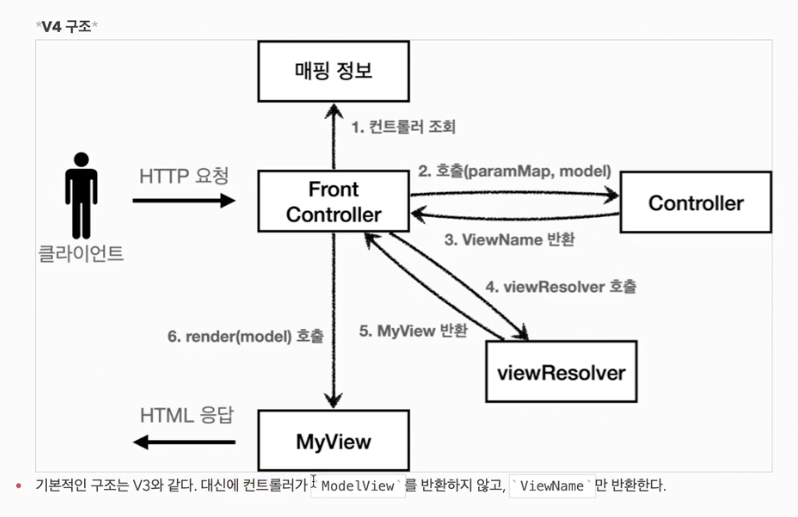

## 유연한 컨트롤러1 - v5
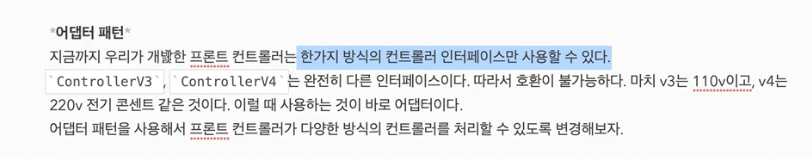
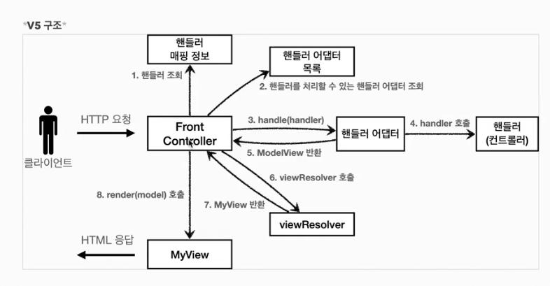
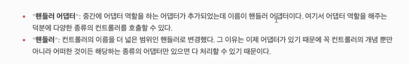

## 유연한 컨트롤러2 - v5
- v4 추가
## 정리
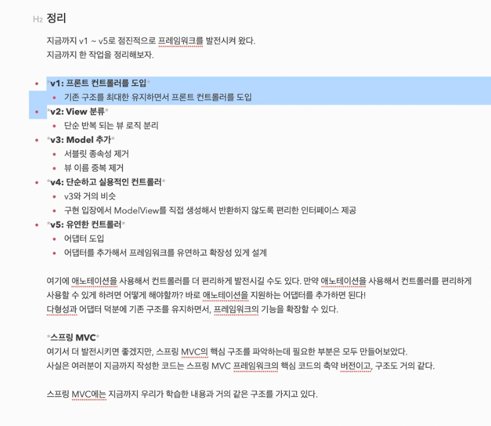
