## 스프링 MVC 전체구조
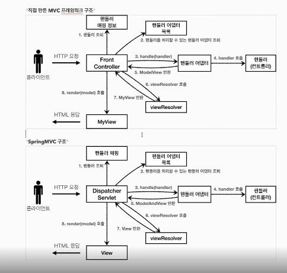

    - 디스패쳐 서블릿 == 프론트컨트롤러
    - cmd + O : class 검색
    - shift + option + cmd + u : 다이어그램 보기
    - shift + control + 화살표 : 메소드 단위로 옮겨다니기

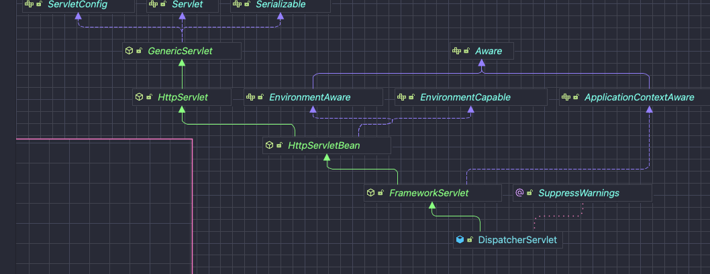
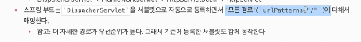
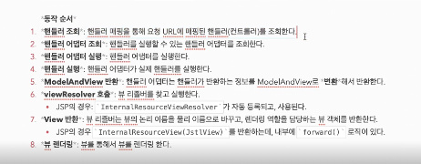


- 핵심코드
```
@SuppressWarnings("deprecation")
	protected void doDispatch(HttpServletRequest request, HttpServletResponse response) throws Exception {
		HttpServletRequest processedRequest = request;
		HandlerExecutionChain mappedHandler = null;
		boolean multipartRequestParsed = false;

		WebAsyncManager asyncManager = WebAsyncUtils.getAsyncManager(request);

		try {
			ModelAndView mv = null;
			Exception dispatchException = null;

			try {
				processedRequest = checkMultipart(request);
				multipartRequestParsed = (processedRequest != request);

				// Determine handler for the current request.
				mappedHandler = getHandler(processedRequest);
				if (mappedHandler == null) {
					noHandlerFound(processedRequest, response);
					return;
				}

				// Determine handler adapter for the current request.
				HandlerAdapter ha = getHandlerAdapter(mappedHandler.getHandler());

				// Process last-modified header, if supported by the handler.
				String method = request.getMethod();
				boolean isGet = HttpMethod.GET.matches(method);
				if (isGet || HttpMethod.HEAD.matches(method)) {
					long lastModified = ha.getLastModified(request, mappedHandler.getHandler());
					if (new ServletWebRequest(request, response).checkNotModified(lastModified) && isGet) {
						return;
					}
				}

				if (!mappedHandler.applyPreHandle(processedRequest, response)) {
					return;
				}

				// Actually invoke the handler.
				mv = ha.handle(processedRequest, response, mappedHandler.getHandler());

				if (asyncManager.isConcurrentHandlingStarted()) {
					return;
				}

				applyDefaultViewName(processedRequest, mv);
				mappedHandler.applyPostHandle(processedRequest, response, mv);
			}
			catch (Exception ex) {
				dispatchException = ex;
			}
			catch (Throwable err) {
				// As of 4.3, we're processing Errors thrown from handler methods as well,
				// making them available for @ExceptionHandler methods and other scenarios.
				dispatchException = new ServletException("Handler dispatch failed: " + err, err);
			}
			processDispatchResult(processedRequest, response, mappedHandler, mv, dispatchException);
		}
		catch (Exception ex) {
			triggerAfterCompletion(processedRequest, response, mappedHandler, ex);
		}
		catch (Throwable err) {
			triggerAfterCompletion(processedRequest, response, mappedHandler,
					new ServletException("Handler processing failed: " + err, err));
		}
		finally {
			if (asyncManager.isConcurrentHandlingStarted()) {
				// Instead of postHandle and afterCompletion
				if (mappedHandler != null) {
					mappedHandler.applyAfterConcurrentHandlingStarted(processedRequest, response);
				}
			}
			else {
				// Clean up any resources used by a multipart request.
				if (multipartRequestParsed) {
					cleanupMultipart(processedRequest);
				}
			}
		}
	}

```
## 핸들러 매핑과 핸들러 어댑터
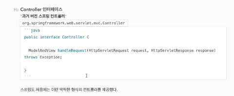

    - 참고로 Contoller 인터페이스와 @Controller는 많이 다르다.
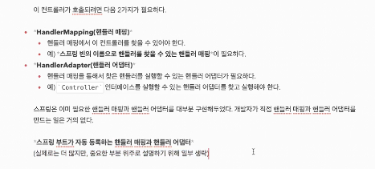
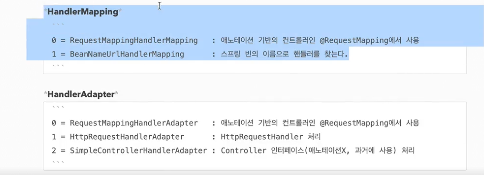
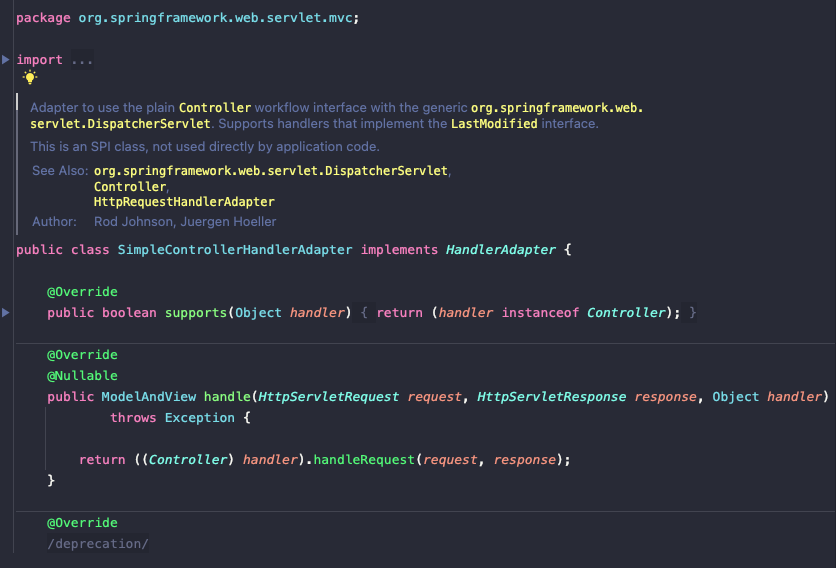
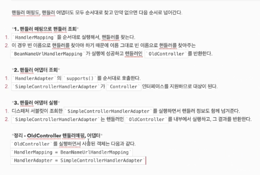

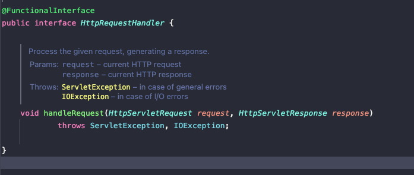
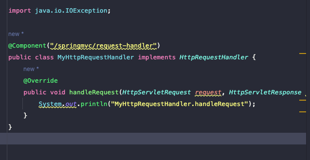
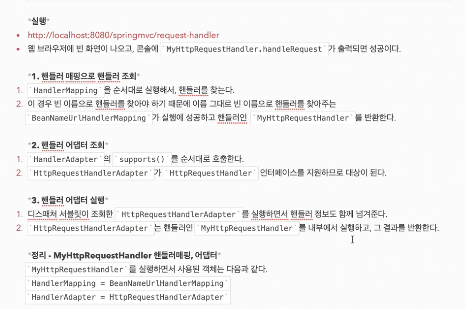

    - 대부분은 @RequestMapping을 사용한다.
    - 가장 우순순위가 높은 매핑과 핸들러는 RequestMappingHandlerMapping, 
    RequestMappingHandlerAdapter 이다.
    
## 뷰 리졸버
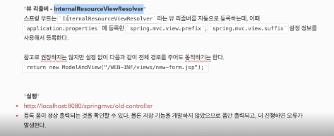
    - InternalResourveViewResolver
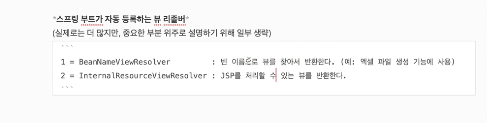
    
## 스프링 MVC 시작하기
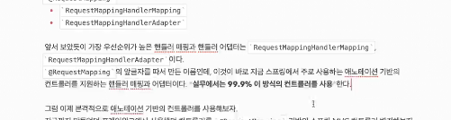
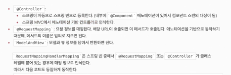

## 스프링 MVC 컨트롤러 통합
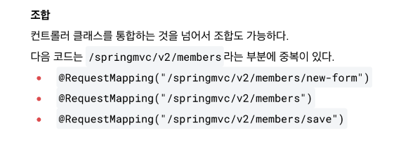

## 스프링 MVC 실용적인 방식
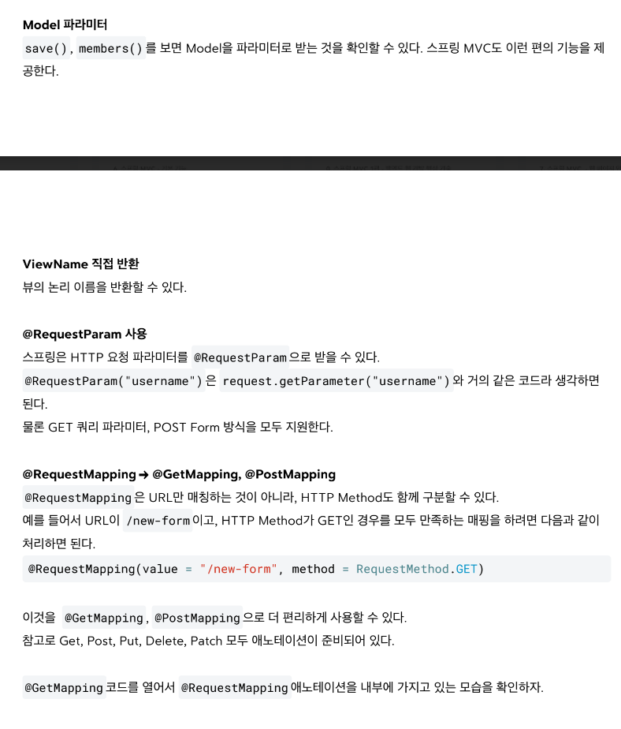
## 정리