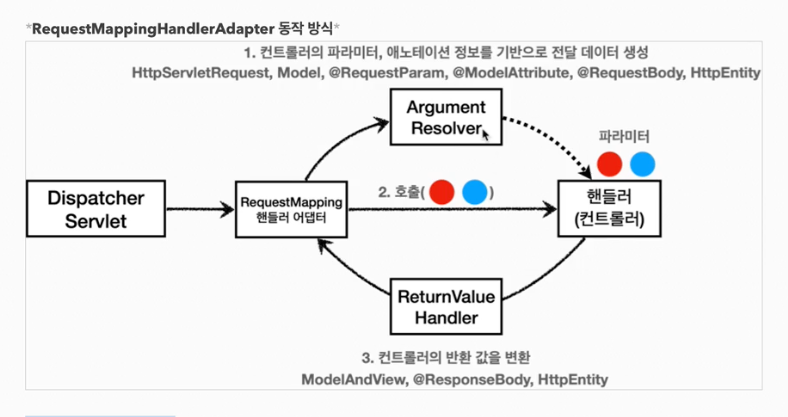

## 로그

        
        - 개발서버는 debug 출력 
        - 운영서버는 info를 많이 출력한다.

### 올바른 로그 사용법

    - +연산을 하면 쓰지도 않는 데이터를 더하기로 연산을 해서 컴퓨팅 자원을 낭비하게 된다.
    - 따라서 의미없는 연산을 피하기 위해서 더하기 연산보다는 {} 에 값을 넣는 형태를 사용하는게 베스트 프랙티스이다.

## 요청매핑

- consume 은 요청헤더의 content-type 기반 으로 맵핑
- produces 는 요청헤더의 accept 기반 으로 맵핑

## 요청매핑 api 예시

    - required = false 로 하고 받는것을 int 타입으로 하면 에러남. 왜냐하면 null이 들어갈수 없기 때문
    - 이때는 Integer로 받아야 한다.

    - null 과 ""은 다르다. String 값을 빈값으로 요청을 보낼경우 빈 문자열이 들어가 있다. 따라서 통과가 된다. (조심해야 한다.)

    - 요청에 빈공백이 들어와서 default값으로 처리해준다.

## @RequestBody는 생략이 불가능하다 대신 @ModelAttribute가 붙는다.

## 정적리소스 제공 경로

## 스프링부트 기본 메세지 컨버터

## 요청핸들러 어댑터 구조

## 확장
