## Tip

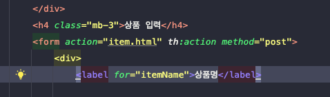

    - action을 정의해주지 않으면, 현재 url에 post 방식으로 보내게 된다.

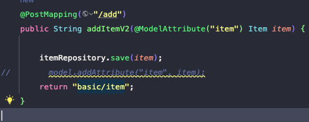

    - modelAttribute는 model에 attribute 하는 역할까지 해준다.
    - modelAttribute의 이름을 지정해주지 않으면, 객체의 대문자를 소문자로 바꾼 값을 기본 default이름으로 attribute가 실행된다.

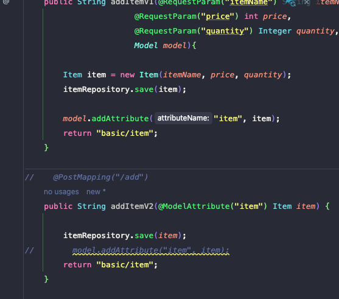
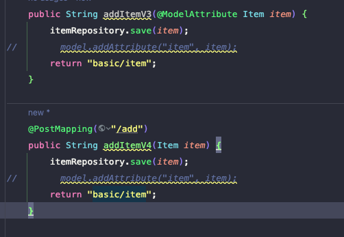

    - version3 추천

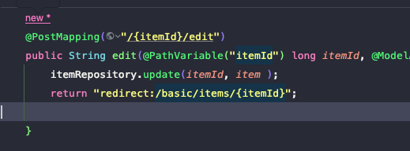

    - 상품수정후 리다이렉트

### 리다이렉트시 주의할점

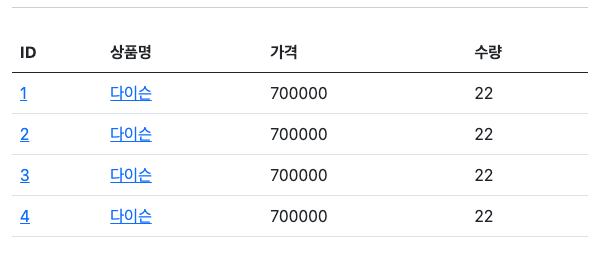
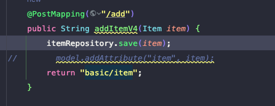

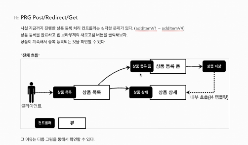
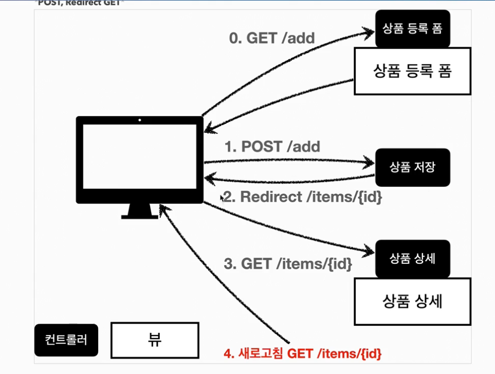

## 리다이렉트 attribute
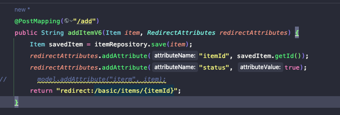
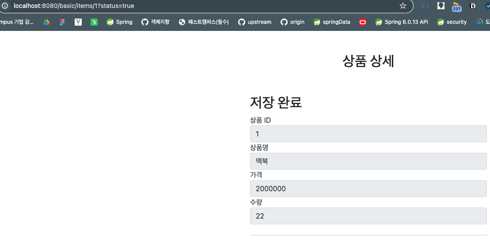

    - url인코딩, 쿼리파라미터 처리까지 해준다.
    - PathVariable은 바인딩 해주고, 나머지는 쿼리파라미터로
    처리한다.