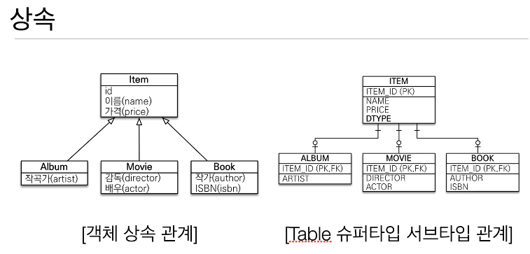
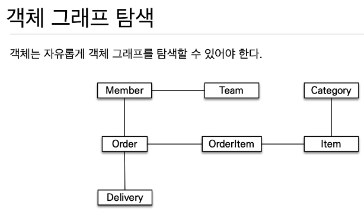

## SQL 중심적인 개발의 문제점
    - 지금시대는 객체는 관계형 db에 보관
    - 객체에 필드 하나만 추가해도 관련된 쿼리를 다 고쳐야 한다.

    - 개발자 == sql 매퍼??

    - 진정한 의미의 계층 분할이 어렵다.
    - 객체답게 모델링 할수록 매핑 작업만 늘어난다.
    - 객체를 자바 컬렉션에 저장 하듯이 db에 저장할 수는 없을까?

## JPA 소개

    - JPA는 오픈소스에서 시작한 ORM(자바표준)

    - 같은 트랜젝션 안에서만 가능함

