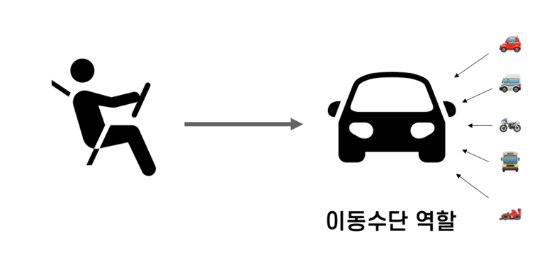

## 객체지향의 4가지 특징
    - 추상화 :불필요한 세부 사항들은 제거하고 가장 본질적이고 공통적인 부분만을 추출하여 표현
         객체의 공통적인 속성과 기능을 추출하여 정의하는것(ex. 추상클래스, 인터페이스)
    
    - 다형성 : 다형성(多形性)이란 한자 이름 그대로 어떤 객체의 속성이나 기능이 상황에 따라 여러 가지 형태를 가질 수 있는 성질

    - 캡슐화 :  서로 연관있는 속성과 기능들을 하나의 캡슐(capsule)로 만들어 데이터를 외부로부터 보호하는 것

    - 상속 : 상속이란 기존의 클래스를 재활용하여 새로운 클래스를 작성하는 자바의 문법 요소를 의미합니다.

## 객체지향의 5가지 설계 원칙

    - 단일책임의원칙 (Single Responsible Principle) : 하나의 객체는 하나의 책임을 지닌다.
    - 개방폐쇄의원칙 (Open/Closed Principle) : 확장에는 열려있고, 변경에는 닫혀있다. 기존코드를 변경하지 않고 기능추가 가능해야 한다.
    - 리스코프치환의원칙 : 상위 타입의 객체를 하위 타입의 객체로 치환해도 동작에 문제가 없어야 한다. 
    - 인터페이스분리의 원칙 : 많은 기능을 가진 인터페이스를 작은단위로 분리시켜, 클라이언트에게 필요한 인터페이스만 구현하도록 한다.
    - 의존성 역전의 원칙 : 의존관계를 맺을때 자주 변경되는 쪽이 아니라, 변경이 거의 일어나지 않는 쪽에 의존하라.
    자기보다 변하기 쉬운것에 의존하게 되면 변화의 영향을 많이 받기 때문에, 추상화된 인터페이스나 상위 클래스를 둬서 변화의 영향을 받지 않게 하기 위한 원칙

## 객체 자향이란?

## 절차지향 vs 객체지향

## 객체지향의 설계와 구현

    - 비슷한 것을 하나로 모으고, 다른성격의 것을 분리시킨다.
    - 높은응집도, 낮은 결합도의 장점
        : 변경이 생겼을 때, 변경의 포인트가 하나로 집중될 수 있다. >> 영양범위를 파악하는 것이 한곳에 집중됨
    - 객체지향에 있어 변경에 대한 요구사항이 들어왔을때, 특정 한 부분만 수정하면 된다는 것이 응집도가 높다는 부분.
    - 어떠한 변화가 생겼을때, 다른곳에 영향을 미치지 않는다면 낮은 결합도라고 생각한다.
    - 즉, 객체지향설계를 하는 이유는, 어떠한 변경이 생겼을때, 아주 빠르게, 유연하게 대응할수 있음을 의미한다.

## 객체지향 설계의 순서

