## 리플렉션 API 개념 소개 및 실습
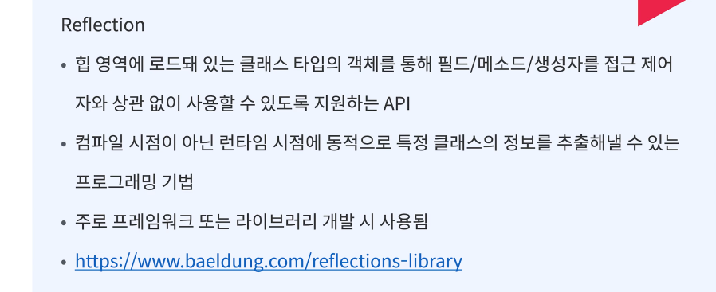

    - 힙영역 클래스 타입 객체 가져오는 방법 3가지
        : Class.class , instance.getClasss, Class.fullname

    - 참고 : jvm의 클래스 로더는 클래스 파일에 대한 로딩이 끝나면 클래스 타입의 객체를 
    생성해서 메모리 힙 영역에 저장한다.
    https://www.baeldung.com/reflections-library (리플렉션 api)

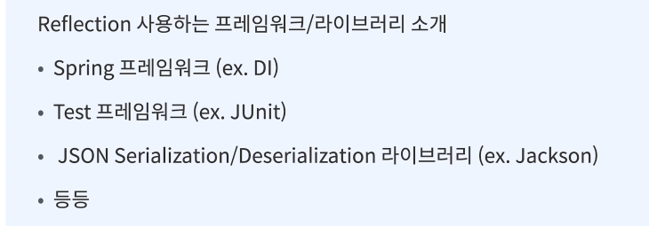
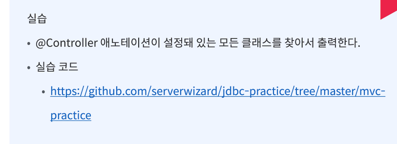

    - Reflections reflections = new Reflections("org.example");
    // root가 java 디렉토리 하위임 org.example 하위의 모든 클래스 대상으로 리플렉션 사용한다는 의미

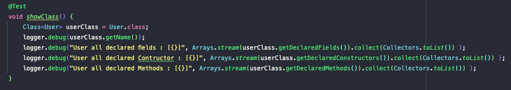
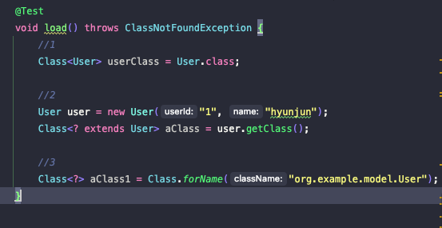
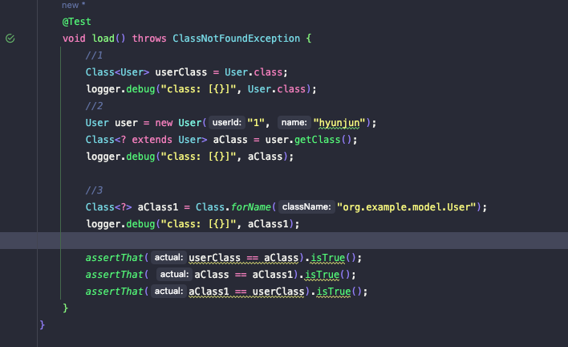

## 프런트컨트롤러 패턴 개념 소개
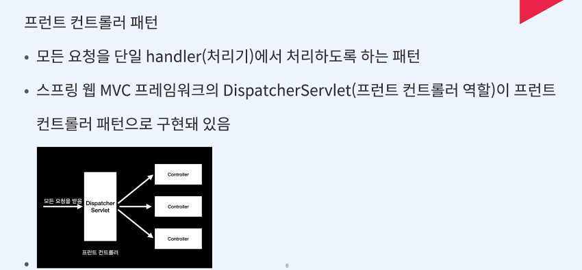
    - 중앙집중식
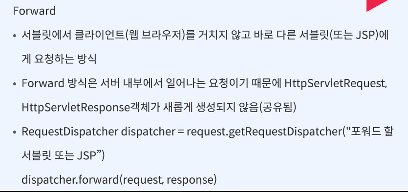
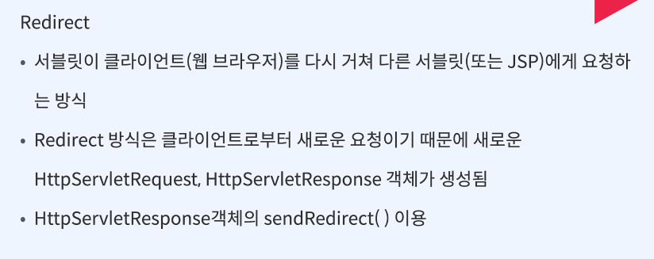
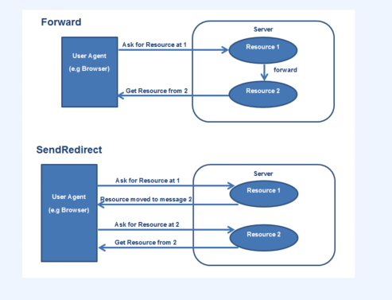

## 프런트 컨트롤러 패턴 실습
## MVC 프레임워크 만들기 개념 소개
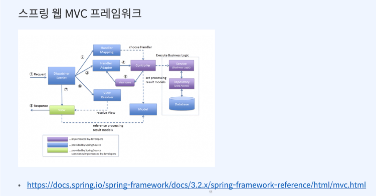
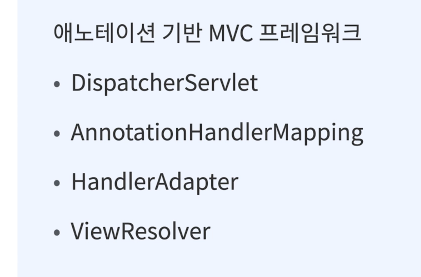

## MVC 프레임워크 만들기 실습    implementation 'org.apache.tomcat.embed:tomcat-embed-core:8.5.42'
    implementation 'org.apache.tomcat.embed:tomcat-embed-jasper:8.5.42'

    // logback-classic
    implementation 'ch.qos.logback:logback-classic:1.2.3'

    testImplementation 'org.junit.jupiter:junit-jupiter-api:5.8.1'
    testRuntimeOnly 'org.junit.jupiter:junit-jupiter-engine:5.8.1'
